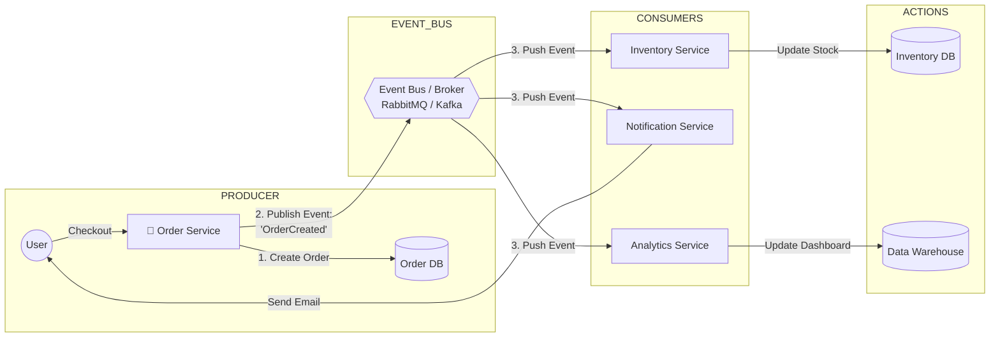
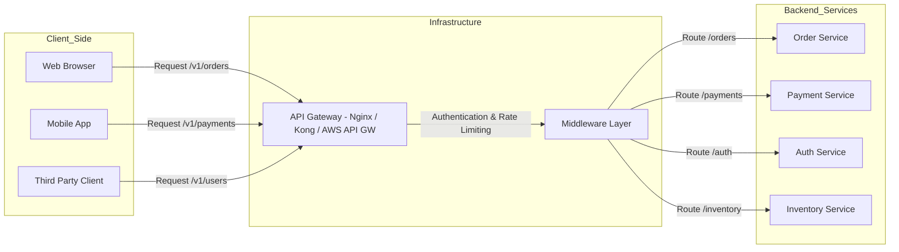
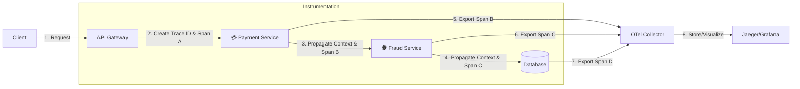
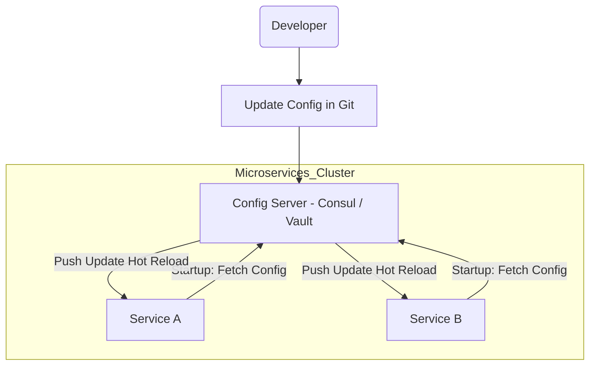
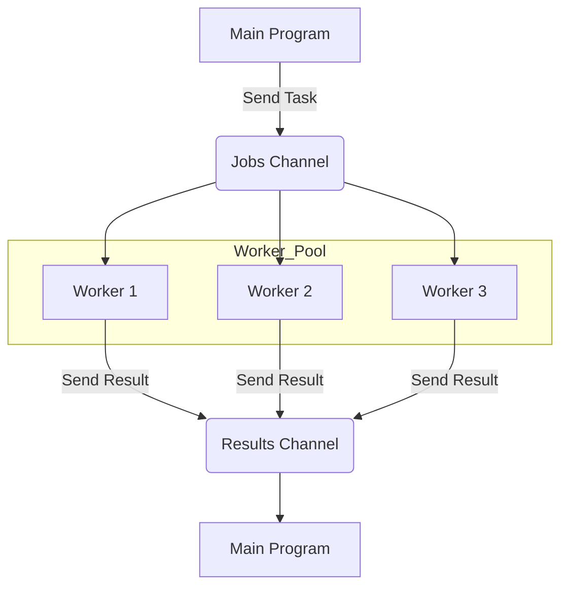
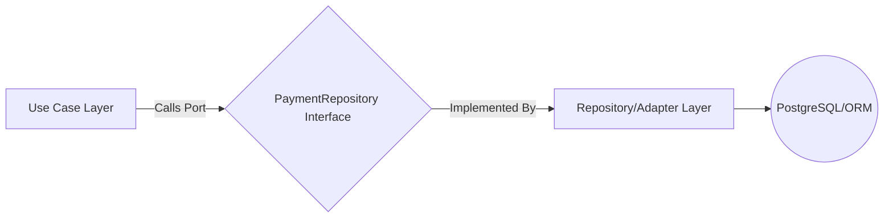
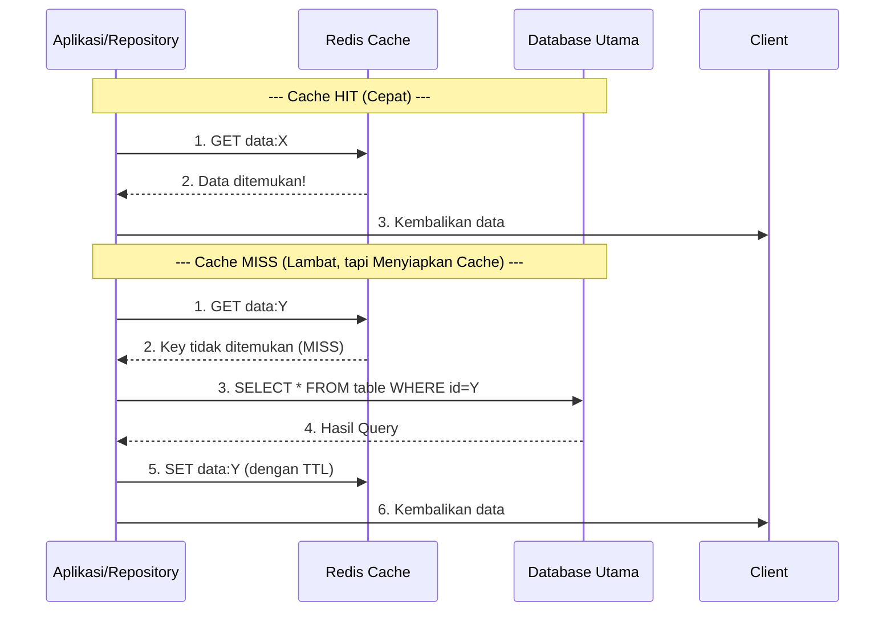
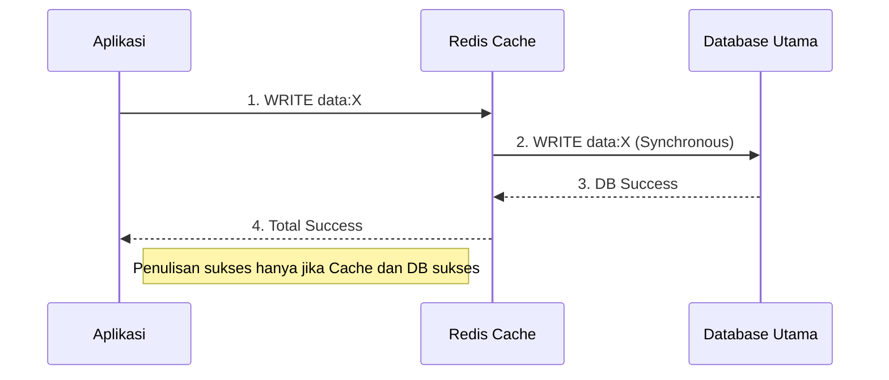
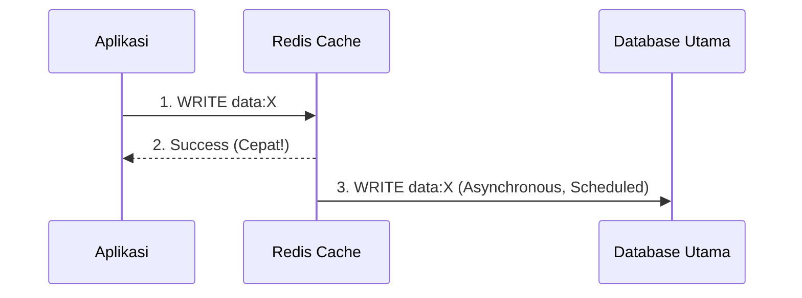

# System Design Note
##### Write by: Adrian Milano

# **Microservices**

## **Service-To-Service Communication**
#### 1. Pola Synchronous (Komunikasi Langsung)
Pola ini melibatkan panggilan langsung dan real-time dari satu layanan ke layanan lain. Layanan pengirim harus menunggu respons sebelum melanjutkan tugasnya.

**Mekanisme**
- **Protokol Utama**: HTTP/HTTPS (sering menggunakan REST atau GraphQL) dan gRPC.
- **Cara Kerja**: Service A menggunakan client library untuk memanggil endpoint (URI) Service B. Komunikasi terjadi melalui jaringan, dan Service A diblokir (blocking) hingga menerima respons atau timeout.

**Kapan Digunakan?**
- **Permintaan Kritis & Real-time**: Ketika layanan pengirim sangat membutuhkan hasil dari layanan penerima untuk menyelesaikan transaksinya.
  - Contoh: `Auth Service` memverifikasi token dari `User Service`.
  - Contoh: `Payment Service` memanggil `Fraud Service` untuk cek risiko sebelum melanjutkan transaksi.
 
**Kelebihan vs Kekurangan**
| Kelebihan                     | Kekurangan                                                                 |
|------------------------------|----------------------------------------------------------------------------|
| Simple dan Langsung: Mudah diimplementasikan dan di-debug. | Tight Coupling: Jika Service B mati, Service A bisa gagal (Cascading Failure). |
| Respon Real-time: Hasil tersedia segera (Latensi rendah). | Scalability Challenge: Layanan yang sering dipanggil menjadi bottleneck (Titik sumbatan). |

#### 2. Pola Asynchronous (Komunikasi Tidak Langsung)
Pola ini menggunakan perantara (Broker) dan biasanya didorong oleh Event-Driven Architecture (EDA) yang baru saja kita bahas. Layanan pengirim tidak perlu menunggu respons.

**Mekanisme**
- **Protokol Utama**: Messaging/Event Streaming (AMQP, Kafka Protocol).
- **Cara Kerja**: Service A (Producer) mengirim pesan/event ke Message Broker (Kafka, RabbitMQ). Broker menyimpan pesan tersebut. Service B (Consumer) mengambil pesan dari Broker sesuai waktunya. Service A dan B tidak pernah berkomunikasi langsung.

**Kapan Digunakan?**
- **Integrasi Long-Running Task**: Untuk tugas yang memakan waktu lama atau tidak mendesak.
  - Contoh: Setelah Order Service membuat pesanan, ia mengirim event `ORDER_CREATED` ke Broker. Layanan lain (Inventory, Email, Data Analytics) mengonsumsi event tersebut.
  - Contoh: Worker Pool mengambil tugas dari Queue.
 
**Kelebihan vs Kekurangan**
| Kelebihan                                                                 | Kekurangan                                                           |
|---------------------------------------------------------------------------|----------------------------------------------------------------------|
| Loose Coupling: Service independen, tidak ada cascading failure jika satu layanan mati. | Eventual Consistency: Data tidak sinkron secara instan.             |
| Resilience: Pesan tetap di Broker meski Consumer mati, memastikan pemrosesan data (data durability). | Debugging Kompleks: Sulit melacak aliran pesan melintasi berbagai layanan. |


## **Event-Driven Architecture**
**Event-Driven Architecture (EDA)** adalah pola arsitektur di mana layanan-layanan (services) dalam sistem berkomunikasi dengan cara memancarkan "Event" (Peristiwa), bukan dengan saling memanggil secara langsung (Direct Request).

**1. Analogi: "Telepon" vs. "Grup WhatsApp"**
- REST API (Request-Response) = Menelepon
  - Service A menelepon Service B: "Halo, tolong update stok dong. Aku tungguin ya di telepon sampai kamu selesai."
  - Masalah: Kalau Service B sibuk atau mati, Service A ikutan macet (nunggu/timeout). Mereka Coupled (saling terikat erat).
- Event-Driven Architecture = Chat di Grup WhatsApp
  - Service A mengirim pesan ke Grup: "Guys, ada ORDER BARU nih (Event)!" Lalu Service A langsung lanjut kerja hal lain.
  - Service B (Gudang) baca pesan itu -> Potong stok.
  - Service C (Email) baca pesan itu -> Kirim invoice.
  - Kelebihan: Service A tidak peduli siapa yang baca, kapan dibaca, atau apakah Service B sedang mati. Yang penting dia sudah lapor. Mereka Decoupled (tidak terikat).
 
**2. Diagram Visual**


**3. Komponen Utama EDA**
1. **Event Producer** (Penerbit):
   - Komponen yang mendeteksi kejadian.
   - Contoh: Saat user klik "Bayar", Order Service menjadi Producer yang menerbitkan event `ORDER_PAID`.
2. **Event Router / Broker** (Perantara):
   - Infrastruktur "pipa" atau "jalur" tempat event mengalir.
   - Tools populer: RabbitMQ, Apache Kafka, AWS SNS/SQS, Google Pub/Sub.
3. **Event Consumer** (Penerima):
   - Komponen yang "mendengarkan" (subscribe) event tertentu dan bereaksi.
   - Contoh: Inventory Service mendengarkan event `ORDER_PAID` untuk mengurangi stok.
  
**4. Mengapa Event Driven Architecture ?**
1. **Decoupling** (Pemisahan Ketergantungan):
   - Jika `Notification Service` error/mati, `Order Service` TIDAK ikut error. User tetap bisa belanja. Emailnya tertunda saja (ada di antrean broker), nanti dikirim pas service nyala lagi.
2. **Scalability** (Skalabilitas):
   - Kalau traffic belanja naik gila-gilaan, kita bisa memperbanyak (scale up) server `Order Service` saja tanpa perlu memperbesar server `Analytics Service` saat itu juga.
3. **Extensibility** (Kemudahan Pengembangan):
   - Besok bos minta fitur baru: "Setiap ada order, kirim data ke tim Marketing."
   - Kita tinggal buat service baru yang dengar event `ORDER_CREATED`. Kita TIDAK PERLU mengedit kodingan `Order Service` sama sekali. Aman dari bug regresi.
  
**5. Tantangan**
1. **Complexity**: Melacak flow jadi susah. "Ini stok berkurang gara-gara event yang mana ya?" Debugging lebih sulit daripada sistem monolith biasa.
2. **Eventual Consistency**: Data tidak sinkron detik itu juga. User sudah bayar, tapi mungkin stok di gudang baru berkurang 2 detik kemudian. Aplikasi harus didesain untuk mentoleransi jeda ini.

## **API gateway**
Bayangkan **API Gateway** sebagai resepsionis utama atau petugas valet parking di sebuah hotel besar yang memiliki banyak layanan (restoran, spa, gym, kamar).
- **Tanpa Gateway**: Setiap klien harus tahu alamat spesifik dari setiap layanan (alamat gym, alamat restoran, dll.). Jika alamat berubah, semua klien harus di-update.
- **Dengan Gateway**: Klien hanya tahu satu alamat (alamat hotel). Mereka memberikan permintaan kepada Gateway. Gateway tahu persis di mana layanan yang diminta berada dan meneruskan permintaan tersebut.

**Fungsi**
API Gateway melakukan lebih dari sekadar routing (meneruskan permintaan). Dalam konteks Senior Fullstack, API Gateway mengambil alih banyak tugas operasional yang seharusnya tidak dilakukan oleh backend services (seperti Payment Service atau Auth Service).

| Fungsi                 | Deskripsi                                                                                                                        | Senioritas                                                                                   |
|------------------------|-----------------------------------------------------------------------------------------------------------------------------------|----------------------------------------------------------------------------------------------|
| Routing & Komposisi    | Meneruskan permintaan ke layanan backend yang sesuai. Bisa menggabungkan respons dari beberapa service menjadi satu respons untuk klien. | Menghindari klien harus melakukan panggilan ke 5 endpoint berbeda.                          |
| Authentication & Authorization | Memvalidasi JWT Token (Bearer Token) pada setiap permintaan. Jika token tidak valid, permintaan ditolak sebelum mencapai backend service. | Security Layer 1: Backend Service tidak perlu repot melakukan validasi token.               |
| Rate Limiting          | Membatasi jumlah permintaan yang dapat dilakukan klien (IP/User) per unit waktu (misalnya, 100 requests per menit).               | Denial of Service (DoS) Protection: Melindungi backend services dari lonjakan trafik.       |
| Load Balancing         | Mendistribusikan permintaan masuk ke beberapa instance layanan backend untuk menghindari overload.                                 | High Availability: Memastikan tidak ada satu server pun yang kewalahan.                     |
| Logging & Monitoring   | Mencatat semua permintaan masuk dan keluar untuk keperluan audit dan monitoring performa.                                         | Observability: Memberikan pandangan terpusat terhadap seluruh trafik sistem.                |
| Protokol Translation   | Menerima permintaan dari klien (REST/HTTP) dan menerjemahkannya ke protokol service (misalnya, gRPC).                             | Flexibility: Memungkinkan tim backend bebas memilih protokol terbaik.                       |

**Hubungannya dengan Komponen Lain**
| Komponen                 | Hubungan dengan API Gateway                                                                                  |
|--------------------------|---------------------------------------------------------------------------------------------------------------|
| Client (FE/Mobile)       | API Gateway adalah satu-satunya endpoint yang mereka panggil.                                                 |
| Load Balancer (Nginx/ALB)| Gateway biasanya berada di belakang Load Balancer (atau bahkan bisa berfungsi ganda sebagai Load Balancer).   |
| Microservices            | Gateway adalah klien dari Microservices. Gateway tahu alamat internal Microservices.                         |
| Authentication Flow      | Pada alur otentikasi, Gateway adalah tempat validasi token (langkah 6 pada flow Anda).                       |

**API Gateway dalam Arsitektur**


**API Gateway vs. Load Balancer**
- **Load Balancer (LB)**: Bekerja pada level 4/7 OSI. Fungsinya murni distribusi trafik berdasarkan algoritma (Round Robin, Least Connections). LB tidak melihat logika bisnis token.
- API Gateway: Bekerja pada level 7. Memiliki kesadaran aplikasi (application awareness). Gateway dapat memverifikasi token JWT, mengubah struktur permintaan, dan membuat keputusan routing berdasarkan logika bisnis (misalnya, jika `user_id` adalah admin, kirim ke versi 2 layanan).

Dalam sistem modern, Anda seringkali menggunakan keduanya: ALB (Load Balancer) di depan API Gateway (untuk distribusi dasar) atau menggunakan solusi terpadu seperti Kong, Tyk, atau AWS API Gateway.

## **Distributed Tracing**
Distributed Tracing adalah solusi untuk masalah observability (kemampuan mengamati sistem) pada sistem yang kompleks.

Bayangkan Anda mengirimkan permintaan POST `/v1/payments` ke API Gateway Anda. Permintaan ini mungkin melibatkan 7 layanan berbeda:

1. API Gateway (Auth check)
2. Payment Service (Mencatat request)
3. User Service (Mengecek saldo user)
4. Fraud Service (Analisis risiko)
5. Database (Memulai transaksi)
5. Queue (Mengirim event)
6. Worker Service (Memproses event)

Jika permintaan ini gagal atau lambat, bagaimana Anda tahu di mana letak masalahnya?
- **Tanpa Tracing**: Anda hanya tahu API Gateway butuh 5 detik untuk merespons.
- **Dengan Tracing**: Anda tahu 4 detik dihabiskan di Fraud Service karena adanya timeout koneksi ke layanan pihak ketiga.

**Konsep Utama**

Distributed Tracing bekerja dengan dua komponen utama:
1. **Trace**: Seluruh perjalanan lengkap dari sebuah permintaan, dari awal hingga akhir.
2. **Span**: Unit pekerjaan tunggal di dalam sebuah Trace. Span memiliki ID unik, waktu mulai, dan waktu selesai. Setiap panggilan ke layanan, setiap query ke database, atau setiap panggilan fungsi penting adalah satu Span.

**Cara Kerja**

Setiap kali layanan memanggil layanan lain (baik Synchronous REST maupun Asynchronous Messaging), ia harus meneruskan header khusus, yang disebut Context Propagation (Penerusan Konteks).
1. **Service A** menerima permintaan dan membuat **Trace ID** dan **Span ID** baru.
2. Saat **Service A** memanggil **Service B**, ia menyertakan **Trace ID** yang sama di dalam header HTTP (misalnya, `traceparent` header).
3. **Service B** menerima header, tahu itu adalah bagian dari Trace yang sudah ada, dan membuat **Span ID** baru di bawah Trace ID yang sama.
4. Semua Span ini kemudian dikirim ke **Tracer Collector** (seperti Jaeger atau Zipkin) untuk visualisasi.

**OpenTelemetry (OTel)**

OpenTelemetry (OTel) adalah proyek open-source yang menjadi standar industri (CNCF Project) untuk menghasilkan, mengumpulkan, dan mengekspor data telemetri (Metrics, Logging, dan Tracing) secara universal dan vendor-agnostic.

**Distributed Tracing dalam Diagram Arsitektur**


**The Interview Angle**
1. **Mengidentifikasi Latency Bottlenecks**: Dengan cepat menemukan layanan atau fungsi mana yang paling lambat (seperti Fraud Service yang memakan 4 detik pada contoh awal).
2. **Debugging Asynchronous Flows**: Memungkinkan Anda melihat seluruh alur kerja (Trace) meskipun melibatkan RabbitMQ/Kafka, karena OTel juga mendukung context propagation melalui pesan queue.
3. **Meningkatkan Sinyal (Signal-to-Noise Ratio)**: Anda dapat mencari semua log yang terkait dengan satu permintaan (Log Correlation) menggunakan Trace ID, alih-alih mencari di ribuan baris log yang tidak relevan.

## **Configuration Management**

**Config Management** adalah praktik dan alat yang digunakan untuk mengelola, menyimpan, dan mendistribusikan data konfigurasi (pengaturan) aplikasi Anda secara terpusat, alih-alih menyimpannya langsung di dalam kode atau file lokal.

**Masalah Tanpa Config Management**

Di lingkungan Monolith tradisional, konfigurasi seperti database connection strings, API keys, dan port number sering disimpan dalam file `.env` atau `application.properties` di dalam repositori kode.

Ini menimbulkan masalah di lingkungan terdistribusi:
1. **Keamanan**: Menyimpan secrets (kunci rahasia) di dalam kode (walaupun .env) berisiko bocor, apalagi jika dikomit ke Git.
2. **Skalabilitas**: Jika Anda memiliki 20 microservices, dan kata sandi database berubah, Anda harus update, build ulang, dan deploy ke-20 service tersebut satu per satu.
3. **Lingkungan**: Sulit membedakan konfigurasi antara Dev, Staging, dan Production tanpa proses manual yang rawan kesalahan.

**Konsep Config Management Terpusat:** 
| Komponen            | Deskripsi                                                                                          | Tools Populer                                         |
|---------------------|-----------------------------------------------------------------------------------------------------|--------------------------------------------------------|
| Configuration Server | Sebuah layanan terpisah yang menyimpan, mengelola versi, dan melayani konfigurasi (misalnya, dari Git atau Database). | HashiCorp Consul, Spring Cloud Config, AWS AppConfig. |
| Secret Store        | Solusi khusus untuk menyimpan informasi super sensitif (seperti API keys dan passwords).           | HashiCorp Vault, AWS Secrets Manager, K8s Secrets.     |
| Client Agent        | Library atau daemon yang diinstal pada aplikasi (Microservices) untuk mengambil konfigurasi dari Server. | Library klien bawaan, Sidecar Containers (Kubernetes). |

**The Process Flow**

**Penjelasan Alur:**
1. Saat Service A dan Service B di-booting (startup), mereka tidak memiliki konfigurasi database. Mereka hanya tahu alamat Config Server.
2. Mereka menghubungi Config Server (CS) dan berkata: "Saya Service A, di lingkungan Production."
3. Config Server mengembalikan konfigurasi yang benar (misalnya, DB_URL_PROD).
4. Hot Reload: Jika DB URL diubah di CS, CS dapat memberi tahu Service B untuk menarik (pull) konfigurasi baru tanpa perlu di-restart atau deploy ulang.

**The Senior Angle**

1. Decoupling Konfigurasi dari Kode: Anda dapat mengubah timeout di Service B tanpa menyentuh satu baris kode pun di repositori Service B.
2. Zero Downtime Updates: Dengan hot reloading, Anda dapat mengubah feature flag atau URL endpoint tanpa menyebabkan downtime (waktu henti).
3. Auditing & Versioning: Karena konfigurasi sering disimpan di Git atau Vault, setiap perubahan dikontrol dan memiliki version history. Ini penting untuk kepatuhan (compliance).
3. Security (Secrets Management): Memisahkan secrets (kunci sensitif) ke Secret Store yang dilindungi (seperti Vault) memastikan kunci tersebut tidak pernah tersentuh oleh operator atau deployment pipeline biasa.


## **Health Check (Liveness Probe)**

Health Check, atau yang sering disebut Liveness Probe (Pemeriksaan Kehidupan), bertujuan untuk mengetahui: Apakah layanan ini masih hidup dan berjalan dengan baik?

**Tujuan Utama: Self-Healing (Penyembuhan Diri)**
- **Pola Pikir**: Jika sebuah instance (server/container) gagal, bunuh dan restart!
- **Mekanisme**: Panggilan periodik (misalnya, setiap 10 detik) ke endpoint internal seperti `/health` atau `/liveness`.
- **Kondisi Kegagalan**: Panggilan ini akan gagal jika:
    - Aplikasi mengalami **deadlock** (macet).
    - Aplikasi kehabisan memori **(OOM - Out of Memory)**.
    - Main thread aplikasi terblokir.

**Tindakan Sistem**

Jika Health Check gagal (misalnya, 3 kali berturut-turut), orchestrator (seperti Kubernetes atau Docker Swarm) akan menganggap instance tersebut **gagal total** dan akan secara otomatis **me-restart** atau **mengganti instance** tersebut.

## **Readiness Check (Readiness Probe)**

Readiness Check, atau yang sering disebut Readiness Probe (Pemeriksaan Kesiapan), bertujuan untuk mengetahui: Apakah layanan ini siap untuk menerima trafik dari luar?

**Tujuan Utama: Traffic Management (Manajemen Trafik)**
- **Pola Pikir**: Layanan boleh hidup, tapi jangan kirim trafik kepadanya sampai ia benar-benar siap!
- **Mekanisme**: Panggilan periodik ke endpoint internal seperti /ready atau /readiness.
- **Kondisi Kegagalan**: Panggilan ini akan gagal jika:
    - Layanan baru saja **di-restart** dan masih memuat konfigurasi atau cache.
    - Layanan telah hidup, tetapi **koneksi ke database** atau **Config Server** belum berhasil terjalin.
    - Layanan sedang **graceful shutdown** dan ingin mengosongkan trafik.

**Tindakan Sistem**

Jika Readiness Check gagal, Load Balancer (atau Kubernetes Service) akan mengeluarkan instance tersebut dari daftar target yang menerima trafik.
- Instance tersebut **tetap hidup** (tidak di-restart).
- Setelah Readiness Check berhasil lagi, instance tersebut **dimasukkan kembali** ke pool trafik.

**Perbedaan**
| **Fitur** | **Health Check (Liveness)** | **Readiness Check (Readiness)** |
|----------|------------------------------|---------------------------------|
| **Pertanyaan** | Apakah saya harus di-restart? | Apakah saya boleh menerima trafik? |
| **Tujuan** | Menjaga kesehatan internal (self-healing). | Menjaga kualitas layanan (traffic management). |
| **Kapan Cek Gagal** | Service deadlock/crash. | Service baru startup atau koneksi DB putus. |
| **Aksi Sistem** | Restart container/pod. | Mengeluarkan instance dari Load Balancer/Service. |

**Contoh Kasus**
1. Anda men-deploy **Payment Service** yang baru.
2. Service hidup (Liveness Check OK), tetapi butuh 30 detik untuk initialize koneksi ke PostgreSQL.
3. Selama 30 detik ini, **Readiness Check** akan Gagal.
4. Load Balancer **tidak akan** mengirim trafik ke Service baru tersebut.
5. Setelah 30 detik, koneksi DB berhasil, Readiness Check **OK**.
6. Load Balancer **mulai** mengirim trafik ke Service baru.

Ini menjamin Zero Downtime Deployment (Deployment tanpa downtime).

## **Service Contract (Kontrak Layanan)**

**Service Contract** adalah perjanjian formal antara dua layanan (service) mengenai bagaimana mereka akan berkomunikasi dan bertukar data. Ini mendefinisikan struktur, format, dan protokol yang harus dipatuhi oleh kedua pihak.
- Isi Kontrak: Kontrak ini biasanya mencakup:
    - Protokol: REST (JSON), gRPC (Protocol Buffers), atau Asynchronous (Schema Kafka).
    - Endpoint: URI/Metode yang tersedia (POST /v1/payments).
    - Payload (Schema): Struktur data yang dikirim dan diterima, termasuk tipe data dan field wajib/opsional (misalnya, file .proto untuk gRPC atau schema JSON).
- Pentingnya: Kontrak menjamin bahwa meskipun Service A dan Service B dikembangkan oleh tim yang berbeda menggunakan bahasa yang berbeda, mereka dapat berinteraksi dengan sukses. Perubahan pada Service B yang melanggar kontrak akan mematahkan Service A.

## **Bounded Context (Konteks Terbatas)**

**Bounded Context** adalah konsep utama dalam Domain-Driven Design (DDD). Ini mendefinisikan batas logis di mana suatu istilah, model, atau konsep bisnis memiliki arti yang tunggal dan konsisten.
- Pola Pikir: Di dunia nyata, kata "Pelanggan" memiliki arti berbeda di setiap departemen.
    - Di Sales/Marketing, "Pelanggan" adalah Lead atau Prospect.
    - Di Shipping/Logistics, "Pelanggan" adalah Penerima (Recipient) dengan alamat kirim.
    - Di Accounting, "Pelanggan" adalah Penagih (Payer) dengan info pajak.
- Dalam Microservices: Setiap Bounded Context harus menjadi basis untuk sebuah Microservice yang terpisah.
    - Customer Service: Memiliki model Customer (nama, email, status).
    - Shipping Service: Memiliki model Recipient (alamat, koordinat).
    - Kedua service ini memiliki model data internal yang berbeda, meskipun merujuk pada orang yang sama. Ini mencegah ambiguitas dan spaghetti code.

## **Observability (Kemampuan Mengamati Sistem)**

**Observability** adalah kemampuan untuk mengetahui keadaan internal sistem hanya dengan mengamati data yang keluar dari sistem tersebut. Ini adalah evolusi dari Monitoring.
- Monitoring vs. Observability:
    - Monitoring memberi tahu Anda APA yang salah (misalnya, CPU Usage 90%).
    - Observability membantu Anda mencari tahu MENGAPA itu salah (misalnya, karena adanya 3 permintaan slow query dari IP tertentu).
- Tiga Pilar Observability: Untuk mencapai Observability, sistem harus menghasilkan tiga jenis data (sering dikumpulkan menggunakan OpenTelemetry yang kita bahas sebelumnya):
    - Metrics: Data numerik yang dikumpulkan dari waktu ke waktu (CPU, RAM, Latency).
    - Logging: Catatan tekstual dari peristiwa diskrit (error, warning, info).
    - Tracing: Jalur lengkap permintaan melintasi layanan (mencakup korelasi log dan metrik).


## **Circuit Breaker Pattern (Pola Pemutus Sirkuit)**

**Circuit Breaker Pattern** adalah pola desain yang meningkatkan ketahanan (resilience) sistem dengan mencegah layanan membuang waktu dan sumber daya untuk berulang kali mencoba terhubung ke layanan yang sedang down (mati) atau lambat.
- Analogi: Seperti pemutus sirkuit listrik di rumah Anda. Jika ada korsleting, sirkuit memutus aliran listrik untuk melindungi peralatan Anda.
- Cara Kerja:
    1. Closed (Tertutup): Keadaan normal, semua permintaan dilewatkan.
    2. Open (Terbuka): Jika terjadi X kegagalan berturut-turut (misalnya, 5 timeout), sirkuit "terbuka". Permintaan selanjutnya tidak dikirim ke layanan yang gagal, melainkan langsung dikembalikan dengan respon error cepat.
    3. Half-Open (Setengah Terbuka): Setelah beberapa waktu (timeout pemulihan), sirkuit mencoba mengirim satu permintaan uji. Jika berhasil, sirkuit kembali ke Closed. Jika gagal, tetap di Open.
- Manfaat: Mencegah Cascading Failure (kegagalan berantai) di mana satu layanan yang down menjatuhkan semua layanan yang memanggilnya.

## **Idempotent Worker (Pekerja Idempoten)**

**Idempotency** adalah properti di mana melakukan operasi yang sama berkali-kali memberikan hasil yang sama seolah-olah operasi itu hanya dilakukan sekali.
- Idempotent Worker: Dalam sistem Asynchronous (dengan Message Queue), seorang Worker disebut idempoten jika ia dapat memproses pesan yang sama lebih dari satu kali tanpa menyebabkan efek samping ganda yang tidak diinginkan.
- Masalah yang Dipecahkan: Dalam sistem terdistribusi, kegagalan jaringan atau timeout di Queue seringkali menyebabkan pesan terkirim setidaknya sekali (at least once), yang berarti pesan yang sama mungkin diterima dua kali (disebut duplication).
    - Contoh: Worker memproses `PAYMENT_APPROVED` dua kali.
- Implementasi: Worker harus menggunakan Transaction ID (atau Idempotency Key) yang unik:
    1. Worker menerima pesan.
    2. Ia memeriksa di database (atau Redis) apakah Idempotency Key sudah pernah diproses.
    3. Jika SUDAH, Worker mengabaikannya (return success).
    4. Jika BELUM, Worker memprosesnya dan mencatat kunci tersebut.

Hal ini sangat penting dalam domain keuangan dan pembayaran untuk mencegah tagihan ganda atau pemrosesan pesanan ganda.


______________________________
# **GOLANG**

Ref: [Uber Go Guide](https://github.com/stanleydv12/uber-go-guide-id)

## **Clean Architecture (Hexagonal / Onion)**

Clean Architecture (atau sering disebut Hexagonal, Onion, atau Ports and Adapters) adalah filosofi desain yang menekankan pemisahan kekhawatiran (separation of concerns) dengan membuat aturan dependensi yang ketat.

Tujuan utamanya adalah memastikan bahwa aturan bisnis inti (Domain/Core) sistem Anda tidak tergantung pada detail implementasi luar, seperti database, framework UI, atau library pihak ketiga.

**Prinsip Inti: Aturan Dependensi (Dependency Rule)**
Aturan yang paling penting adalah: Kode luar harus bergantung pada kode dalam, BUKAN sebaliknya.

Ini berarti:
1. Framework/Database bergantung pada Use Cases.
2. Use Cases bergantung pada Entities (Domain).
3. Entities (inti) tidak bergantung pada apa pun yang ada di luar.

Intinya, panah dependensi harus selalu menunjuk ke dalam (ke arah inti).

**Layer/Ring Utama**

Arsitektur ini biasanya dipecah menjadi beberapa lapisan konsentris, dengan lapisan inti adalah logika bisnis murni.
| **Lapisan (Ring)**            | **Tugas Utama**                                                                                                   | **Dependensi**                                         | **Golang Konteks**                                       |
|------------------------------|--------------------------------------------------------------------------------------------------------------------|---------------------------------------------------------|-----------------------------------------------------------|
| **1. Entities / Domain Core** | Berisi *Enterprise Business Rules*. Objek dengan aturan bisnis paling stabil (misal Payment, User).               | Tidak ada (murni Go/Logika).                           | Struct Go murni, metode, dan tipe data.                  |
| **2. Use Cases / Application**| Berisi *Application Business Rules*. Logika spesifik aplikasi (misal CreatePaymentUseCase, LoginUseCase).        | Entities dan Interfaces (Ports).                       | Implementasi interfaces dari layer Domain.               |
| **3. Interface Adapters**     | Adapter yang mengubah data dari format eksternal ke internal dan sebaliknya.                                     | Bergantung pada Use Cases.                             | Controller (gRPC/REST), Repository Interfaces, Presenters. |
| **4. Frameworks & Devices**   | Lapisan terluar. Semua detail implementasi (database, web server, UI, tools).                                    | Bergantung pada Interface Adapters.                    | Gin/Echo, GORM/SQL driver, Logrus/Zap.                   |

**Konsep Penting Go: Ports and Adapters (Hexagonal)**

Konsep Hexagonal (sering disamakan dengan Clean Architecture) menekankan penggunaan Interfaces yang disebut Ports di layer Use Cases.
1. Port (Interface):
    - Didefinisikan di layer Use Cases/Application.
    - Contoh: `type PaymentRepository interface { Save(p Payment) error }`
    - Use Case (Core) TIDAK TAHU bagaimana data disimpan, ia hanya tahu ia butuh metode `Save`.
2. Adapter (Implementasi):
    - Didefinisikan di layer Frameworks/Adapters.
    - Contoh: `type PostgreSQLAdapter struct { db *sql.DB }` yang mengimplementasikan `PaymentRepository`.
    - Adapter berfungsi sebagai jembatan antara dunia luar (PostgreSQL) dan dunia dalam (Use Case).

**Mengapa Cocok untuk Golang?**
1. Explicit Dependency Inversion: Golang secara alami mendorong penggunaan Interfaces. Clean Architecture memformalkan penggunaan interfaces ini untuk membalikkan dependensi, sesuai dengan Prinsip Inversi Dependensi (DIP).
2. Testability: Inti (Use Cases) dapat diuji 100% tanpa perlu mocking database, HTTP server, atau file sistem, karena semua dependensi eksternal diganti dengan mock interface.
3. Performance: Logika bisnis inti tetap ringan dan tidak terbebani oleh overhead framework berat.


## **Concurrency**

Go dirancang dengan filosofi **"Don't communicate by sharing memory; share memory by communicating"**. Filosofi ini diwujudkan melalui Goroutine dan Channel.

1. **Goroutine (Unit Concurrency)**

Goroutine adalah fungsi yang berjalan secara bersamaan dengan fungsi lain. Mereka adalah setara dengan threads di bahasa lain, tetapi jauh lebih ringan dan dikelola oleh runtime Go.
- Apa itu: Goroutine adalah fungsi ringan yang dieksekusi secara konkuren.
- Ukuran: Goroutine dimulai hanya dengan stack beberapa kilobyte (biasanya 2KB), sedangkan thread OS biasanya membutuhkan 1MB. Ini memungkinkan aplikasi Go menjalankan ratusan ribu Goroutine secara efisien.
- Implementasi: Dibuat hanya dengan menambahkan keyword go di depan pemanggilan fungsi.
- Multiplexing: Go runtime secara otomatis memetakan Goroutine ke sejumlah kecil thread OS (biasanya sama dengan jumlah core CPU Anda, diatur oleh GOMAXPROCS).

```c
package main

import (
    "fmt"
    "time"
)

func cetak(s string) {
    for i := 0; i < 3; i++ {
        time.Sleep(100 * time.Millisecond)
        fmt.Println(s)
    }
}

func main() {
    // Goroutine berjalan secara konkuren
    go cetak("Dunia") 
    
    // Fungsi utama (Main Goroutine)
    cetak("Halo") 
    
    // Menunggu sedikit agar Goroutine selesai
    time.Sleep(1 * time.Second)
}
```
2. **Channel (Jalur Komunikasi)**

Channel adalah mekanisme komunikasi utama antara Goroutine. Channel memungkinkan Goroutine untuk mengirim dan menerima nilai secara aman, mencegah race condition yang sering terjadi saat berbagi memori (mutex/lock).
- Apa itu: Channel adalah pipe (pipa) tempat Anda dapat mengirim nilai dari satu Goroutine dan menerimanya di Goroutine lain.
- Sifat: Channel adalah tipe pertama di Go, dan mereka memiliki behavior bawaan untuk blocking (pemblokiran) yang sinkron.

| **Jenis Channel** | **Deskripsi**                                                   | **Kapan Blokir?**                                                         |
|-------------------|-----------------------------------------------------------------|---------------------------------------------------------------------------|
| **Unbuffered**    | Channel tanpa kapasitas. Hanya bisa mengirim jika ada penerima. | Pengirim memblokir sampai ada penerima, dan penerima memblokir sampai ada pengirim. |
| **Buffered**      | Channel dengan kapasitas tetap (N).                             | Pengirim memblokir jika buffer penuh. Penerima memblokir jika buffer kosong. |


```c
// Membuat channel unbuffered
pesan := make(chan string) 

go func() {
    // Mengirim ke channel. Blokir sampai ada penerima.
    pesan <- "Selesai memproses" 
}()

// Menerima dari channel. Blokir sampai ada pengirim.
hasil := <-pesan 
fmt.Println(hasil) // Output: Selesai memproses
```

3. **Worker Pool (Pola Implementasi Concurrency Terkontrol)**

Worker Pool adalah pola desain yang menggunakan Goroutine dan Channel untuk membatasi dan mengelola jumlah operasi bersamaan (concurrency) untuk tugas-tugas yang berat.
- Masalah yang Dipecahkan: Mencegah resource exhaustion (habisnya sumber daya, seperti RAM atau koneksi database) jika terlalu banyak tugas berat yang dijalankan secara bersamaan.
- Cara Kerja (Pola):
    - Dua Channel dibuat: `jobs` (untuk mengirim tugas) dan `results` (untuk menerima hasil).
    - Sejumlah kecil Worker Goroutine (misalnya, 5) diluncurkan. Ini adalah Pool itu sendiri.
    - Setiap Worker berulang kali menerima tugas dari channel `jobs` dan mengirimkan hasil ke channel `results`.
    - Fungsi utama mengirim semua tugas ke channel `jobs` dan kemudian mengumpulkan semua hasil dari channel `results`.



Pola Worker Pool di Go adalah cara paling efektif untuk mengontrol tingkat concurrency (misalnya, hanya 10 permintaan HTTP eksternal yang diizinkan berjalan sekaligus) untuk melindungi layanan pihak ketiga dari kelebihan beban, yang merupakan aplikasi nyata dari Circuit Breaker dan Rate Limiting di sisi klien (seperti yang kita bahas sebelumnya).

## **Golang Best Practices**
1. **`context` (Paket `context`)**

Paket `context` adalah alat penting untuk mengelola batas waktu (timeout), pembatalan (cancellation), dan nilai antar-Goroutine di aplikasi Go.
- Tujuan Utama: Mengelola lifecycle (siklus hidup) sebuah permintaan. Ini memastikan bahwa ketika sebuah request dibatalkan oleh client (misalnya, client menutup browser), Goroutine yang mengerjakan tugas tersebut juga dihentikan, sehingga mencegah resource leak.
- Penggunaan: Argumen `context.Context` harus menjadi argumen pertama di setiap fungsi yang berada di jalur request (misalnya, di Controller, Use Case, dan Repository).

```c
func (s *UserService) GetUser(ctx context.Context, id int) (*User, error) {
    // Di sini, Anda bisa cek ctx.Done() untuk melihat apakah
    // permintaan telah dibatalkan oleh klien (atau timeout).
    
    // Meneruskan context ke layer berikutnya (Repository)
    user, err := s.repo.FindByID(ctx, id) 
    
    // ...
}
```
- Penting untuk Senior: context adalah mekanisme standar untuk pembatalan propagasi pada arsitektur Microservices, bahkan saat melakukan panggilan HTTP/gRPC ke layanan lain.

2. **Error Wrapping (`errors` Package)**

Go modern mendorong pola Error Wrapping alih-alih sekadar mengembalikan string error. Ini memberikan konteks dan memfasilitasi penanganan error yang lebih cerdas.
- Masalah Lama: return `errors.New("database error: record not found")` — Ini adalah string mati yang sulit diolah.
- Error Wrapping: Menggunakan `fmt.Errorf` dengan verb `%w` (wrap). Ini membungkus error yang lebih rendah (inner error) ke dalam error baru yang lebih tinggi (outer error).
```c
// Di layer Repository
err := db.QueryRow("SELECT ...")
if err != nil {
    // Wrap error asli dari driver DB
    return fmt.Errorf("repository: failed to find user %d: %w", id, err) 
}
```
- Penanganan Cerdas: Di layer Controller/Middleware, Anda dapat menggunakan:
    - `errors.Is()`: Membandingkan error dengan nilai sentinel (misalnya, `errors.Is(err, sql.ErrNoRows)`). Berguna untuk logika.
    - `errors.As()`: Mengekstrak error ke tipe error spesifik (misalnya, error validasi kustom).
    - `errors.Unwrap()`: Mengambil error lapisan dalam
- Manfaat: Memungkinkan log yang kaya konteks (context-rich logging) di layer luar, sambil tetap mempertahankan tipe error asli untuk logika di layer dalam.

3. **Interface Segregation Principle (ISP)**

ISP adalah prinsip dari SOLID, yang menyatakan bahwa klien seharusnya tidak dipaksa untuk bergantung pada antarmuka (interface) yang tidak mereka gunakan.
- Pola Pikir: Lebih baik memiliki banyak antarmuka kecil dan spesifik daripada satu antarmuka besar yang gemuk (fat interface).
- Di Golang: Sering disebut sebagai "Interfaces belong on the consumer side" (Interface milik sisi yang mengonsumsi/membutuhkan).
- Contoh Buruk (Fat Interface):
```c
type Repository interface {
    Create(data interface{}) error // Dipakai
    Update(data interface{}) error // Dipakai
    Delete(id int) error           // Tidak dipakai di Use Case ini
    AuditLog(msg string) error     // Tidak dipakai
}
```
- Contoh Baik (Segregated Interfaces - Sesuai ISP):
```c
// Interface ini didefinisikan di layer Use Case (Consumer)
type UserCreator interface {
    Create(user User) error
}

type UserDeleter interface {
    Delete(id int) error
}

// Service yang menggunakannya hanya bergantung pada yang dibutuhkan
func NewUserCreateUseCase(creator UserCreator) *UserCreateUseCase {
    // ...
}
```
- Manfaat: Mendorong Loose Coupling (keterkaitan longgar) dan mempermudah mocking untuk unit testing. Anda hanya perlu membuat mock untuk metode yang benar-benar digunakan oleh Use Case Anda. Ini sangat penting untuk implementasi Clean Architecture (Ports and Adapters).

## **REST API**

Saat membangun REST API di Go, best practice adalah menggunakan framework ringan (bukan full-stack framework) untuk menangani lapisan Interface Adapters (Controller/Handler) dari Clean Architecture Anda.

1. **Peran Framework**

Dalam konteks Clean Architecture (yang sudah kita bahas), framework seperti Gin atau Echo berada di lapisan paling luar: Frameworks & Devices. Tugas mereka adalah:

    1. Routing: Memetakan path URL (`/payments/:id`) ke fungsi Handler.
    2. Request Binding: Mengambil JSON/Form data dari request dan memetakannya ke struct Go.
    3. Middleware: Menjalankan fungsi sebelum/sesudah Handler (misalnya, Logging, CORS, Authentication).
    4. Response Handling: Mengirim respons JSON/XML yang mudah.

 
2. **Memilih Framework: Ringan, Cepat, dan Konkuren**

| Framework | Kecepatan & Filosofi | Kelebihan Utama |
|----------|------------------------|------------------|
| **Gin** | Sangat populer dan high-performance. Ringan, berbasis tree routing. | Sangat stabil, banyak middleware siap pakai, template engine dasar. |
| **Echo** | Cepat, minimalis, dan fleksibel. Cocok untuk proyek Clean Architecture. | API yang rapi, middleware modular, zero allocation untuk JSON. |
| **Fiber** | Sangat cepat. Dibangun di atas Fasthttp, bukan net/http Go. | Kecepatan eksekusi yang superior, sintaks mirip Express.js (Node.js). |


Walaupun Fiber lebih cepat dalam *benchmark* mentah, Gin dan Echo lebih sering digunakan karena kompatibel dengan paket net/http standar Go, termasuk paket context, sehingga lebih mudah diintegrasikan dengan third-party libraries dan OpenTelemetry Tracing.

3. **Implementasi: Menghubungkan Handler ke Use Case**

Ini adalah bagian paling penting dalam Clean Architecture: Handler TIDAK boleh berisi logika bisnis (Use Case).

**Contoh Handler (Gin/Echo/Fiber)**

Misalnya Anda memiliki Use Case di layer Application (`paymentService`):
```c
// 1. Layer Application (Use Case/Service)
type PaymentService struct { /* dependencies... */ }

func (s *PaymentService) ProcessPayment(amount float64) error {
    // Logika Bisnis inti ada di sini
    if amount < 1.0 {
        return errors.New("payment amount too low")
    }
    // ... panggil Repository
    return nil 
}
```

**Controller/Handler (Layer Interface Adapters):**
```c
// 2. Layer Interface Adapters (Handler/Controller)

// Handler memiliki dependency ke Use Case
type PaymentHandler struct {
    service *PaymentService 
}

// Handler function (menggunakan Gin/Echo/Fiber context)
func (h *PaymentHandler) HandleProcessPayment(c *gin.Context) {
    // 1. Terima Request (Binding/Decoding)
    var reqData struct {
        Amount float64 `json:"amount"`
    }
    if err := c.BindJSON(&reqData); err != nil {
        c.JSON(400, gin.H{"error": "Invalid request"})
        return
    }

    // 2. Panggil Use Case (Hanya Meneruskan Tugas)
    // Penting: Meneruskan Context!
    ctx := c.Request.Context() 
    err := h.service.ProcessPayment(ctx, reqData.Amount) 

    // 3. Respon
    if err != nil {
        // Penanganan error wrapping di sini
        if errors.Is(err, errors.New("payment amount too low")) {
             c.JSON(400, gin.H{"error": err.Error()})
             return
        }
        c.JSON(500, gin.H{"error": "Internal Server Error"})
        return
    }

    c.JSON(200, gin.H{"message": "Payment processed"})
}
```

4. **Best Practice Khusus Framework (Middleware)**
- Authentication Middleware: Gunakan middleware framework (misalnya, `gin.Use(authMiddleware)`) untuk memverifikasi JWT Token sebelum request mencapai `HandleProcessPayment`. Ini mewujudkan peran API Gateway yang kita bahas.
- Logging & Tracing: Gunakan middleware OTel/Tracing (misalnya, `otelgin` untuk Gin) agar setiap *request* yang masuk secara otomatis membuat Trace ID baru, memungkinkan Distributed Tracing di layer terluar.
- Context Propagation: Pastikan Anda selalu menggunakan `c.Request.Context()` dan meneruskannya ke layer Use Case dan Repository untuk mendukung timeout dan cancellation (membuktikan pemahaman Anda tentang paket `context`).

## **Database Layer: Repository Pattern**

Repository Pattern adalah best practice untuk mengisolasi logika bisnis (Use Cases) dari detail basis data (PostgreSQL, MongoDB, dll.).

1. **Peran di Clean Architecture**

Seperti yang kita bahas, Database Layer adalah Adapter yang mengimplementasikan Port (Interface) yang didefinisikan di layer Application/Use Cases.


- Port (Interface): Didefinisikan di `domain/payment_repository.go`
- Adapter (Implementation): Didefinisikan di `infrastructure/repository/postgres_repository.go`.

2. **Implementasi di Golang: Driver vs. ORM**
A. SQL Driver Murni (Paket `database/sql`)
- Mekanisme: Menggunakan paket bawaan Go, `database/sql`, bersama dengan driver spesifik (misalnya, pq untuk PostgreSQL). Anda harus menulis SQL mentah (raw SQL) dan secara manual memetakan (scanning) hasil baris ke struct Go.
- Keuntungan: Kontrol penuh terhadap query, kinerja superior, dan tidak ada magic (mudah di-debug). Ini adalah pilihan ideal untuk query yang sangat kompleks atau kritis kinerja.
- Kekurangan: Lebih verbose (panjang), membutuhkan lebih banyak kode boilerplate (berulang) untuk CRUD dasar.

B. ORM/Query Builder (Object-Relational Mapping)
- Mekanisme: Menggunakan library pihak ketiga yang memungkinkan Anda berinteraksi dengan database menggunakan objek/metode Go alih-alih SQL.
- Contoh: GORM, sqlx, Bun.
- Keuntungan: Lebih cepat untuk implementasi CRUD dasar, mengurangi kode boilerplate, dan menyederhanakan migrasi.
- Kekurangan: Potensi latency karena overhead ORM, dan terkadang menghasilkan SQL yang kurang efisien (N+1 query problem).

Gunakan SQL Driver Murni atau sqlx (Query Builder ringan) untuk query yang paling kritis, dan gunakan ORM seperti GORM hanya untuk CRUD sederhana jika kecepatan pengembangan diprioritaskan.

3. **Pentingnya Context dan Error Wrapping**

Seperti yang sudah dibahas di Best Practices:
- `context.Context`: Harus diteruskan ke setiap metode Repository (e.g., `repo.FindByID(ctx, id)`). Ini memungkinkan pembatalan query (query cancellation) jika permintaan klien timeout atau dibatalkan, menghemat sumber daya database.
- Error Wrapping: Selalu wrap error driver database asli. Misalnya, jika PostgreSQL mengembalikan `No Rows Found`, Repository harus mengubahnya menjadi `repo.ErrNotFound` kustom (atau sejenisnya) sebelum dikembalikan ke Use Case.

4. **Database Transactions**

Untuk operasi yang melibatkan beberapa langkah penulisan data yang harus bersifat Atomic (semuanya sukses atau semuanya gagal, seperti transfer uang), Database Transaction harus diimplementasikan di layer Repository.
```c
// Contoh Pola Transaksi di Repository
func (r *PostgresRepo) Transfer(ctx context.Context, fromID, toID int, amount float64) error {
    tx, err := r.db.BeginTx(ctx, nil)
    if err != nil {
        return err
    }
    
    // Defer rollback, jika commit gagal, ini akan dipanggil
    defer func() {
        if r := recover(); r != nil {
            tx.Rollback() 
            panic(r)
        } else if err != nil {
            tx.Rollback()
        }
    }()

    // 1. Kurangi saldo 'fromID'
    _, err = tx.ExecContext(ctx, "UPDATE accounts SET balance = balance - $1 WHERE id = $2", amount, fromID)
    // ... check error

    // 2. Tambah saldo 'toID'
    _, err = tx.ExecContext(ctx, "UPDATE accounts SET balance = balance + $1 WHERE id = $2", amount, toID)
    // ... check error
    
    // Jika semua sukses:
    return tx.Commit() 
}
```
Implementasi yang benar menjamin ACID properties (Atomicity, Consistency, Isolation, Durability), yang sangat vital untuk sistem pembayaran.


## **Caching dengan Redis (Strategi & Implementasi)**
1. **Kenapa Redis untuk Caching?**

| Fitur | Deskripsi | Manfaat |
|-------|-----------|----------|
| **In-Memory** | Data disimpan di RAM utama server. | Latency sangat rendah (sub-milidetik), jauh lebih cepat dari database relasional (PostgreSQL). |
| **Data Structures** | Mendukung berbagai tipe data (String, Hash, List, Set, Sorted Set). | Memungkinkan caching yang kompleks (misalnya, leaderboard dengan Sorted Set). |
| **TTL (Time To Live)** | Dapat mengatur waktu kadaluarsa otomatis untuk setiap key. | Sangat ideal untuk caching; data lama akan otomatis dihapus. |
| **Persistence Opsional** | Mendukung RDB Snapshot atau AOF Logging untuk data durability (bisa hidup lagi setelah restart). | Data cache tidak hilang total saat server crash. |

2. **Strategi Caching Utama (The Patterns)**

Ada dua pola utama yang harus Anda pahami saat menggunakan Redis di lapisan Repository atau Use Case:

**A. Cache-Aside (Lazy Loading)**

Ini adalah pola caching yang paling umum dan diterapkan di sisi Application/Repository Layer Anda.

    1. Read Request: Aplikasi (Use Case/Repository) menerima permintaan data.
    2. Check Cache: Aplikasi pertama-tama memeriksa Redis.
    3. Cache HIT: Jika data ditemukan (HIT), langsung kembalikan ke klien. Selesai (cepat)!
    4. Cache MISS: Jika data tidak ditemukan (MISS), aplikasi:
        - Ambil data dari Primary Database (PostgreSQL).
        - Simpan data tersebut ke Redis (dengan TTL).
        - Kembalikan data ke klien.

**B. Write-Through (Konsistensi Tinggi)**

Pola ini fokus pada konsistensi data saat terjadi operasi WRITE.

    1. Write Request: Aplikasi menerima permintaan untuk mengubah data.
    2. Write to DB & Cache: Aplikasi secara sinkron menulis data ke Database dan ke Redis sekaligus.
    3. Acknowledge: Setelah keduanya berhasil, kembalikan respons sukses.

Pola yang Lebih Umum untuk Update: Pada praktik modern, pola Cache-Aside sering dipadukan dengan Cache Invalidation (Write-Back) saat terjadi perubahan data. Artinya, saat data di-update di DB, data yang relevan di Redis akan dihapus (DEL key), memaksa Cache MISS pada permintaan berikutnya, yang kemudian memuat ulang data segar dari DB (seperti yang kita bahas di Payment Review Flow).

3. **Implementasi di Golang (Repository Pattern)**

Dalam Clean Architecture, logika Cache-Aside ada di layer Repository/Persistence.
```c
// Contoh Metode Repository (dengan Redis)
type PaymentCacheRepository struct {
    DBClient *sql.DB // Koneksi PostgreSQL
    RDBClient *redis.Client // Koneksi Redis
}

func (r *PaymentCacheRepository) GetPaymentByID(ctx context.Context, id int) (*Payment, error) {
    // 1. Cek Redis (Cache-Aside)
    paymentJSON, err := r.RDBClient.Get(ctx, fmt.Sprintf("payment:%d", id)).Result()
    if err == nil {
        // Cache HIT: Deserialize dan kembalikan (cepat!)
        // ... return Payment struct
    }

    // 2. Cache MISS: Ambil dari DB
    payment, err := r.DBClient.QueryRowContext(ctx, "SELECT ...")
    if err != nil {
        return nil, err
    }

    // 3. Simpan ke Redis untuk permintaan berikutnya
    r.RDBClient.Set(ctx, fmt.Sprintf("payment:%d", id), json.Marshal(payment), 5 * time.Minute) 

    return payment, nil
}
```

4. **Konsistensi**
- Cache Stale (Data Usang): Risiko terbesar dari caching. Data di Redis sudah lama dan tidak sama dengan data di DB. Diatasi dengan TTL yang tepat dan Cache Invalidation (menghapus key yang relevan saat ada operasi WRITE).
- Thundering Herd: Ribuan permintaan Cache MISS terjadi secara bersamaan, membebani DB secara masif. Diatasi dengan lock pada key yang hilang (Single-Flight Pattern di Go) atau menggunakan TTL Jitter (mengacak sedikit waktu TTL).

## **Message Queue (Broker)**

Message Queue berfungsi sebagai perantara (Broker) yang memisahkan aplikasi pengirim (Producer) dari aplikasi penerima (Consumer). Ini adalah fondasi dari komunikasi Asynchronous dalam arsitektur terdistribusi.

| Komponen | Peran | Tools |
|----------|--------|--------|
| **Producer** | Aplikasi yang membuat dan mengirim pesan/event ke Queue/Topic. | Order Service, Payment Service. |
| **Consumer** | Aplikasi yang menerima dan memproses pesan dari Queue/Topic. | Notification Service, Inventory Service. |
| **Queue/Topic** | Tempat penyimpanan pesan sementara. | Antrean di RabbitMQ, Topic di Kafka/NATS. |
| **Broker** | Server yang mengelola Queue/Topic dan pengiriman pesan. | RabbitMQ, Kafka, NATS. |


1. **Producer (Pengirim Pesan)**

Producer adalah aplikasi yang bertugas mencatat bahwa sebuah peristiwa (event) telah terjadi dan mengirimkannya ke Broker.
- Cara Kerja:
    1. Sebuah peristiwa terjadi di Producer (misalnya, `User Created`, `Payment Approved`).
    2. Producer membuat pesan (payload JSON/Binary) yang berisi data peristiwa tersebut.
    3. Producer mengirim pesan ke Queue atau Topic di Broker.
    4. Setelah pesan berhasil dikirim dan diakui (ACK) oleh Broker, tugas Producer selesai. Producer tidak peduli apakah ada Consumer yang online atau tidak (Pola Fire and Forget).
- Contoh di Go: Setelah transaksi di Payment Service sukses, Producer akan menggunakan client library (misalnya, `sarama` untuk Kafka) untuk mengirim pesan `PAYMENT_APPROVED` ke Topic.

2. **Consumer (Penerima Pesan)**

Consumer adalah aplikasi yang secara pasif mendengarkan dan memproses pesan yang masuk di Queue/Topic yang sudah di-subscribe.

- Cara Kerja:
    1. Consumer me-subscribe ke Queue/Topic yang relevan.
    2. Broker mendorong pesan ke Consumer, atau Consumer secara aktif menarik pesan (pull).
    3. Consumer memproses pesan tersebut (misalnya, mengirim email, mengurangi stok, mencatat log).
    4. Setelah pemrosesan sukses, Consumer mengirim Acknowledgement (ACK) kembali ke Broker.
    5. Broker kemudian menghapus pesan tersebut dari antrean (atau menandai offset di Kafka).
- Contoh di Go: Notification Service akan menjadi Consumer. Ia akan memiliki Worker Goroutine yang terus-menerus mendengarkan Topic `PAYMENT_APPROVED`. Ketika pesan tiba, Worker akan memicu fungsi pengiriman email.

3. **Perbandingan Broker Utama**

| Broker        | Filosofi                                           | Pola Utama                                                                 | Durability & Skalabilitas |
|---------------|----------------------------------------------------|----------------------------------------------------------------------------|----------------------------|
| **RabbitMQ**  | Message Queueing (Pesan harus diproses secepatnya). | FIFO (First-In, First-Out), pesan dihapus setelah di-ACK.                 | Baik untuk High Availability dan Task Queue. |
| **Apache Kafka** | Event Streaming (Pesan adalah log yang tidak terhapus). | Topic dan Partitioning. Pesan dibaca berdasarkan Offset (seperti kursor). | Sangat skalabel untuk volume tinggi dan replay data. |
| **NATS**      | High-Performance Messaging (kecepatan & kesederhanaan). | Pub/Sub sederhana, sangat cepat, fokus real-time & telemetry.             | Tidak menyimpan pesan permanen (kecuali NATS Streaming/JetStream). |

Pilih **Kafka** jika Anda perlu menyimpan semua event secara permanen untuk data analysis atau event sourcing. Pilih RabbitMQ jika Anda perlu menjamin pesan yang cepat dikirim dan diproses, cocok untuk Task Queues (seperti Worker Pool).

**Dekoupling & Resilience**

Fungsi utama dari Message Broker adalah Resilience (ketahanan):
- Jika Consumer mati, Producer tetap dapat mengirim pesan ke Broker. Pesan menunggu di antrean sampai Consumer kembali online dan siap memproses.
- Ini menjamin bahwa logika bisnis utama (misalnya, Order Service) tidak gagal hanya karena layanan sekunder (misalnya, Email Service) sedang down.


______________________________
# **Caching**

## **Cache-Aside Pattern (Lazy Loading)**

Cache-Aside Pattern adalah strategi di mana aplikasi (bukan cache itu sendiri) yang bertanggung jawab untuk mengelola data di cache (misalnya, Redis) dan menjaga konsistensinya dengan database utama (misalnya, PostgreSQL).

**Tujuan Utama**

Mengurangi latency dan beban pada database utama dengan melayani data yang sering diminta langsung dari memori cache.

1. **Alur Kerja (READ Operation)**

Ini adalah alur di mana aplikasi Anda membaca data:
1. Aplikasi Cek Cache: Layanan Anda menerima permintaan data dan pertama-tama memeriksa Cache (Redis) untuk key yang relevan.
2. Cache HIT: Jika data ditemukan, aplikasi langsung mengembalikan data dari cache ke klien. (Sangat Cepat!)
3. Cache MISS: Jika data tidak ditemukan, aplikasi melakukan hal berikut:
    - Read from DB: Mengambil data dari Database Utama.
    - Write to Cache: Menyimpan data yang baru diambil tersebut ke dalam cache (dengan TTL yang ditetapkan).
    - Return to Client: Mengembalikan data ke klien.



2. **Alur Kerja (WRITE Operation - Cache Invalidation)**

Saat data diubah, strategi yang paling umum digunakan bersama Cache-Aside adalah Cache Invalidation (Penghapusan Cache):
1. Aplikasi Tulis ke DB: Aplikasi melakukan operasi WRITE (INSERT/UPDATE/DELETE) ke Database Utama (untuk menjamin konsistensi data).
2. Aplikasi Hapus Cache: Aplikasi kemudian menghapus (DELETE) key yang relevan dari cache.
3. Lanjutan: Permintaan READ berikutnya untuk key yang sama akan menghasilkan Cache MISS, memaksa aplikasi mengambil data terbaru dari DB, dan menulisnya kembali ke cache (memastikan data yang baru masuk adalah data segar).

**Keuntungan dan Kekurangan**

| Keuntungan | Kekurangan |
|-----------|------------|
| **Simpel & Fleksibel:** Logika caching berada di kode aplikasi, mudah disesuaikan. | **Risiko Data Usang (Stale Data):** Ada jeda antara Write to DB dan Cache Invalidation. Jika invalidation gagal, cache bisa berisi data usang sampai TTL habis. |
| **Resilience:** Jika cache mati, aplikasi tetap jalan (hanya lebih lambat karena semua request ke DB). | **Thundering Herd:** Jika key populer expired, banyak request bersamaan menuju DB dan menyebabkan spike beban. |
| **Hanya Cache Data yang Dibutuhkan:** Tidak membuang memori untuk data yang jarang diakses. | **Latency pada Cache MISS:** Permintaan pertama selalu lambat karena harus membaca dari DB. |

## **Write-Through dan Write-Back**

Kedua pola ini berbeda dari Cache-Aside karena cache berpartisipasi langsung dalam operasi penulisan data.

1. **Write-Through (Konsistensi Kuat)**

Write-Through adalah pola di mana data ditulis ke cache dan database utama secara sinkron dan bersamaan dalam satu operasi.

**Alur Kerja (WRITE Operation)**
1. Aplikasi Tulis ke Cache: Layanan Anda mengirim perintah WRITE (Update/Insert) ke Cache (misalnya, Redis).
2. Cache Tulis ke DB: Cache yang bertanggung jawab untuk memastikan data yang sama juga ditulis ke Database Utama.
3. Acknowledge: Aplikasi hanya menerima respons sukses setelah kedua operasi (ke Cache dan DB) berhasil diselesaikan.



**Pro vs Kontra**

| Keuntungan | Kekurangan |
|------------|------------|
| **Konsistensi Kuat:** Data di cache dan DB selalu sinkron setelah penulisan. | **Latency Tinggi:** Operasi WRITE lebih lambat karena harus menunggu dua operasi I/O jaringan. |
| **Data Durability:** Data dijamin sudah ada di storage utama (DB). | **Overhead:** Setiap WRITE membebani cache dan DB secara langsung. |

2. **Write-Back (Performa Tinggi)**

Write-Back (sering disebut Write-Behind) adalah pola yang mengutamakan performa penulisan dengan mengorbankan sedikit durability dan konsistensi.

______________________________
**Alur Kerja (WRITE Operation)**
1. Aplikasi Tulis ke Cache: Layanan Anda mengirim perintah WRITE ke Cache.
2. Acknowledge Cepat: Cache segera mengirim respons sukses kembali ke aplikasi. (Cepat!)
3. Penulisan Asinkron: Cache menyimpan data yang dimodifikasi (dirty data) di memorinya dan secara asinkron (nanti) menulis data tersebut ke Database Utama.



______________________________
**Pro vs Kontra**

| Keuntungan | Kekurangan |
|------------|------------|
| **Latency WRITE Rendah:** Performa sangat tinggi karena aplikasi tidak menunggu I/O DB. | **Risiko Kehilangan Data:** Jika cache mati sebelum data dirty sempat ditulis ke DB, data hilang. |
| **I/O Batching:** Cache dapat mengelompokkan banyak WRITE menjadi satu operasi DB besar (batch write), menghemat I/O DB. | **Kompleksitas:** Membutuhkan mekanisme recovery kompleks untuk menangani kegagalan cache. |

3. **Perbandingan di Konteks Sistem Pembayaran**

| Pola         | Kapan Digunakan?                                                | Contoh Skenario                                      |
|--------------|------------------------------------------------------------------|--------------------------------------------------------|
| **Write-Through** | Data harus konsisten dan tahan lama.                             | Data Konfigurasi: Pengaturan sistem kritikal.         |
| **Write-Back**    | Performa penulisan sangat kritikal, dan kehilangan data jangka pendek dapat ditoleransi. | Sesi Pengguna (Session Data): Jika sesi hilang, pengguna hanya perlu login lagi. |
| **Cache-Aside**   | Dominan READ-Heavy, penulisan ditangani dengan Invalidation. | Data Profil/Produk: Paling umum di Microservices.     |


## **TTL (Time To Live): Strategi Pasif**

TTL (Time To Live) adalah durasi waktu yang ditetapkan pada data di cache, setelahnya data tersebut dianggap usang (stale) dan akan dihapus (atau ditandai untuk dihapus) secara otomatis oleh cache (misalnya, Redis).

______________________________
**Tujuan TTL**
1. Manajemen Memori: Memastikan data lama yang tidak lagi diakses akan dihapus secara otomatis, menjaga memori cache tetap efisien.
2. Jaminan Kesegaran (Eventual Freshness): Data akan disegarkan setidaknya setelah periode TTL berakhir.

______________________________
**Trade-off Kritis**

| Durasi TTL            | Kinerja (Performance)                             | Konsistensi (Consistency)                 |
|-----------------------|---------------------------------------------------|--------------------------------------------|
| **Pendek (1–5 menit)** | Lebih rendah (lebih sering Cache MISS).           | Lebih tinggi (data lebih cepat segar).     |
| **Panjang (1 jam+)**   | Lebih tinggi (lebih banyak Cache HIT).            | Lebih rendah (data bisa usang lebih lama). |


Keputusan TTL tidak hanya teknis, tetapi juga bisnis. Apakah pengguna dapat mentolerir melihat stok lama selama 5 menit? Jika ya, gunakan TTL panjang. Jika data harus real-time (misalnya, saldo bank), TTL harus sangat pendek atau menggunakan invalidation segera.

______________________________
**Invalidation Strategy: Strategi Aktif**

Invalidation Strategy adalah mekanisme aktif yang digunakan aplikasi untuk menghapus data dari cache segera setelah data tersebut diubah di database utama. Tujuannya adalah meminimalkan risiko stale data.

Ada dua strategi utama untuk Invalidasi:

**1. TTL-Based Invalidation (Strategi Pasif)**
- Mekanisme: Mengandalkan sepenuhnya pada TTL. Aplikasi tidak melakukan apa-apa saat penulisan, membiarkan data di cache usang sampai waktu TTL-nya berakhir.
- Kapan Digunakan: Untuk data yang jarang berubah dan konsistensi instan tidak penting (misalnya, daftar kategori produk yang di-update seminggu sekali).

**2. Event-Based Invalidation (Strategi Aktif / Write-Through/Back)**

Ini adalah praktik terbaik untuk menjaga konsistensi pada data yang sering diubah (seperti profil user, inventaris, atau status pembayaran).

A. Direct Invalidation (Pola Umum)
- Mekanisme: Aplikasi menulis ke DB, dan segera setelah itu mengeluarkan perintah `DELETE` ke cache untuk key yang baru saja diubah.
- Digunakan pada: Pola Cache-Aside.

B. Message-Based Invalidation (Microservices Best Practice)
- Mekanisme: Paling scalable di arsitektur Microservices (EDA).
    - Producer (Service A): Menulis data ke DB.
    - Producer: Mengirim Event (misalnya, `USER_UPDATED`) ke Message Broker (Kafka/RabbitMQ).
    - Consumer (Cache Invalidation Service): Menerima event dan, sebagai reaksinya, mengeluarkan perintah `DELETE` ke cache.
- Keuntungan:
    - Decoupling: Service yang menulis (Producer) tidak perlu tahu detail implementasi caching di layanan lain.
    - Resilience: Jika layanan cache mengalami timeout, event masih ada di Broker dan dapat dicoba lagi (retry) nanti.

______________________________
**Isu Kritis: Race Condition**

Pada strategi Direct Invalidation, selalu ada risiko Race Condition antara WRITE dan DELETE:

1. Service A WRITE ke DB.
2. Service B melakukan READ MISS (mengambil data lama dari DB).
3. Service B WRITE data lama ke Cache.
4. Service A melakukan DELETE ke Cache.

Hasil Akhir: Data segar ada di DB, tapi Cache salah menghapus data lama yang baru saja dimasukkan (data usang tetap ada).

Menerapkan **Global Lock** pada key yang sedang di-update, atau menggunakan pola yang lebih kompleks seperti Read-Through/Write-Through yang mengelola lock ini secara internal.

## **Redis Use Cases (Beyond Basic Caching)**

**1. Reduce DB Reads (Caching)**

Ini adalah peran paling umum dari Redis, yang secara langsung berkaitan dengan pola Cache-Aside dan Write-Through yang telah kita bahas.
- Tujuan: Mengalihkan sebagian besar beban READ dari slow-storage (Database) ke fast-storage (In-Memory Cache) untuk meningkatkan latency dan menurunkan biaya operasional DB.
- Cara Kerja:
    - Pola: Cache-Aside (Lazy Loading) di lapisan Repository.
    - Data Structure: Biasanya String (untuk menyimpan objek JSON utuh) atau Hash (untuk menyimpan struct yang kompleks).
    - Strategi: Terapkan TTL yang sesuai dan Cache Invalidation yang aktif (menghapus key terkait saat data di DB berubah) untuk menjaga kesegaran data.
- Contoh Implementasi: Memuat data profil user, daftar produk terpopuler, atau hasil query yang mahal.

**2. Session Store (Penyimpanan Sesi)**

Ini adalah use case fundamental untuk membuat layanan backend Anda stateless (tanpa status), yang sangat penting untuk Horizontal Scaling di belakang Load Balancer atau API Gateway.
- Tujuan: Memindahkan data sesi pengguna dari memori server (local memory) atau dari DB utama ke penyimpanan yang terpusat dan sangat cepat.
- Masalah yang Dipecahkan: Jika data sesi disimpan secara lokal di Server A, ketika request berikutnya diarahkan ke Server B oleh Load Balancer, Server B tidak akan mengenali sesi tersebut (error).
- Cara Kerja:
    - Mekanisme: Ketika user login, token (atau Session ID) diberikan ke client. Data payload sesi (misalnya, `user_id`, `roles`, `expiry`) disimpan di Redis menggunakan token sebagai Key.
    - Data Structure: String atau Hash.
    - Strategi: Gunakan perintah `SETEX` (Set with Expiration) di Redis. TTL Redis diatur sama persis dengan waktu kedaluwarsa sesi (misalnya, 2 jam). Ketika sesi habis, Redis secara otomatis menghapusnya.

**3. Rate Limiting (Pembatasan Tingkat Permintaan)**

Digunakan untuk melindungi layanan backend Anda dari penyalahgunaan, serangan Denial of Service (DoS), atau klien yang berperilaku buruk. Ini adalah fungsi yang sering didelegasikan ke API Gateway.
- Tujuan: Membatasi jumlah request yang diizinkan dari user atau IP tertentu dalam jangka waktu tertentu (misalnya, 100 requests/menit).
- Masalah yang Dipecahkan: Mencegah satu client memonopoli sumber daya sistem (CPU, DB Connections).
- Cara Kerja (Fixed Window Algorithm):
    - Key: Tentukan key berdasarkan ID user atau IP (`rate:limit:user:123`).
    - Hitung: Gunakan perintah Redis `INCR` (Increment). Perintah ini secara atomic (aman dari race condition) menambah nilai key tersebut.
    - Batasi Waktu: Set TTL pada key sama dengan ukuran jendela waktu (misalnya, 60 detik).
    - Blokir: Jika nilai key setelah `INCR` melebihi batas (misalnya, 100), request diblokir dan dikembalikan kode HTTP 429 Too Many Requests.

Ini memastikan bahwa penghitungan request tetap konsisten di seluruh instance API Gateway Anda, karena Redis bertindak sebagai central counter yang terpercaya.

# **Message Broker**

## **Concepts**

**Dead Letter Queue (DLQ)**
- Apa itu: Sebuah antrean khusus yang dirancang untuk menyimpan pesan-pesan yang gagal diproses setelah beberapa kali percobaan retry (coba ulang).
- Tujuan:
    - Isolasi: Mencegah pesan yang "beracun" (poison pill messages) memblokir seluruh antrean utama.
    - Debugging: Memberikan tempat terpusat bagi developer untuk menganalisis mengapa pesan gagal, tanpa perlu menghentikan sistem.
- Cara Kerja: Setelah Consumer gagal memproses pesan N kali, Broker secara otomatis mengalihkannya ke antrean DLQ.

**Idempotency**
- Apa itu: Sifat di mana melakukan operasi yang sama berkali-kali menghasilkan efek akhir yang sama seolah-olah hanya dilakukan sekali.
- Kaitan MQ: Hampir semua Broker menjamin pengiriman At-Least-Once. Artinya, pesan bisa terkirim dua kali (duplicate). Consumer harus didesain Idempotent (misalnya, menggunakan Idempotency Key) untuk menangani duplicate tersebut tanpa menimbulkan efek samping ganda (misalnya, menagih kartu kredit dua kali).

**At-Least-Once vs. Exactly-Once**
- At-Least-Once (Paling Umum): Broker menjamin bahwa pesan akan dikirim ke Consumer setidaknya satu kali (bisa lebih). Ini adalah default yang lebih mudah dicapai di Kafka/RabbitMQ. Solusinya membutuhkan Consumer yang Idempotent.
- Exactly-Once (The Holy Grail): Broker menjamin bahwa pesan akan diproses tepat satu kali, bahkan saat terjadi kegagalan. Ini sangat kompleks dan membutuhkan jaminan di sisi Broker dan Stream Processor (misalnya, Kafka Streams/Flink Transactional Producer). Ini biasanya tidak diperlukan kecuali dalam sistem keuangan yang sangat ketat.

**Consumer Group**
- Apa itu: Sekelompok Consumer yang secara kolektif berlangganan satu Topic (di Kafka) atau Queue (di RabbitMQ).
- Tujuan:
    - Horizontal Scaling: Memungkinkan Anda menjalankan banyak instance Consumer untuk memproses message secara paralel, sehingga meningkatkan throughput.
    - Load Balancing: Setiap pesan di Topic (atau partisi di Kafka) dijamin hanya akan diproses oleh satu Consumer di dalam Group tersebut.
- Kaitan Kafka: Di Kafka, Consumer Group mengelola offset (posisi baca) bersama. Jika sebuah Topic memiliki 4 partitions, dan ada 4 Consumer dalam satu Group, setiap Consumer akan bertanggung jawab atas 1 partition saja.