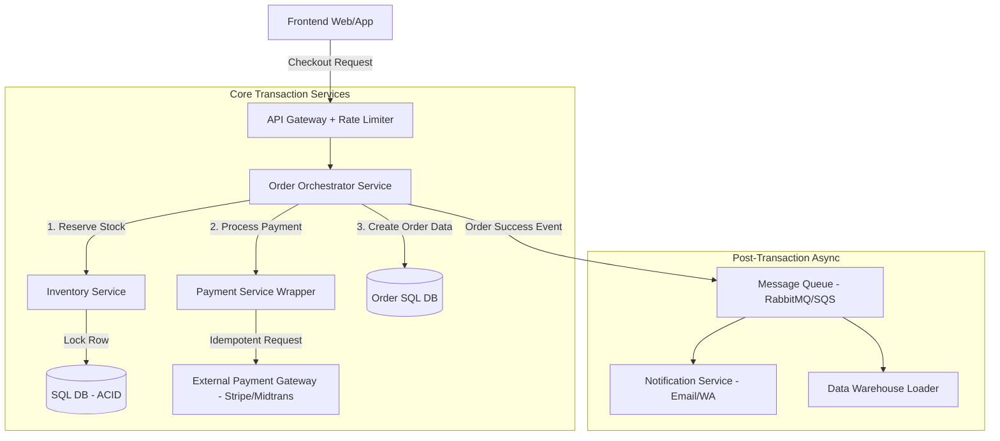

```mermaid
graph TD
    Client[Frontend Web/App] -->|Checkout Request| APIGW[API Gateway + Rate Limiter]

    subgraph "Core Transaction Services"
        APIGW --> OrderSvc[Order Orchestrator Service]
        OrderSvc -->|1. Reserve Stock| InventorySvc[Inventory Service]
        InventorySvc -->|Lock Row| InventoryDB[(SQL DB - ACID)]

        OrderSvc -->|2. Process Payment| PaymentSvc[Payment Service Wrapper]
        PaymentSvc -->|Idempotent Request| 3rdPartyPG[External Payment Gateway - Stripe/Midtrans]

        OrderSvc -->|3. Create Order Data| OrderDB[(Order SQL DB)]
    end

    subgraph "Post-Transaction Async"
        OrderSvc -->|Order Success Event| MQ[Message Queue - RabbitMQ/SQS]
        MQ --> NotifSvc[Notification Service - Email/WA]
        MQ --> AnalyticsSvc[Data Warehouse Loader]
    end
```
