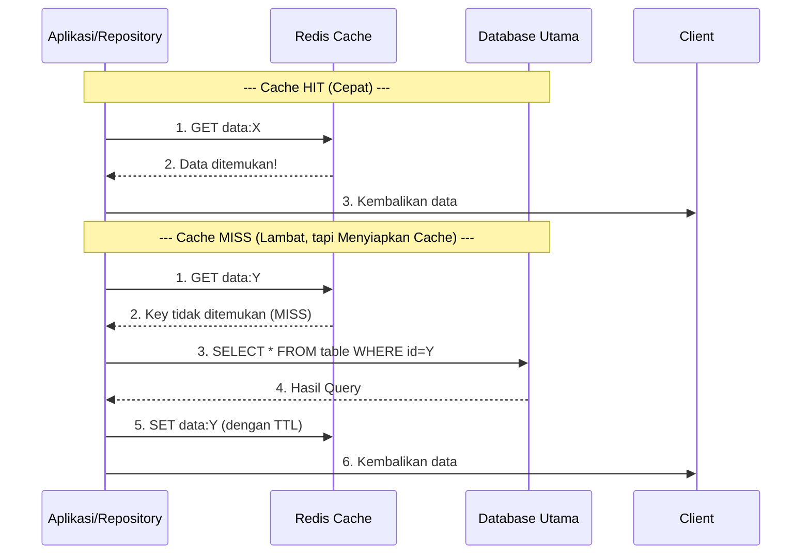
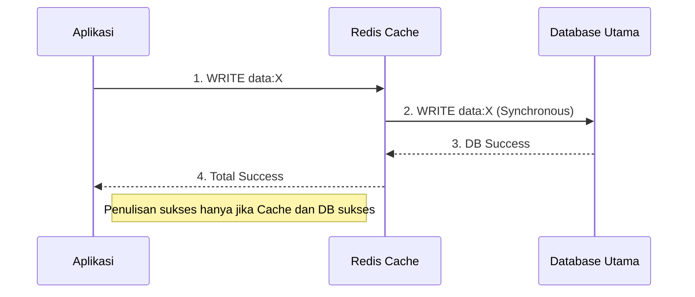
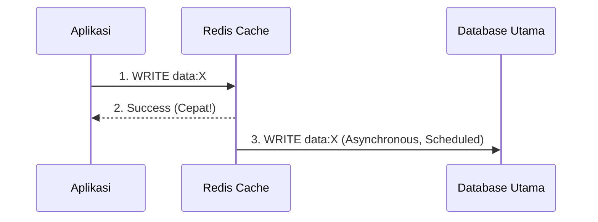

# **Caching**
##### Write by: Adrian Milano

## **Cache-Aside Pattern (Lazy Loading)**

Cache-Aside Pattern adalah strategi di mana aplikasi (bukan cache itu sendiri) yang bertanggung jawab untuk mengelola data di cache (misalnya, Redis) dan menjaga konsistensinya dengan database utama (misalnya, PostgreSQL).

**Tujuan Utama**

Mengurangi latency dan beban pada database utama dengan melayani data yang sering diminta langsung dari memori cache.

1. **Alur Kerja (READ Operation)**

Ini adalah alur di mana aplikasi Anda membaca data:
1. Aplikasi Cek Cache: Layanan Anda menerima permintaan data dan pertama-tama memeriksa Cache (Redis) untuk key yang relevan.
2. Cache HIT: Jika data ditemukan, aplikasi langsung mengembalikan data dari cache ke klien. (Sangat Cepat!)
3. Cache MISS: Jika data tidak ditemukan, aplikasi melakukan hal berikut:
    - Read from DB: Mengambil data dari Database Utama.
    - Write to Cache: Menyimpan data yang baru diambil tersebut ke dalam cache (dengan TTL yang ditetapkan).
    - Return to Client: Mengembalikan data ke klien.

2. **Alur Kerja (WRITE Operation - Cache Invalidation)**

Saat data diubah, strategi yang paling umum digunakan bersama Cache-Aside adalah Cache Invalidation (Penghapusan Cache):
1. Aplikasi Tulis ke DB: Aplikasi melakukan operasi WRITE (INSERT/UPDATE/DELETE) ke Database Utama (untuk menjamin konsistensi data).
2. Aplikasi Hapus Cache: Aplikasi kemudian menghapus (DELETE) key yang relevan dari cache.
3. Lanjutan: Permintaan READ berikutnya untuk key yang sama akan menghasilkan Cache MISS, memaksa aplikasi mengambil data terbaru dari DB, dan menulisnya kembali ke cache (memastikan data yang baru masuk adalah data segar).

**Keuntungan dan Kekurangan**

| Keuntungan | Kekurangan |
|-----------|------------|
| **Simpel & Fleksibel:** Logika caching berada di kode aplikasi, mudah disesuaikan. | **Risiko Data Usang (Stale Data):** Ada jeda antara Write to DB dan Cache Invalidation. Jika invalidation gagal, cache bisa berisi data usang sampai TTL habis. |
| **Resilience:** Jika cache mati, aplikasi tetap jalan (hanya lebih lambat karena semua request ke DB). | **Thundering Herd:** Jika key populer expired, banyak request bersamaan menuju DB dan menyebabkan spike beban. |
| **Hanya Cache Data yang Dibutuhkan:** Tidak membuang memori untuk data yang jarang diakses. | **Latency pada Cache MISS:** Permintaan pertama selalu lambat karena harus membaca dari DB. |

## **Write-Through dan Write-Back**

Kedua pola ini berbeda dari Cache-Aside karena cache berpartisipasi langsung dalam operasi penulisan data.

1. **Write-Through (Konsistensi Kuat)**

Write-Through adalah pola di mana data ditulis ke cache dan database utama secara sinkron dan bersamaan dalam satu operasi.

**Alur Kerja (WRITE Operation)**
1. Aplikasi Tulis ke Cache: Layanan Anda mengirim perintah WRITE (Update/Insert) ke Cache (misalnya, Redis).
2. Cache Tulis ke DB: Cache yang bertanggung jawab untuk memastikan data yang sama juga ditulis ke Database Utama.
3. Acknowledge: Aplikasi hanya menerima respons sukses setelah kedua operasi (ke Cache dan DB) berhasil diselesaikan.

**Pro vs Kontra**

| Keuntungan | Kekurangan |
|------------|------------|
| **Konsistensi Kuat:** Data di cache dan DB selalu sinkron setelah penulisan. | **Latency Tinggi:** Operasi WRITE lebih lambat karena harus menunggu dua operasi I/O jaringan. |
| **Data Durability:** Data dijamin sudah ada di storage utama (DB). | **Overhead:** Setiap WRITE membebani cache dan DB secara langsung. |

2. **Write-Back (Performa Tinggi)**

Write-Back (sering disebut Write-Behind) adalah pola yang mengutamakan performa penulisan dengan mengorbankan sedikit durability dan konsistensi.

______________________________
**Alur Kerja (WRITE Operation)**
1. Aplikasi Tulis ke Cache: Layanan Anda mengirim perintah WRITE ke Cache.
2. Acknowledge Cepat: Cache segera mengirim respons sukses kembali ke aplikasi. (Cepat!)
3. Penulisan Asinkron: Cache menyimpan data yang dimodifikasi (dirty data) di memorinya dan secara asinkron (nanti) menulis data tersebut ke Database Utama.

______________________________
**Pro vs Kontra**

| Keuntungan | Kekurangan |
|------------|------------|
| **Latency WRITE Rendah:** Performa sangat tinggi karena aplikasi tidak menunggu I/O DB. | **Risiko Kehilangan Data:** Jika cache mati sebelum data dirty sempat ditulis ke DB, data hilang. |
| **I/O Batching:** Cache dapat mengelompokkan banyak WRITE menjadi satu operasi DB besar (batch write), menghemat I/O DB. | **Kompleksitas:** Membutuhkan mekanisme recovery kompleks untuk menangani kegagalan cache. |

3. **Perbandingan di Konteks Sistem Pembayaran**

| Pola         | Kapan Digunakan?                                                | Contoh Skenario                                      |
|--------------|------------------------------------------------------------------|--------------------------------------------------------|
| **Write-Through** | Data harus konsisten dan tahan lama.                             | Data Konfigurasi: Pengaturan sistem kritikal.         |
| **Write-Back**    | Performa penulisan sangat kritikal, dan kehilangan data jangka pendek dapat ditoleransi. | Sesi Pengguna (Session Data): Jika sesi hilang, pengguna hanya perlu login lagi. |
| **Cache-Aside**   | Dominan READ-Heavy, penulisan ditangani dengan Invalidation. | Data Profil/Produk: Paling umum di Microservices.     |

## **TTL (Time To Live): Strategi Pasif**

TTL (Time To Live) adalah durasi waktu yang ditetapkan pada data di cache, setelahnya data tersebut dianggap usang (stale) dan akan dihapus (atau ditandai untuk dihapus) secara otomatis oleh cache (misalnya, Redis).

______________________________
**Tujuan TTL**
1. Manajemen Memori: Memastikan data lama yang tidak lagi diakses akan dihapus secara otomatis, menjaga memori cache tetap efisien.
2. Jaminan Kesegaran (Eventual Freshness): Data akan disegarkan setidaknya setelah periode TTL berakhir.

______________________________
**Trade-off Kritis**

| Durasi TTL            | Kinerja (Performance)                             | Konsistensi (Consistency)                 |
|-----------------------|---------------------------------------------------|--------------------------------------------|
| **Pendek (1–5 menit)** | Lebih rendah (lebih sering Cache MISS).           | Lebih tinggi (data lebih cepat segar).     |
| **Panjang (1 jam+)**   | Lebih tinggi (lebih banyak Cache HIT).            | Lebih rendah (data bisa usang lebih lama). |

Keputusan TTL tidak hanya teknis, tetapi juga bisnis. Apakah pengguna dapat mentolerir melihat stok lama selama 5 menit? Jika ya, gunakan TTL panjang. Jika data harus real-time (misalnya, saldo bank), TTL harus sangat pendek atau menggunakan invalidation segera.

______________________________
**Invalidation Strategy: Strategi Aktif**

Invalidation Strategy adalah mekanisme aktif yang digunakan aplikasi untuk menghapus data dari cache segera setelah data tersebut diubah di database utama. Tujuannya adalah meminimalkan risiko stale data.

Ada dua strategi utama untuk Invalidasi:

**1. TTL-Based Invalidation (Strategi Pasif)**
- Mekanisme: Mengandalkan sepenuhnya pada TTL. Aplikasi tidak melakukan apa-apa saat penulisan, membiarkan data di cache usang sampai waktu TTL-nya berakhir.
- Kapan Digunakan: Untuk data yang jarang berubah dan konsistensi instan tidak penting (misalnya, daftar kategori produk yang di-update seminggu sekali).

**2. Event-Based Invalidation (Strategi Aktif / Write-Through/Back)**

Ini adalah praktik terbaik untuk menjaga konsistensi pada data yang sering diubah (seperti profil user, inventaris, atau status pembayaran).

A. Direct Invalidation (Pola Umum)
- Mekanisme: Aplikasi menulis ke DB, dan segera setelah itu mengeluarkan perintah `DELETE` ke cache untuk key yang baru saja diubah.
- Digunakan pada: Pola Cache-Aside.

B. Message-Based Invalidation (Microservices Best Practice)
- Mekanisme: Paling scalable di arsitektur Microservices (EDA).
    - Producer (Service A): Menulis data ke DB.
    - Producer: Mengirim Event (misalnya, `USER_UPDATED`) ke Message Broker (Kafka/RabbitMQ).
    - Consumer (Cache Invalidation Service): Menerima event dan, sebagai reaksinya, mengeluarkan perintah `DELETE` ke cache.
- Keuntungan:
    - Decoupling: Service yang menulis (Producer) tidak perlu tahu detail implementasi caching di layanan lain.
    - Resilience: Jika layanan cache mengalami timeout, event masih ada di Broker dan dapat dicoba lagi (retry) nanti.

______________________________
**Isu Kritis: Race Condition**

Pada strategi Direct Invalidation, selalu ada risiko Race Condition antara WRITE dan DELETE:

1. Service A WRITE ke DB.
2. Service B melakukan READ MISS (mengambil data lama dari DB).
3. Service B WRITE data lama ke Cache.
4. Service A melakukan DELETE ke Cache.

Hasil Akhir: Data segar ada di DB, tapi Cache salah menghapus data lama yang baru saja dimasukkan (data usang tetap ada).

Menerapkan **Global Lock** pada key yang sedang di-update, atau menggunakan pola yang lebih kompleks seperti Read-Through/Write-Through yang mengelola lock ini secara internal.

## **Redis Use Cases (Beyond Basic Caching)**

**1. Reduce DB Reads (Caching)**

Ini adalah peran paling umum dari Redis, yang secara langsung berkaitan dengan pola Cache-Aside dan Write-Through yang telah kita bahas.
- Tujuan: Mengalihkan sebagian besar beban READ dari slow-storage (Database) ke fast-storage (In-Memory Cache) untuk meningkatkan latency dan menurunkan biaya operasional DB.
- Cara Kerja:
    - Pola: Cache-Aside (Lazy Loading) di lapisan Repository.
    - Data Structure: Biasanya String (untuk menyimpan objek JSON utuh) atau Hash (untuk menyimpan struct yang kompleks).
    - Strategi: Terapkan TTL yang sesuai dan Cache Invalidation yang aktif (menghapus key terkait saat data di DB berubah) untuk menjaga kesegaran data.
- Contoh Implementasi: Memuat data profil user, daftar produk terpopuler, atau hasil query yang mahal.

**2. Session Store (Penyimpanan Sesi)**

Ini adalah use case fundamental untuk membuat layanan backend Anda stateless (tanpa status), yang sangat penting untuk Horizontal Scaling di belakang Load Balancer atau API Gateway.
- Tujuan: Memindahkan data sesi pengguna dari memori server (local memory) atau dari DB utama ke penyimpanan yang terpusat dan sangat cepat.
- Masalah yang Dipecahkan: Jika data sesi disimpan secara lokal di Server A, ketika request berikutnya diarahkan ke Server B oleh Load Balancer, Server B tidak akan mengenali sesi tersebut (error).
- Cara Kerja:
    - Mekanisme: Ketika user login, token (atau Session ID) diberikan ke client. Data payload sesi (misalnya, `user_id`, `roles`, `expiry`) disimpan di Redis menggunakan token sebagai Key.
    - Data Structure: String atau Hash.
    - Strategi: Gunakan perintah `SETEX` (Set with Expiration) di Redis. TTL Redis diatur sama persis dengan waktu kedaluwarsa sesi (misalnya, 2 jam). Ketika sesi habis, Redis secara otomatis menghapusnya.

**3. Rate Limiting (Pembatasan Tingkat Permintaan)**

Digunakan untuk melindungi layanan backend Anda dari penyalahgunaan, serangan Denial of Service (DoS), atau klien yang berperilaku buruk. Ini adalah fungsi yang sering didelegasikan ke API Gateway.
- Tujuan: Membatasi jumlah request yang diizinkan dari user atau IP tertentu dalam jangka waktu tertentu (misalnya, 100 requests/menit).
- Masalah yang Dipecahkan: Mencegah satu client memonopoli sumber daya sistem (CPU, DB Connections).
- Cara Kerja (Fixed Window Algorithm):
    - Key: Tentukan key berdasarkan ID user atau IP (`rate:limit:user:123`).
    - Hitung: Gunakan perintah Redis `INCR` (Increment). Perintah ini secara atomic (aman dari race condition) menambah nilai key tersebut.
    - Batasi Waktu: Set TTL pada key sama dengan ukuran jendela waktu (misalnya, 60 detik).
    - Blokir: Jika nilai key setelah `INCR` melebihi batas (misalnya, 100), request diblokir dan dikembalikan kode HTTP 429 Too Many Requests.

Ini memastikan bahwa penghitungan request tetap konsisten di seluruh instance API Gateway Anda, karena Redis bertindak sebagai central counter yang terpercaya.