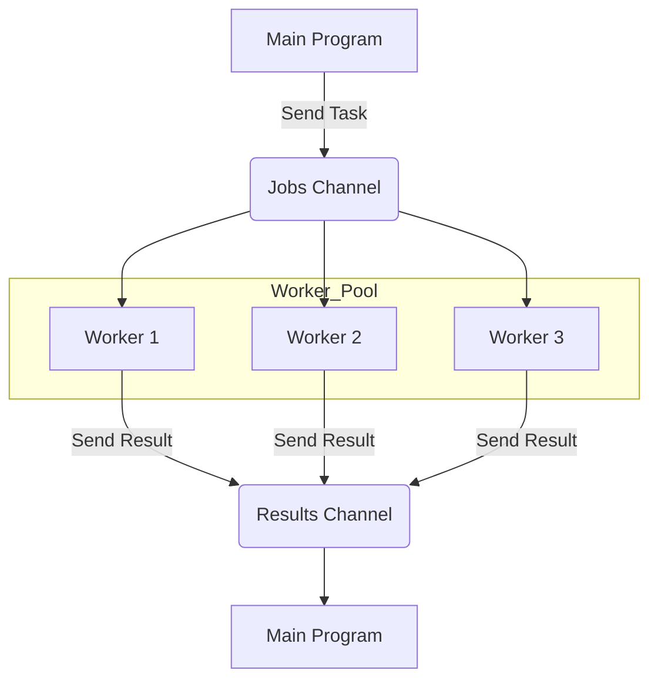
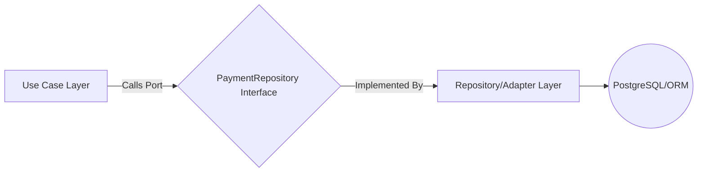

# **GOLANG**

Ref: [Uber Go Guide](https://github.com/stanleydv12/uber-go-guide-id)

## **Clean Architecture (Hexagonal / Onion)**

Clean Architecture (atau sering disebut Hexagonal, Onion, atau Ports and Adapters) adalah filosofi desain yang menekankan pemisahan kekhawatiran (separation of concerns) dengan membuat aturan dependensi yang ketat.

Tujuan utamanya adalah memastikan bahwa aturan bisnis inti (Domain/Core) sistem Anda tidak tergantung pada detail implementasi luar, seperti database, framework UI, atau library pihak ketiga.

**Prinsip Inti: Aturan Dependensi (Dependency Rule)**
Aturan yang paling penting adalah: Kode luar harus bergantung pada kode dalam, BUKAN sebaliknya.

Ini berarti:
1. Framework/Database bergantung pada Use Cases.
2. Use Cases bergantung pada Entities (Domain).
3. Entities (inti) tidak bergantung pada apa pun yang ada di luar.

Intinya, panah dependensi harus selalu menunjuk ke dalam (ke arah inti).

**Layer/Ring Utama**

Arsitektur ini biasanya dipecah menjadi beberapa lapisan konsentris, dengan lapisan inti adalah logika bisnis murni.
| **Lapisan (Ring)**            | **Tugas Utama**                                                                                                   | **Dependensi**                                         | **Golang Konteks**                                       |
|------------------------------|--------------------------------------------------------------------------------------------------------------------|---------------------------------------------------------|-----------------------------------------------------------|
| **1. Entities / Domain Core** | Berisi *Enterprise Business Rules*. Objek dengan aturan bisnis paling stabil (misal Payment, User).               | Tidak ada (murni Go/Logika).                           | Struct Go murni, metode, dan tipe data.                  |
| **2. Use Cases / Application**| Berisi *Application Business Rules*. Logika spesifik aplikasi (misal CreatePaymentUseCase, LoginUseCase).        | Entities dan Interfaces (Ports).                       | Implementasi interfaces dari layer Domain.               |
| **3. Interface Adapters**     | Adapter yang mengubah data dari format eksternal ke internal dan sebaliknya.                                     | Bergantung pada Use Cases.                             | Controller (gRPC/REST), Repository Interfaces, Presenters. |
| **4. Frameworks & Devices**   | Lapisan terluar. Semua detail implementasi (database, web server, UI, tools).                                    | Bergantung pada Interface Adapters.                    | Gin/Echo, GORM/SQL driver, Logrus/Zap.                   |

**Konsep Penting Go: Ports and Adapters (Hexagonal)**

Konsep Hexagonal (sering disamakan dengan Clean Architecture) menekankan penggunaan Interfaces yang disebut Ports di layer Use Cases.
1. Port (Interface):
    - Didefinisikan di layer Use Cases/Application.
    - Contoh: `type PaymentRepository interface { Save(p Payment) error }`
    - Use Case (Core) TIDAK TAHU bagaimana data disimpan, ia hanya tahu ia butuh metode `Save`.
2. Adapter (Implementasi):
    - Didefinisikan di layer Frameworks/Adapters.
    - Contoh: `type PostgreSQLAdapter struct { db *sql.DB }` yang mengimplementasikan `PaymentRepository`.
    - Adapter berfungsi sebagai jembatan antara dunia luar (PostgreSQL) dan dunia dalam (Use Case).

**Mengapa Cocok untuk Golang?**
1. Explicit Dependency Inversion: Golang secara alami mendorong penggunaan Interfaces. Clean Architecture memformalkan penggunaan interfaces ini untuk membalikkan dependensi, sesuai dengan Prinsip Inversi Dependensi (DIP).
2. Testability: Inti (Use Cases) dapat diuji 100% tanpa perlu mocking database, HTTP server, atau file sistem, karena semua dependensi eksternal diganti dengan mock interface.
3. Performance: Logika bisnis inti tetap ringan dan tidak terbebani oleh overhead framework berat.


## **Concurrency**

Go dirancang dengan filosofi **"Don't communicate by sharing memory; share memory by communicating"**. Filosofi ini diwujudkan melalui Goroutine dan Channel.

1. **Goroutine (Unit Concurrency)**

Goroutine adalah fungsi yang berjalan secara bersamaan dengan fungsi lain. Mereka adalah setara dengan threads di bahasa lain, tetapi jauh lebih ringan dan dikelola oleh runtime Go.
- Apa itu: Goroutine adalah fungsi ringan yang dieksekusi secara konkuren.
- Ukuran: Goroutine dimulai hanya dengan stack beberapa kilobyte (biasanya 2KB), sedangkan thread OS biasanya membutuhkan 1MB. Ini memungkinkan aplikasi Go menjalankan ratusan ribu Goroutine secara efisien.
- Implementasi: Dibuat hanya dengan menambahkan keyword go di depan pemanggilan fungsi.
- Multiplexing: Go runtime secara otomatis memetakan Goroutine ke sejumlah kecil thread OS (biasanya sama dengan jumlah core CPU Anda, diatur oleh GOMAXPROCS).

```c
package main

import (
    "fmt"
    "time"
)

func cetak(s string) {
    for i := 0; i < 3; i++ {
        time.Sleep(100 * time.Millisecond)
        fmt.Println(s)
    }
}

func main() {
    // Goroutine berjalan secara konkuren
    go cetak("Dunia") 
    
    // Fungsi utama (Main Goroutine)
    cetak("Halo") 
    
    // Menunggu sedikit agar Goroutine selesai
    time.Sleep(1 * time.Second)
}
```
2. **Channel (Jalur Komunikasi)**

Channel adalah mekanisme komunikasi utama antara Goroutine. Channel memungkinkan Goroutine untuk mengirim dan menerima nilai secara aman, mencegah race condition yang sering terjadi saat berbagi memori (mutex/lock).
- Apa itu: Channel adalah pipe (pipa) tempat Anda dapat mengirim nilai dari satu Goroutine dan menerimanya di Goroutine lain.
- Sifat: Channel adalah tipe pertama di Go, dan mereka memiliki behavior bawaan untuk blocking (pemblokiran) yang sinkron.

| **Jenis Channel** | **Deskripsi**                                                   | **Kapan Blokir?**                                                         |
|-------------------|-----------------------------------------------------------------|---------------------------------------------------------------------------|
| **Unbuffered**    | Channel tanpa kapasitas. Hanya bisa mengirim jika ada penerima. | Pengirim memblokir sampai ada penerima, dan penerima memblokir sampai ada pengirim. |
| **Buffered**      | Channel dengan kapasitas tetap (N).                             | Pengirim memblokir jika buffer penuh. Penerima memblokir jika buffer kosong. |


```c
// Membuat channel unbuffered
pesan := make(chan string) 

go func() {
    // Mengirim ke channel. Blokir sampai ada penerima.
    pesan <- "Selesai memproses" 
}()

// Menerima dari channel. Blokir sampai ada pengirim.
hasil := <-pesan 
fmt.Println(hasil) // Output: Selesai memproses
```

3. **Worker Pool (Pola Implementasi Concurrency Terkontrol)**

Worker Pool adalah pola desain yang menggunakan Goroutine dan Channel untuk membatasi dan mengelola jumlah operasi bersamaan (concurrency) untuk tugas-tugas yang berat.
- Masalah yang Dipecahkan: Mencegah resource exhaustion (habisnya sumber daya, seperti RAM atau koneksi database) jika terlalu banyak tugas berat yang dijalankan secara bersamaan.
- Cara Kerja (Pola):
    - Dua Channel dibuat: `jobs` (untuk mengirim tugas) dan `results` (untuk menerima hasil).
    - Sejumlah kecil Worker Goroutine (misalnya, 5) diluncurkan. Ini adalah Pool itu sendiri.
    - Setiap Worker berulang kali menerima tugas dari channel `jobs` dan mengirimkan hasil ke channel `results`.
    - Fungsi utama mengirim semua tugas ke channel `jobs` dan kemudian mengumpulkan semua hasil dari channel `results`.



Pola Worker Pool di Go adalah cara paling efektif untuk mengontrol tingkat concurrency (misalnya, hanya 10 permintaan HTTP eksternal yang diizinkan berjalan sekaligus) untuk melindungi layanan pihak ketiga dari kelebihan beban, yang merupakan aplikasi nyata dari Circuit Breaker dan Rate Limiting di sisi klien (seperti yang kita bahas sebelumnya).

## **Golang Best Practices**
1. **`context` (Paket `context`)**

Paket `context` adalah alat penting untuk mengelola batas waktu (timeout), pembatalan (cancellation), dan nilai antar-Goroutine di aplikasi Go.
- Tujuan Utama: Mengelola lifecycle (siklus hidup) sebuah permintaan. Ini memastikan bahwa ketika sebuah request dibatalkan oleh client (misalnya, client menutup browser), Goroutine yang mengerjakan tugas tersebut juga dihentikan, sehingga mencegah resource leak.
- Penggunaan: Argumen `context.Context` harus menjadi argumen pertama di setiap fungsi yang berada di jalur request (misalnya, di Controller, Use Case, dan Repository).

```c
func (s *UserService) GetUser(ctx context.Context, id int) (*User, error) {
    // Di sini, Anda bisa cek ctx.Done() untuk melihat apakah
    // permintaan telah dibatalkan oleh klien (atau timeout).
    
    // Meneruskan context ke layer berikutnya (Repository)
    user, err := s.repo.FindByID(ctx, id) 
    
    // ...
}
```
- Penting untuk Senior: context adalah mekanisme standar untuk pembatalan propagasi pada arsitektur Microservices, bahkan saat melakukan panggilan HTTP/gRPC ke layanan lain.

2. **Error Wrapping (`errors` Package)**

Go modern mendorong pola Error Wrapping alih-alih sekadar mengembalikan string error. Ini memberikan konteks dan memfasilitasi penanganan error yang lebih cerdas.
- Masalah Lama: return `errors.New("database error: record not found")` — Ini adalah string mati yang sulit diolah.
- Error Wrapping: Menggunakan `fmt.Errorf` dengan verb `%w` (wrap). Ini membungkus error yang lebih rendah (inner error) ke dalam error baru yang lebih tinggi (outer error).
```c
// Di layer Repository
err := db.QueryRow("SELECT ...")
if err != nil {
    // Wrap error asli dari driver DB
    return fmt.Errorf("repository: failed to find user %d: %w", id, err) 
}
```
- Penanganan Cerdas: Di layer Controller/Middleware, Anda dapat menggunakan:
    - `errors.Is()`: Membandingkan error dengan nilai sentinel (misalnya, `errors.Is(err, sql.ErrNoRows)`). Berguna untuk logika.
    - `errors.As()`: Mengekstrak error ke tipe error spesifik (misalnya, error validasi kustom).
    - `errors.Unwrap()`: Mengambil error lapisan dalam
- Manfaat: Memungkinkan log yang kaya konteks (context-rich logging) di layer luar, sambil tetap mempertahankan tipe error asli untuk logika di layer dalam.

3. **Interface Segregation Principle (ISP)**

ISP adalah prinsip dari SOLID, yang menyatakan bahwa klien seharusnya tidak dipaksa untuk bergantung pada antarmuka (interface) yang tidak mereka gunakan.
- Pola Pikir: Lebih baik memiliki banyak antarmuka kecil dan spesifik daripada satu antarmuka besar yang gemuk (fat interface).
- Di Golang: Sering disebut sebagai "Interfaces belong on the consumer side" (Interface milik sisi yang mengonsumsi/membutuhkan).
- Contoh Buruk (Fat Interface):
```c
type Repository interface {
    Create(data interface{}) error // Dipakai
    Update(data interface{}) error // Dipakai
    Delete(id int) error           // Tidak dipakai di Use Case ini
    AuditLog(msg string) error     // Tidak dipakai
}
```
- Contoh Baik (Segregated Interfaces - Sesuai ISP):
```c
// Interface ini didefinisikan di layer Use Case (Consumer)
type UserCreator interface {
    Create(user User) error
}

type UserDeleter interface {
    Delete(id int) error
}

// Service yang menggunakannya hanya bergantung pada yang dibutuhkan
func NewUserCreateUseCase(creator UserCreator) *UserCreateUseCase {
    // ...
}
```
- Manfaat: Mendorong Loose Coupling (keterkaitan longgar) dan mempermudah mocking untuk unit testing. Anda hanya perlu membuat mock untuk metode yang benar-benar digunakan oleh Use Case Anda. Ini sangat penting untuk implementasi Clean Architecture (Ports and Adapters).

## **REST API**

Saat membangun REST API di Go, best practice adalah menggunakan framework ringan (bukan full-stack framework) untuk menangani lapisan Interface Adapters (Controller/Handler) dari Clean Architecture Anda.

1. **Peran Framework**

Dalam konteks Clean Architecture (yang sudah kita bahas), framework seperti Gin atau Echo berada di lapisan paling luar: Frameworks & Devices. Tugas mereka adalah:

    1. Routing: Memetakan path URL (`/payments/:id`) ke fungsi Handler.
    2. Request Binding: Mengambil JSON/Form data dari request dan memetakannya ke struct Go.
    3. Middleware: Menjalankan fungsi sebelum/sesudah Handler (misalnya, Logging, CORS, Authentication).
    4. Response Handling: Mengirim respons JSON/XML yang mudah.

 
2. **Memilih Framework: Ringan, Cepat, dan Konkuren**

| Framework | Kecepatan & Filosofi | Kelebihan Utama |
|----------|------------------------|------------------|
| **Gin** | Sangat populer dan high-performance. Ringan, berbasis tree routing. | Sangat stabil, banyak middleware siap pakai, template engine dasar. |
| **Echo** | Cepat, minimalis, dan fleksibel. Cocok untuk proyek Clean Architecture. | API yang rapi, middleware modular, zero allocation untuk JSON. |
| **Fiber** | Sangat cepat. Dibangun di atas Fasthttp, bukan net/http Go. | Kecepatan eksekusi yang superior, sintaks mirip Express.js (Node.js). |


Walaupun Fiber lebih cepat dalam *benchmark* mentah, Gin dan Echo lebih sering digunakan karena kompatibel dengan paket net/http standar Go, termasuk paket context, sehingga lebih mudah diintegrasikan dengan third-party libraries dan OpenTelemetry Tracing.

3. **Implementasi: Menghubungkan Handler ke Use Case**

Ini adalah bagian paling penting dalam Clean Architecture: Handler TIDAK boleh berisi logika bisnis (Use Case).

**Contoh Handler (Gin/Echo/Fiber)**

Misalnya Anda memiliki Use Case di layer Application (`paymentService`):
```c
// 1. Layer Application (Use Case/Service)
type PaymentService struct { /* dependencies... */ }

func (s *PaymentService) ProcessPayment(amount float64) error {
    // Logika Bisnis inti ada di sini
    if amount < 1.0 {
        return errors.New("payment amount too low")
    }
    // ... panggil Repository
    return nil 
}
```

**Controller/Handler (Layer Interface Adapters):**
```c
// 2. Layer Interface Adapters (Handler/Controller)

// Handler memiliki dependency ke Use Case
type PaymentHandler struct {
    service *PaymentService 
}

// Handler function (menggunakan Gin/Echo/Fiber context)
func (h *PaymentHandler) HandleProcessPayment(c *gin.Context) {
    // 1. Terima Request (Binding/Decoding)
    var reqData struct {
        Amount float64 `json:"amount"`
    }
    if err := c.BindJSON(&reqData); err != nil {
        c.JSON(400, gin.H{"error": "Invalid request"})
        return
    }

    // 2. Panggil Use Case (Hanya Meneruskan Tugas)
    // Penting: Meneruskan Context!
    ctx := c.Request.Context() 
    err := h.service.ProcessPayment(ctx, reqData.Amount) 

    // 3. Respon
    if err != nil {
        // Penanganan error wrapping di sini
        if errors.Is(err, errors.New("payment amount too low")) {
             c.JSON(400, gin.H{"error": err.Error()})
             return
        }
        c.JSON(500, gin.H{"error": "Internal Server Error"})
        return
    }

    c.JSON(200, gin.H{"message": "Payment processed"})
}
```

4. **Best Practice Khusus Framework (Middleware)**
- Authentication Middleware: Gunakan middleware framework (misalnya, `gin.Use(authMiddleware)`) untuk memverifikasi JWT Token sebelum request mencapai `HandleProcessPayment`. Ini mewujudkan peran API Gateway yang kita bahas.
- Logging & Tracing: Gunakan middleware OTel/Tracing (misalnya, `otelgin` untuk Gin) agar setiap *request* yang masuk secara otomatis membuat Trace ID baru, memungkinkan Distributed Tracing di layer terluar.
- Context Propagation: Pastikan Anda selalu menggunakan `c.Request.Context()` dan meneruskannya ke layer Use Case dan Repository untuk mendukung timeout dan cancellation (membuktikan pemahaman Anda tentang paket `context`).

## **Database Layer: Repository Pattern**

Repository Pattern adalah best practice untuk mengisolasi logika bisnis (Use Cases) dari detail basis data (PostgreSQL, MongoDB, dll.).

1. **Peran di Clean Architecture**

Seperti yang kita bahas, Database Layer adalah Adapter yang mengimplementasikan Port (Interface) yang didefinisikan di layer Application/Use Cases.


- Port (Interface): Didefinisikan di `domain/payment_repository.go`
- Adapter (Implementation): Didefinisikan di `infrastructure/repository/postgres_repository.go`.

2. **Implementasi di Golang: Driver vs. ORM**
A. SQL Driver Murni (Paket `database/sql`)
- Mekanisme: Menggunakan paket bawaan Go, `database/sql`, bersama dengan driver spesifik (misalnya, pq untuk PostgreSQL). Anda harus menulis SQL mentah (raw SQL) dan secara manual memetakan (scanning) hasil baris ke struct Go.
- Keuntungan: Kontrol penuh terhadap query, kinerja superior, dan tidak ada magic (mudah di-debug). Ini adalah pilihan ideal untuk query yang sangat kompleks atau kritis kinerja.
- Kekurangan: Lebih verbose (panjang), membutuhkan lebih banyak kode boilerplate (berulang) untuk CRUD dasar.

B. ORM/Query Builder (Object-Relational Mapping)
- Mekanisme: Menggunakan library pihak ketiga yang memungkinkan Anda berinteraksi dengan database menggunakan objek/metode Go alih-alih SQL.
- Contoh: GORM, sqlx, Bun.
- Keuntungan: Lebih cepat untuk implementasi CRUD dasar, mengurangi kode boilerplate, dan menyederhanakan migrasi.
- Kekurangan: Potensi latency karena overhead ORM, dan terkadang menghasilkan SQL yang kurang efisien (N+1 query problem).

Gunakan SQL Driver Murni atau sqlx (Query Builder ringan) untuk query yang paling kritis, dan gunakan ORM seperti GORM hanya untuk CRUD sederhana jika kecepatan pengembangan diprioritaskan.

3. **Pentingnya Context dan Error Wrapping**

Seperti yang sudah dibahas di Best Practices:
- `context.Context`: Harus diteruskan ke setiap metode Repository (e.g., `repo.FindByID(ctx, id)`). Ini memungkinkan pembatalan query (query cancellation) jika permintaan klien timeout atau dibatalkan, menghemat sumber daya database.
- Error Wrapping: Selalu wrap error driver database asli. Misalnya, jika PostgreSQL mengembalikan `No Rows Found`, Repository harus mengubahnya menjadi `repo.ErrNotFound` kustom (atau sejenisnya) sebelum dikembalikan ke Use Case.

4. **Database Transactions**

Untuk operasi yang melibatkan beberapa langkah penulisan data yang harus bersifat Atomic (semuanya sukses atau semuanya gagal, seperti transfer uang), Database Transaction harus diimplementasikan di layer Repository.
```c
// Contoh Pola Transaksi di Repository
func (r *PostgresRepo) Transfer(ctx context.Context, fromID, toID int, amount float64) error {
    tx, err := r.db.BeginTx(ctx, nil)
    if err != nil {
        return err
    }
    
    // Defer rollback, jika commit gagal, ini akan dipanggil
    defer func() {
        if r := recover(); r != nil {
            tx.Rollback() 
            panic(r)
        } else if err != nil {
            tx.Rollback()
        }
    }()

    // 1. Kurangi saldo 'fromID'
    _, err = tx.ExecContext(ctx, "UPDATE accounts SET balance = balance - $1 WHERE id = $2", amount, fromID)
    // ... check error

    // 2. Tambah saldo 'toID'
    _, err = tx.ExecContext(ctx, "UPDATE accounts SET balance = balance + $1 WHERE id = $2", amount, toID)
    // ... check error
    
    // Jika semua sukses:
    return tx.Commit() 
}
```
Implementasi yang benar menjamin ACID properties (Atomicity, Consistency, Isolation, Durability), yang sangat vital untuk sistem pembayaran.


## **Caching dengan Redis (Strategi & Implementasi)**
1. **Kenapa Redis untuk Caching?**

| Fitur | Deskripsi | Manfaat |
|-------|-----------|----------|
| **In-Memory** | Data disimpan di RAM utama server. | Latency sangat rendah (sub-milidetik), jauh lebih cepat dari database relasional (PostgreSQL). |
| **Data Structures** | Mendukung berbagai tipe data (String, Hash, List, Set, Sorted Set). | Memungkinkan caching yang kompleks (misalnya, leaderboard dengan Sorted Set). |
| **TTL (Time To Live)** | Dapat mengatur waktu kadaluarsa otomatis untuk setiap key. | Sangat ideal untuk caching; data lama akan otomatis dihapus. |
| **Persistence Opsional** | Mendukung RDB Snapshot atau AOF Logging untuk data durability (bisa hidup lagi setelah restart). | Data cache tidak hilang total saat server crash. |

2. **Strategi Caching Utama (The Patterns)**

Ada dua pola utama yang harus Anda pahami saat menggunakan Redis di lapisan Repository atau Use Case:

**A. Cache-Aside (Lazy Loading)**

Ini adalah pola caching yang paling umum dan diterapkan di sisi Application/Repository Layer Anda.

    1. Read Request: Aplikasi (Use Case/Repository) menerima permintaan data.
    2. Check Cache: Aplikasi pertama-tama memeriksa Redis.
    3. Cache HIT: Jika data ditemukan (HIT), langsung kembalikan ke klien. Selesai (cepat)!
    4. Cache MISS: Jika data tidak ditemukan (MISS), aplikasi:
        - Ambil data dari Primary Database (PostgreSQL).
        - Simpan data tersebut ke Redis (dengan TTL).
        - Kembalikan data ke klien.

**B. Write-Through (Konsistensi Tinggi)**

Pola ini fokus pada konsistensi data saat terjadi operasi WRITE.

    1. Write Request: Aplikasi menerima permintaan untuk mengubah data.
    2. Write to DB & Cache: Aplikasi secara sinkron menulis data ke Database dan ke Redis sekaligus.
    3. Acknowledge: Setelah keduanya berhasil, kembalikan respons sukses.

Pola yang Lebih Umum untuk Update: Pada praktik modern, pola Cache-Aside sering dipadukan dengan Cache Invalidation (Write-Back) saat terjadi perubahan data. Artinya, saat data di-update di DB, data yang relevan di Redis akan dihapus (DEL key), memaksa Cache MISS pada permintaan berikutnya, yang kemudian memuat ulang data segar dari DB (seperti yang kita bahas di Payment Review Flow).

3. **Implementasi di Golang (Repository Pattern)**

Dalam Clean Architecture, logika Cache-Aside ada di layer Repository/Persistence.
```c
// Contoh Metode Repository (dengan Redis)
type PaymentCacheRepository struct {
    DBClient *sql.DB // Koneksi PostgreSQL
    RDBClient *redis.Client // Koneksi Redis
}

func (r *PaymentCacheRepository) GetPaymentByID(ctx context.Context, id int) (*Payment, error) {
    // 1. Cek Redis (Cache-Aside)
    paymentJSON, err := r.RDBClient.Get(ctx, fmt.Sprintf("payment:%d", id)).Result()
    if err == nil {
        // Cache HIT: Deserialize dan kembalikan (cepat!)
        // ... return Payment struct
    }

    // 2. Cache MISS: Ambil dari DB
    payment, err := r.DBClient.QueryRowContext(ctx, "SELECT ...")
    if err != nil {
        return nil, err
    }

    // 3. Simpan ke Redis untuk permintaan berikutnya
    r.RDBClient.Set(ctx, fmt.Sprintf("payment:%d", id), json.Marshal(payment), 5 * time.Minute) 

    return payment, nil
}
```

4. **Konsistensi**
- Cache Stale (Data Usang): Risiko terbesar dari caching. Data di Redis sudah lama dan tidak sama dengan data di DB. Diatasi dengan TTL yang tepat dan Cache Invalidation (menghapus key yang relevan saat ada operasi WRITE).
- Thundering Herd: Ribuan permintaan Cache MISS terjadi secara bersamaan, membebani DB secara masif. Diatasi dengan lock pada key yang hilang (Single-Flight Pattern di Go) atau menggunakan TTL Jitter (mengacak sedikit waktu TTL).

## **Message Queue (Broker)**

Message Queue berfungsi sebagai perantara (Broker) yang memisahkan aplikasi pengirim (Producer) dari aplikasi penerima (Consumer). Ini adalah fondasi dari komunikasi Asynchronous dalam arsitektur terdistribusi.

| Komponen | Peran | Tools |
|----------|--------|--------|
| **Producer** | Aplikasi yang membuat dan mengirim pesan/event ke Queue/Topic. | Order Service, Payment Service. |
| **Consumer** | Aplikasi yang menerima dan memproses pesan dari Queue/Topic. | Notification Service, Inventory Service. |
| **Queue/Topic** | Tempat penyimpanan pesan sementara. | Antrean di RabbitMQ, Topic di Kafka/NATS. |
| **Broker** | Server yang mengelola Queue/Topic dan pengiriman pesan. | RabbitMQ, Kafka, NATS. |


1. **Producer (Pengirim Pesan)**

Producer adalah aplikasi yang bertugas mencatat bahwa sebuah peristiwa (event) telah terjadi dan mengirimkannya ke Broker.
- Cara Kerja:
    1. Sebuah peristiwa terjadi di Producer (misalnya, `User Created`, `Payment Approved`).
    2. Producer membuat pesan (payload JSON/Binary) yang berisi data peristiwa tersebut.
    3. Producer mengirim pesan ke Queue atau Topic di Broker.
    4. Setelah pesan berhasil dikirim dan diakui (ACK) oleh Broker, tugas Producer selesai. Producer tidak peduli apakah ada Consumer yang online atau tidak (Pola Fire and Forget).
- Contoh di Go: Setelah transaksi di Payment Service sukses, Producer akan menggunakan client library (misalnya, `sarama` untuk Kafka) untuk mengirim pesan `PAYMENT_APPROVED` ke Topic.

2. **Consumer (Penerima Pesan)**

Consumer adalah aplikasi yang secara pasif mendengarkan dan memproses pesan yang masuk di Queue/Topic yang sudah di-subscribe.

- Cara Kerja:
    1. Consumer me-subscribe ke Queue/Topic yang relevan.
    2. Broker mendorong pesan ke Consumer, atau Consumer secara aktif menarik pesan (pull).
    3. Consumer memproses pesan tersebut (misalnya, mengirim email, mengurangi stok, mencatat log).
    4. Setelah pemrosesan sukses, Consumer mengirim Acknowledgement (ACK) kembali ke Broker.
    5. Broker kemudian menghapus pesan tersebut dari antrean (atau menandai offset di Kafka).
- Contoh di Go: Notification Service akan menjadi Consumer. Ia akan memiliki Worker Goroutine yang terus-menerus mendengarkan Topic `PAYMENT_APPROVED`. Ketika pesan tiba, Worker akan memicu fungsi pengiriman email.

3. **Perbandingan Broker Utama**

| Broker        | Filosofi                                           | Pola Utama                                                                 | Durability & Skalabilitas |
|---------------|----------------------------------------------------|----------------------------------------------------------------------------|----------------------------|
| **RabbitMQ**  | Message Queueing (Pesan harus diproses secepatnya). | FIFO (First-In, First-Out), pesan dihapus setelah di-ACK.                 | Baik untuk High Availability dan Task Queue. |
| **Apache Kafka** | Event Streaming (Pesan adalah log yang tidak terhapus). | Topic dan Partitioning. Pesan dibaca berdasarkan Offset (seperti kursor). | Sangat skalabel untuk volume tinggi dan replay data. |
| **NATS**      | High-Performance Messaging (kecepatan & kesederhanaan). | Pub/Sub sederhana, sangat cepat, fokus real-time & telemetry.             | Tidak menyimpan pesan permanen (kecuali NATS Streaming/JetStream). |

Pilih **Kafka** jika Anda perlu menyimpan semua event secara permanen untuk data analysis atau event sourcing. Pilih RabbitMQ jika Anda perlu menjamin pesan yang cepat dikirim dan diproses, cocok untuk Task Queues (seperti Worker Pool).

**Dekoupling & Resilience**

Fungsi utama dari Message Broker adalah Resilience (ketahanan):
- Jika Consumer mati, Producer tetap dapat mengirim pesan ke Broker. Pesan menunggu di antrean sampai Consumer kembali online dan siap memproses.
- Ini menjamin bahwa logika bisnis utama (misalnya, Order Service) tidak gagal hanya karena layanan sekunder (misalnya, Email Service) sedang down.