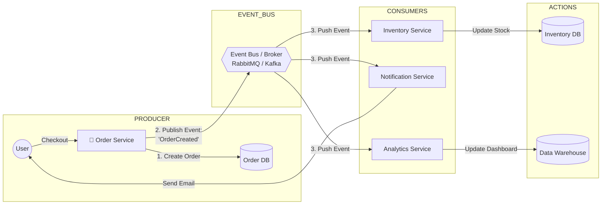
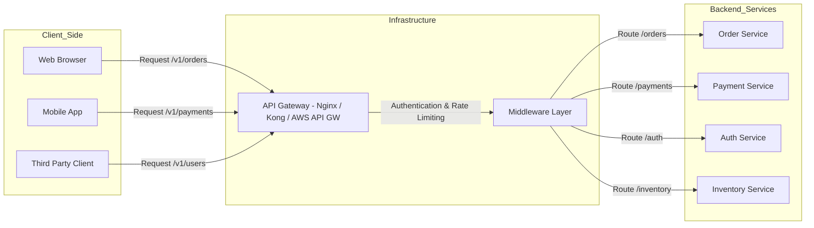
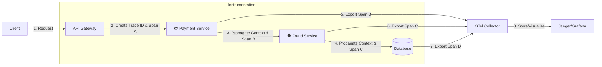
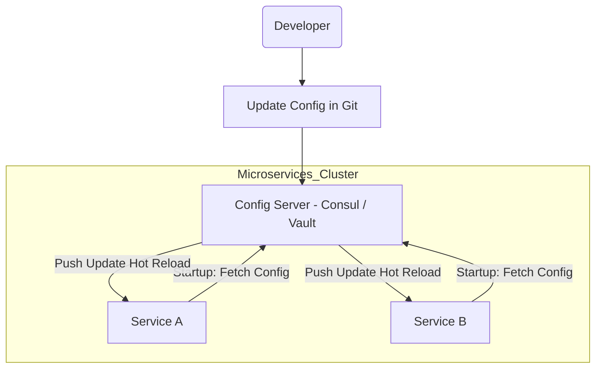

# Microservices
##### Write by: Adrian Milano

## **Service-To-Service Communication**
#### 1. Pola Synchronous (Komunikasi Langsung)
Pola ini melibatkan panggilan langsung dan real-time dari satu layanan ke layanan lain. Layanan pengirim harus menunggu respons sebelum melanjutkan tugasnya.

**Mekanisme**
- **Protokol Utama**: HTTP/HTTPS (sering menggunakan REST atau GraphQL) dan gRPC.
- **Cara Kerja**: Service A menggunakan client library untuk memanggil endpoint (URI) Service B. Komunikasi terjadi melalui jaringan, dan Service A diblokir (blocking) hingga menerima respons atau timeout.

**Kapan Digunakan?**
- **Permintaan Kritis & Real-time**: Ketika layanan pengirim sangat membutuhkan hasil dari layanan penerima untuk menyelesaikan transaksinya.
  - Contoh: `Auth Service` memverifikasi token dari `User Service`.
  - Contoh: `Payment Service` memanggil `Fraud Service` untuk cek risiko sebelum melanjutkan transaksi.
 
**Kelebihan vs Kekurangan**
| Kelebihan                     | Kekurangan                                                                 |
|------------------------------|----------------------------------------------------------------------------|
| Simple dan Langsung: Mudah diimplementasikan dan di-debug. | Tight Coupling: Jika Service B mati, Service A bisa gagal (Cascading Failure). |
| Respon Real-time: Hasil tersedia segera (Latensi rendah). | Scalability Challenge: Layanan yang sering dipanggil menjadi bottleneck (Titik sumbatan). |

#### 2. Pola Asynchronous (Komunikasi Tidak Langsung)
Pola ini menggunakan perantara (Broker) dan biasanya didorong oleh Event-Driven Architecture (EDA) yang baru saja kita bahas. Layanan pengirim tidak perlu menunggu respons.

**Mekanisme**
- **Protokol Utama**: Messaging/Event Streaming (AMQP, Kafka Protocol).
- **Cara Kerja**: Service A (Producer) mengirim pesan/event ke Message Broker (Kafka, RabbitMQ). Broker menyimpan pesan tersebut. Service B (Consumer) mengambil pesan dari Broker sesuai waktunya. Service A dan B tidak pernah berkomunikasi langsung.

**Kapan Digunakan?**
- **Integrasi Long-Running Task**: Untuk tugas yang memakan waktu lama atau tidak mendesak.
  - Contoh: Setelah Order Service membuat pesanan, ia mengirim event `ORDER_CREATED` ke Broker. Layanan lain (Inventory, Email, Data Analytics) mengonsumsi event tersebut.
  - Contoh: Worker Pool mengambil tugas dari Queue.
 
**Kelebihan vs Kekurangan**
| Kelebihan                                                                 | Kekurangan                                                           |
|---------------------------------------------------------------------------|----------------------------------------------------------------------|
| Loose Coupling: Service independen, tidak ada cascading failure jika satu layanan mati. | Eventual Consistency: Data tidak sinkron secara instan.             |
| Resilience: Pesan tetap di Broker meski Consumer mati, memastikan pemrosesan data (data durability). | Debugging Kompleks: Sulit melacak aliran pesan melintasi berbagai layanan. |

## **Event-Driven Architecture**
**Event-Driven Architecture (EDA)** adalah pola arsitektur di mana layanan-layanan (services) dalam sistem berkomunikasi dengan cara memancarkan "Event" (Peristiwa), bukan dengan saling memanggil secara langsung (Direct Request).

**1. Analogi: "Telepon" vs. "Grup WhatsApp"**
- REST API (Request-Response) = Menelepon
  - Service A menelepon Service B: "Halo, tolong update stok dong. Aku tungguin ya di telepon sampai kamu selesai."
  - Masalah: Kalau Service B sibuk atau mati, Service A ikutan macet (nunggu/timeout). Mereka Coupled (saling terikat erat).
- Event-Driven Architecture = Chat di Grup WhatsApp
  - Service A mengirim pesan ke Grup: "Guys, ada ORDER BARU nih (Event)!" Lalu Service A langsung lanjut kerja hal lain.
  - Service B (Gudang) baca pesan itu -> Potong stok.
  - Service C (Email) baca pesan itu -> Kirim invoice.
  - Kelebihan: Service A tidak peduli siapa yang baca, kapan dibaca, atau apakah Service B sedang mati. Yang penting dia sudah lapor. Mereka Decoupled (tidak terikat).
 
**2. Diagram Visual**

**3. Komponen Utama EDA**
1. **Event Producer** (Penerbit):
   - Komponen yang mendeteksi kejadian.
   - Contoh: Saat user klik "Bayar", Order Service menjadi Producer yang menerbitkan event `ORDER_PAID`.
2. **Event Router / Broker** (Perantara):
   - Infrastruktur "pipa" atau "jalur" tempat event mengalir.
   - Tools populer: RabbitMQ, Apache Kafka, AWS SNS/SQS, Google Pub/Sub.
3. **Event Consumer** (Penerima):
   - Komponen yang "mendengarkan" (subscribe) event tertentu dan bereaksi.
   - Contoh: Inventory Service mendengarkan event `ORDER_PAID` untuk mengurangi stok.
  
**4. Mengapa Event Driven Architecture ?**
1. **Decoupling** (Pemisahan Ketergantungan):
   - Jika `Notification Service` error/mati, `Order Service` TIDAK ikut error. User tetap bisa belanja. Emailnya tertunda saja (ada di antrean broker), nanti dikirim pas service nyala lagi.
2. **Scalability** (Skalabilitas):
   - Kalau traffic belanja naik gila-gilaan, kita bisa memperbanyak (scale up) server `Order Service` saja tanpa perlu memperbesar server `Analytics Service` saat itu juga.
3. **Extensibility** (Kemudahan Pengembangan):
   - Besok bos minta fitur baru: "Setiap ada order, kirim data ke tim Marketing."
   - Kita tinggal buat service baru yang dengar event `ORDER_CREATED`. Kita TIDAK PERLU mengedit kodingan `Order Service` sama sekali. Aman dari bug regresi.
  
**5. Tantangan**
1. **Complexity**: Melacak flow jadi susah. "Ini stok berkurang gara-gara event yang mana ya?" Debugging lebih sulit daripada sistem monolith biasa.
2. **Eventual Consistency**: Data tidak sinkron detik itu juga. User sudah bayar, tapi mungkin stok di gudang baru berkurang 2 detik kemudian. Aplikasi harus didesain untuk mentoleransi jeda ini.

## **API gateway**
Bayangkan **API Gateway** sebagai resepsionis utama atau petugas valet parking di sebuah hotel besar yang memiliki banyak layanan (restoran, spa, gym, kamar).
- **Tanpa Gateway**: Setiap klien harus tahu alamat spesifik dari setiap layanan (alamat gym, alamat restoran, dll.). Jika alamat berubah, semua klien harus di-update.
- **Dengan Gateway**: Klien hanya tahu satu alamat (alamat hotel). Mereka memberikan permintaan kepada Gateway. Gateway tahu persis di mana layanan yang diminta berada dan meneruskan permintaan tersebut.

**Fungsi**
API Gateway melakukan lebih dari sekadar routing (meneruskan permintaan). Dalam konteks Senior Fullstack, API Gateway mengambil alih banyak tugas operasional yang seharusnya tidak dilakukan oleh backend services (seperti Payment Service atau Auth Service).

| Fungsi                 | Deskripsi                                                                                                                        | Senioritas                                                                                   |
|------------------------|-----------------------------------------------------------------------------------------------------------------------------------|----------------------------------------------------------------------------------------------|
| Routing & Komposisi    | Meneruskan permintaan ke layanan backend yang sesuai. Bisa menggabungkan respons dari beberapa service menjadi satu respons untuk klien. | Menghindari klien harus melakukan panggilan ke 5 endpoint berbeda.                          |
| Authentication & Authorization | Memvalidasi JWT Token (Bearer Token) pada setiap permintaan. Jika token tidak valid, permintaan ditolak sebelum mencapai backend service. | Security Layer 1: Backend Service tidak perlu repot melakukan validasi token.               |
| Rate Limiting          | Membatasi jumlah permintaan yang dapat dilakukan klien (IP/User) per unit waktu (misalnya, 100 requests per menit).               | Denial of Service (DoS) Protection: Melindungi backend services dari lonjakan trafik.       |
| Load Balancing         | Mendistribusikan permintaan masuk ke beberapa instance layanan backend untuk menghindari overload.                                 | High Availability: Memastikan tidak ada satu server pun yang kewalahan.                     |
| Logging & Monitoring   | Mencatat semua permintaan masuk dan keluar untuk keperluan audit dan monitoring performa.                                         | Observability: Memberikan pandangan terpusat terhadap seluruh trafik sistem.                |
| Protokol Translation   | Menerima permintaan dari klien (REST/HTTP) dan menerjemahkannya ke protokol service (misalnya, gRPC).                             | Flexibility: Memungkinkan tim backend bebas memilih protokol terbaik.                       |

**Hubungannya dengan Komponen Lain**
| Komponen                 | Hubungan dengan API Gateway                                                                                  |
|--------------------------|---------------------------------------------------------------------------------------------------------------|
| Client (FE/Mobile)       | API Gateway adalah satu-satunya endpoint yang mereka panggil.                                                 |
| Load Balancer (Nginx/ALB)| Gateway biasanya berada di belakang Load Balancer (atau bahkan bisa berfungsi ganda sebagai Load Balancer).   |
| Microservices            | Gateway adalah klien dari Microservices. Gateway tahu alamat internal Microservices.                         |
| Authentication Flow      | Pada alur otentikasi, Gateway adalah tempat validasi token (langkah 6 pada flow Anda).                       |

**API Gateway dalam Arsitektur**

**API Gateway vs. Load Balancer**
- **Load Balancer (LB)**: Bekerja pada level 4/7 OSI. Fungsinya murni distribusi trafik berdasarkan algoritma (Round Robin, Least Connections). LB tidak melihat logika bisnis token.
- API Gateway: Bekerja pada level 7. Memiliki kesadaran aplikasi (application awareness). Gateway dapat memverifikasi token JWT, mengubah struktur permintaan, dan membuat keputusan routing berdasarkan logika bisnis (misalnya, jika `user_id` adalah admin, kirim ke versi 2 layanan).

Dalam sistem modern, Anda seringkali menggunakan keduanya: ALB (Load Balancer) di depan API Gateway (untuk distribusi dasar) atau menggunakan solusi terpadu seperti Kong, Tyk, atau AWS API Gateway.

## **Distributed Tracing**
Distributed Tracing adalah solusi untuk masalah observability (kemampuan mengamati sistem) pada sistem yang kompleks.

Bayangkan Anda mengirimkan permintaan POST `/v1/payments` ke API Gateway Anda. Permintaan ini mungkin melibatkan 7 layanan berbeda:

1. API Gateway (Auth check)
2. Payment Service (Mencatat request)
3. User Service (Mengecek saldo user)
4. Fraud Service (Analisis risiko)
5. Database (Memulai transaksi)
5. Queue (Mengirim event)
6. Worker Service (Memproses event)

Jika permintaan ini gagal atau lambat, bagaimana Anda tahu di mana letak masalahnya?
- **Tanpa Tracing**: Anda hanya tahu API Gateway butuh 5 detik untuk merespons.
- **Dengan Tracing**: Anda tahu 4 detik dihabiskan di Fraud Service karena adanya timeout koneksi ke layanan pihak ketiga.

**Konsep Utama**

Distributed Tracing bekerja dengan dua komponen utama:
1. **Trace**: Seluruh perjalanan lengkap dari sebuah permintaan, dari awal hingga akhir.
2. **Span**: Unit pekerjaan tunggal di dalam sebuah Trace. Span memiliki ID unik, waktu mulai, dan waktu selesai. Setiap panggilan ke layanan, setiap query ke database, atau setiap panggilan fungsi penting adalah satu Span.

**Cara Kerja**

Setiap kali layanan memanggil layanan lain (baik Synchronous REST maupun Asynchronous Messaging), ia harus meneruskan header khusus, yang disebut Context Propagation (Penerusan Konteks).
1. **Service A** menerima permintaan dan membuat **Trace ID** dan **Span ID** baru.
2. Saat **Service A** memanggil **Service B**, ia menyertakan **Trace ID** yang sama di dalam header HTTP (misalnya, `traceparent` header).
3. **Service B** menerima header, tahu itu adalah bagian dari Trace yang sudah ada, dan membuat **Span ID** baru di bawah Trace ID yang sama.
4. Semua Span ini kemudian dikirim ke **Tracer Collector** (seperti Jaeger atau Zipkin) untuk visualisasi.

**OpenTelemetry (OTel)**

OpenTelemetry (OTel) adalah proyek open-source yang menjadi standar industri (CNCF Project) untuk menghasilkan, mengumpulkan, dan mengekspor data telemetri (Metrics, Logging, dan Tracing) secara universal dan vendor-agnostic.

**Distributed Tracing dalam Diagram Arsitektur**

**The Interview Angle**
1. **Mengidentifikasi Latency Bottlenecks**: Dengan cepat menemukan layanan atau fungsi mana yang paling lambat (seperti Fraud Service yang memakan 4 detik pada contoh awal).
2. **Debugging Asynchronous Flows**: Memungkinkan Anda melihat seluruh alur kerja (Trace) meskipun melibatkan RabbitMQ/Kafka, karena OTel juga mendukung context propagation melalui pesan queue.
3. **Meningkatkan Sinyal (Signal-to-Noise Ratio)**: Anda dapat mencari semua log yang terkait dengan satu permintaan (Log Correlation) menggunakan Trace ID, alih-alih mencari di ribuan baris log yang tidak relevan.

## **Configuration Management**

**Config Management** adalah praktik dan alat yang digunakan untuk mengelola, menyimpan, dan mendistribusikan data konfigurasi (pengaturan) aplikasi Anda secara terpusat, alih-alih menyimpannya langsung di dalam kode atau file lokal.

**Masalah Tanpa Config Management**

Di lingkungan Monolith tradisional, konfigurasi seperti database connection strings, API keys, dan port number sering disimpan dalam file `.env` atau `application.properties` di dalam repositori kode.

Ini menimbulkan masalah di lingkungan terdistribusi:
1. **Keamanan**: Menyimpan secrets (kunci rahasia) di dalam kode (walaupun .env) berisiko bocor, apalagi jika dikomit ke Git.
2. **Skalabilitas**: Jika Anda memiliki 20 microservices, dan kata sandi database berubah, Anda harus update, build ulang, dan deploy ke-20 service tersebut satu per satu.
3. **Lingkungan**: Sulit membedakan konfigurasi antara Dev, Staging, dan Production tanpa proses manual yang rawan kesalahan.

**Konsep Config Management Terpusat:** 
| Komponen            | Deskripsi                                                                                          | Tools Populer                                         |
|---------------------|-----------------------------------------------------------------------------------------------------|--------------------------------------------------------|
| Configuration Server | Sebuah layanan terpisah yang menyimpan, mengelola versi, dan melayani konfigurasi (misalnya, dari Git atau Database). | HashiCorp Consul, Spring Cloud Config, AWS AppConfig. |
| Secret Store        | Solusi khusus untuk menyimpan informasi super sensitif (seperti API keys dan passwords).           | HashiCorp Vault, AWS Secrets Manager, K8s Secrets.     |
| Client Agent        | Library atau daemon yang diinstal pada aplikasi (Microservices) untuk mengambil konfigurasi dari Server. | Library klien bawaan, Sidecar Containers (Kubernetes). |

**The Process Flow**

**Penjelasan Alur:**
1. Saat Service A dan Service B di-booting (startup), mereka tidak memiliki konfigurasi database. Mereka hanya tahu alamat Config Server.
2. Mereka menghubungi Config Server (CS) dan berkata: "Saya Service A, di lingkungan Production."
3. Config Server mengembalikan konfigurasi yang benar (misalnya, DB_URL_PROD).
4. Hot Reload: Jika DB URL diubah di CS, CS dapat memberi tahu Service B untuk menarik (pull) konfigurasi baru tanpa perlu di-restart atau deploy ulang.

**The Senior Angle**

1. Decoupling Konfigurasi dari Kode: Anda dapat mengubah timeout di Service B tanpa menyentuh satu baris kode pun di repositori Service B.
2. Zero Downtime Updates: Dengan hot reloading, Anda dapat mengubah feature flag atau URL endpoint tanpa menyebabkan downtime (waktu henti).
3. Auditing & Versioning: Karena konfigurasi sering disimpan di Git atau Vault, setiap perubahan dikontrol dan memiliki version history. Ini penting untuk kepatuhan (compliance).
3. Security (Secrets Management): Memisahkan secrets (kunci sensitif) ke Secret Store yang dilindungi (seperti Vault) memastikan kunci tersebut tidak pernah tersentuh oleh operator atau deployment pipeline biasa.

## **Health Check (Liveness Probe)**

Health Check, atau yang sering disebut Liveness Probe (Pemeriksaan Kehidupan), bertujuan untuk mengetahui: Apakah layanan ini masih hidup dan berjalan dengan baik?

**Tujuan Utama: Self-Healing (Penyembuhan Diri)**
- **Pola Pikir**: Jika sebuah instance (server/container) gagal, bunuh dan restart!
- **Mekanisme**: Panggilan periodik (misalnya, setiap 10 detik) ke endpoint internal seperti `/health` atau `/liveness`.
- **Kondisi Kegagalan**: Panggilan ini akan gagal jika:
    - Aplikasi mengalami **deadlock** (macet).
    - Aplikasi kehabisan memori **(OOM - Out of Memory)**.
    - Main thread aplikasi terblokir.

**Tindakan Sistem**

Jika Health Check gagal (misalnya, 3 kali berturut-turut), orchestrator (seperti Kubernetes atau Docker Swarm) akan menganggap instance tersebut **gagal total** dan akan secara otomatis **me-restart** atau **mengganti instance** tersebut.

## **Readiness Check (Readiness Probe)**

Readiness Check, atau yang sering disebut Readiness Probe (Pemeriksaan Kesiapan), bertujuan untuk mengetahui: Apakah layanan ini siap untuk menerima trafik dari luar?

**Tujuan Utama: Traffic Management (Manajemen Trafik)**
- **Pola Pikir**: Layanan boleh hidup, tapi jangan kirim trafik kepadanya sampai ia benar-benar siap!
- **Mekanisme**: Panggilan periodik ke endpoint internal seperti /ready atau /readiness.
- **Kondisi Kegagalan**: Panggilan ini akan gagal jika:
    - Layanan baru saja **di-restart** dan masih memuat konfigurasi atau cache.
    - Layanan telah hidup, tetapi **koneksi ke database** atau **Config Server** belum berhasil terjalin.
    - Layanan sedang **graceful shutdown** dan ingin mengosongkan trafik.

**Tindakan Sistem**

Jika Readiness Check gagal, Load Balancer (atau Kubernetes Service) akan mengeluarkan instance tersebut dari daftar target yang menerima trafik.
- Instance tersebut **tetap hidup** (tidak di-restart).
- Setelah Readiness Check berhasil lagi, instance tersebut **dimasukkan kembali** ke pool trafik.

**Perbedaan**
| **Fitur** | **Health Check (Liveness)** | **Readiness Check (Readiness)** |
|----------|------------------------------|---------------------------------|
| **Pertanyaan** | Apakah saya harus di-restart? | Apakah saya boleh menerima trafik? |
| **Tujuan** | Menjaga kesehatan internal (self-healing). | Menjaga kualitas layanan (traffic management). |
| **Kapan Cek Gagal** | Service deadlock/crash. | Service baru startup atau koneksi DB putus. |
| **Aksi Sistem** | Restart container/pod. | Mengeluarkan instance dari Load Balancer/Service. |

**Contoh Kasus**
1. Anda men-deploy **Payment Service** yang baru.
2. Service hidup (Liveness Check OK), tetapi butuh 30 detik untuk initialize koneksi ke PostgreSQL.
3. Selama 30 detik ini, **Readiness Check** akan Gagal.
4. Load Balancer **tidak akan** mengirim trafik ke Service baru tersebut.
5. Setelah 30 detik, koneksi DB berhasil, Readiness Check **OK**.
6. Load Balancer **mulai** mengirim trafik ke Service baru.

Ini menjamin Zero Downtime Deployment (Deployment tanpa downtime).

## **Service Contract (Kontrak Layanan)**

**Service Contract** adalah perjanjian formal antara dua layanan (service) mengenai bagaimana mereka akan berkomunikasi dan bertukar data. Ini mendefinisikan struktur, format, dan protokol yang harus dipatuhi oleh kedua pihak.
- Isi Kontrak: Kontrak ini biasanya mencakup:
    - Protokol: REST (JSON), gRPC (Protocol Buffers), atau Asynchronous (Schema Kafka).
    - Endpoint: URI/Metode yang tersedia (POST /v1/payments).
    - Payload (Schema): Struktur data yang dikirim dan diterima, termasuk tipe data dan field wajib/opsional (misalnya, file .proto untuk gRPC atau schema JSON).
- Pentingnya: Kontrak menjamin bahwa meskipun Service A dan Service B dikembangkan oleh tim yang berbeda menggunakan bahasa yang berbeda, mereka dapat berinteraksi dengan sukses. Perubahan pada Service B yang melanggar kontrak akan mematahkan Service A.

## **Bounded Context (Konteks Terbatas)**

**Bounded Context** adalah konsep utama dalam Domain-Driven Design (DDD). Ini mendefinisikan batas logis di mana suatu istilah, model, atau konsep bisnis memiliki arti yang tunggal dan konsisten.
- Pola Pikir: Di dunia nyata, kata "Pelanggan" memiliki arti berbeda di setiap departemen.
    - Di Sales/Marketing, "Pelanggan" adalah Lead atau Prospect.
    - Di Shipping/Logistics, "Pelanggan" adalah Penerima (Recipient) dengan alamat kirim.
    - Di Accounting, "Pelanggan" adalah Penagih (Payer) dengan info pajak.
- Dalam Microservices: Setiap Bounded Context harus menjadi basis untuk sebuah Microservice yang terpisah.
    - Customer Service: Memiliki model Customer (nama, email, status).
    - Shipping Service: Memiliki model Recipient (alamat, koordinat).
    - Kedua service ini memiliki model data internal yang berbeda, meskipun merujuk pada orang yang sama. Ini mencegah ambiguitas dan spaghetti code.

## **Observability (Kemampuan Mengamati Sistem)**

**Observability** adalah kemampuan untuk mengetahui keadaan internal sistem hanya dengan mengamati data yang keluar dari sistem tersebut. Ini adalah evolusi dari Monitoring.
- Monitoring vs. Observability:
    - Monitoring memberi tahu Anda APA yang salah (misalnya, CPU Usage 90%).
    - Observability membantu Anda mencari tahu MENGAPA itu salah (misalnya, karena adanya 3 permintaan slow query dari IP tertentu).
- Tiga Pilar Observability: Untuk mencapai Observability, sistem harus menghasilkan tiga jenis data (sering dikumpulkan menggunakan OpenTelemetry yang kita bahas sebelumnya):
    - Metrics: Data numerik yang dikumpulkan dari waktu ke waktu (CPU, RAM, Latency).
    - Logging: Catatan tekstual dari peristiwa diskrit (error, warning, info).
    - Tracing: Jalur lengkap permintaan melintasi layanan (mencakup korelasi log dan metrik).

## **Circuit Breaker Pattern (Pola Pemutus Sirkuit)**

**Circuit Breaker Pattern** adalah pola desain yang meningkatkan ketahanan (resilience) sistem dengan mencegah layanan membuang waktu dan sumber daya untuk berulang kali mencoba terhubung ke layanan yang sedang down (mati) atau lambat.
- Analogi: Seperti pemutus sirkuit listrik di rumah Anda. Jika ada korsleting, sirkuit memutus aliran listrik untuk melindungi peralatan Anda.
- Cara Kerja:
    1. Closed (Tertutup): Keadaan normal, semua permintaan dilewatkan.
    2. Open (Terbuka): Jika terjadi X kegagalan berturut-turut (misalnya, 5 timeout), sirkuit "terbuka". Permintaan selanjutnya tidak dikirim ke layanan yang gagal, melainkan langsung dikembalikan dengan respon error cepat.
    3. Half-Open (Setengah Terbuka): Setelah beberapa waktu (timeout pemulihan), sirkuit mencoba mengirim satu permintaan uji. Jika berhasil, sirkuit kembali ke Closed. Jika gagal, tetap di Open.
- Manfaat: Mencegah Cascading Failure (kegagalan berantai) di mana satu layanan yang down menjatuhkan semua layanan yang memanggilnya.

## **Idempotent Worker (Pekerja Idempoten)**

**Idempotency** adalah properti di mana melakukan operasi yang sama berkali-kali memberikan hasil yang sama seolah-olah operasi itu hanya dilakukan sekali.
- Idempotent Worker: Dalam sistem Asynchronous (dengan Message Queue), seorang Worker disebut idempoten jika ia dapat memproses pesan yang sama lebih dari satu kali tanpa menyebabkan efek samping ganda yang tidak diinginkan.
- Masalah yang Dipecahkan: Dalam sistem terdistribusi, kegagalan jaringan atau timeout di Queue seringkali menyebabkan pesan terkirim setidaknya sekali (at least once), yang berarti pesan yang sama mungkin diterima dua kali (disebut duplication).
    - Contoh: Worker memproses `PAYMENT_APPROVED` dua kali.
- Implementasi: Worker harus menggunakan Transaction ID (atau Idempotency Key) yang unik:
    1. Worker menerima pesan.
    2. Ia memeriksa di database (atau Redis) apakah Idempotency Key sudah pernah diproses.
    3. Jika SUDAH, Worker mengabaikannya (return success).
    4. Jika BELUM, Worker memprosesnya dan mencatat kunci tersebut.

Hal ini sangat penting dalam domain keuangan dan pembayaran untuk mencegah tagihan ganda atau pemrosesan pesanan ganda.
