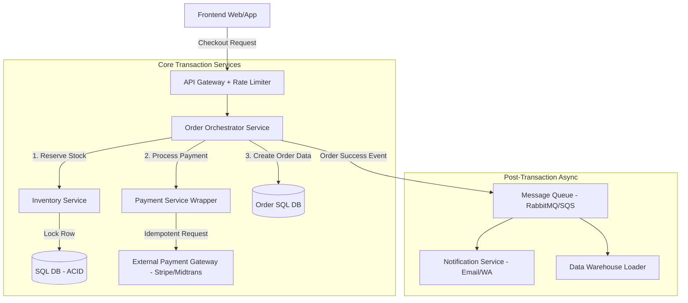

# E-Commerce Checkout System (Transactional)
**Karakteristik:** Write-intensive saat peak (flash sale), membutuhkan konsistensi data yang ketat (ACID), integrasi pihak ketiga yang berisiko gagal (payment gateway).

### Diagram High-Level

### Overview
- **Rate Limiter**: Krusial untuk mencegah bot saat flash sale.
- **Order Orchestrator**: Service pusat yang mengatur alur pembelian.
- **SQL DB (Inventory & Order)**: Di sini kita MENGHARUSKAN penggunaan SQL Database (PostgreSQL/MySQL) karena kita butuh fitur transaksi ACID dan row locking untuk mencegah overselling (menjual barang yang stoknya sudah habis).
- **Payment Service Wrapper**: Jangan biarkan frontend bicara langsung ke Payment Gateway. Backend harus menjadi perantara untuk mencatat status dan menangani error.

### The Senior Edge
1. **Distributed Transactions (Saga Pattern):**
   - **Tantangan**: Bagaimana jika stok berhasil di-reserve, tapi pembayaran gagal? Kita tidak bisa menggunakan transaksi database biasa karena melibatkan       service yang berbeda dan API eksternal.
   - **Solusi Senior**: Jelaskan Saga Pattern. Jika langkah pembayaran gagal, harus ada "Kompetensasi Transaction" (misalnya, trigger event untuk                mengembalikan stok di Inventory Service).
2. **Idempotency:** Sangat krusial di sistem pembayaran. Apa yang terjadi jika user menekan tombol "Bayar" dua kali karena koneksi lambat? Anda harus mendesain API pembayaran agar idempotent (menggunakan kunci unik transaksi) sehingga permintaan ganda tidak menagih user dua kali.
3. **Handling Race Conditions**: Bagaimana memastikan stok tidak minus saat 1000 orang membeli 1 barang terakhir bersamaan? Diskusikan penggunaan SELECT ... FOR UPDATE (pessimistic locking) di database level, atau menggunakan Redis (optimistic locking dengan Lua script) untuk manajemen stok inventory yang cepat.
