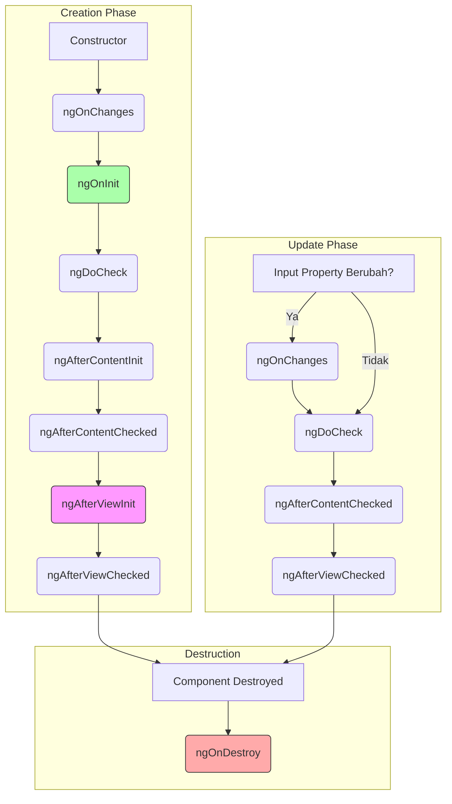
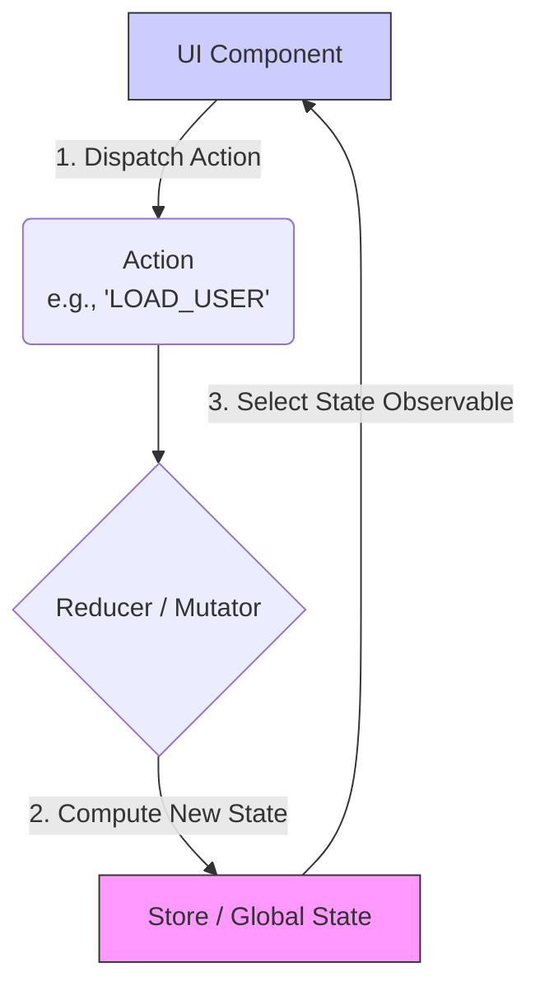
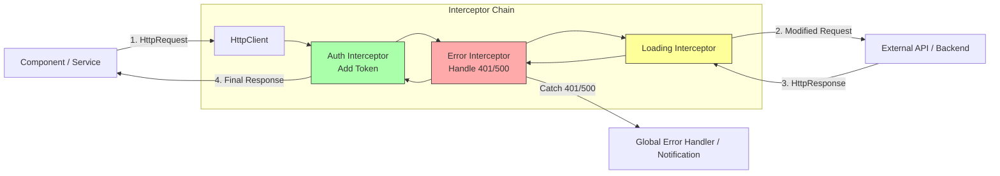
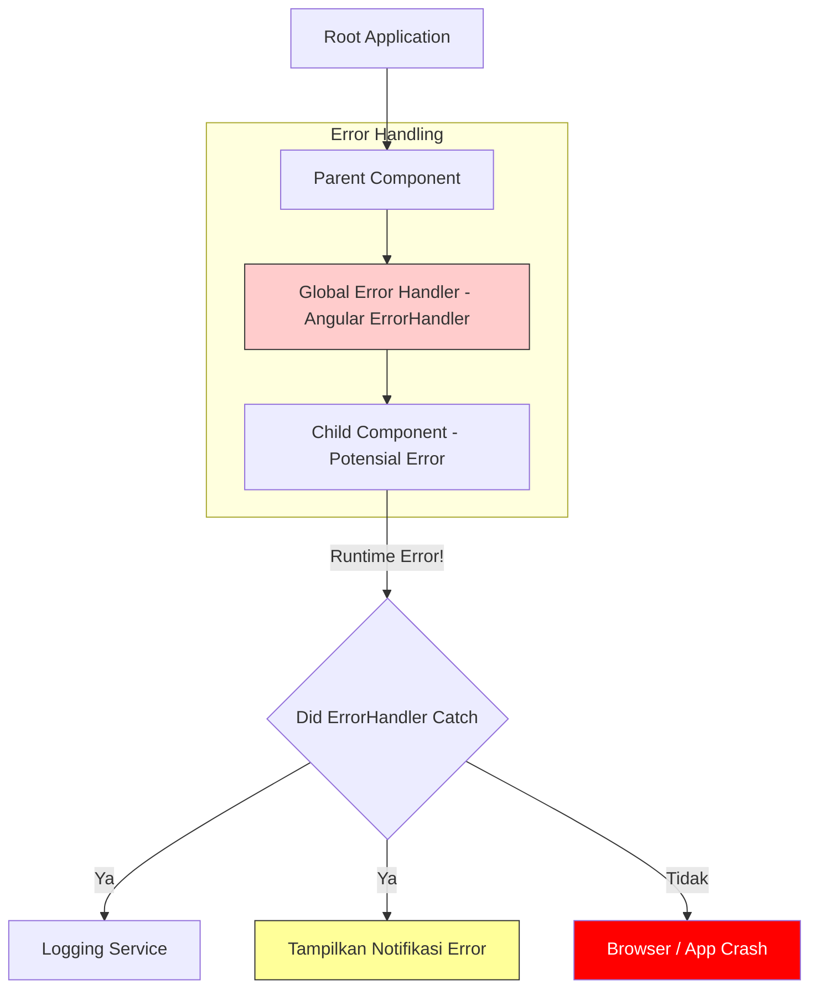
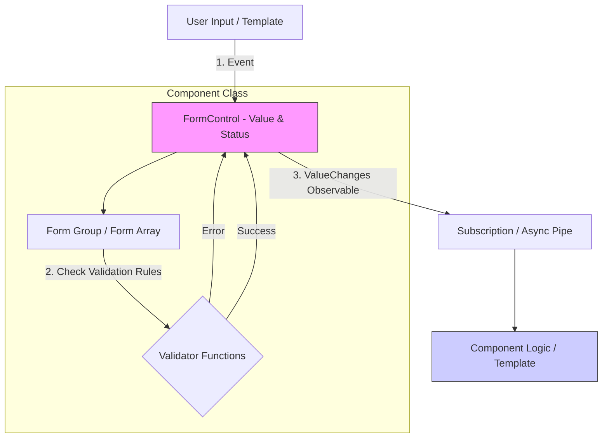

# 🛠️ Desain Sistem Frontend (Angular)

Dokumen ini menjelaskan praktik terbaik dan arsitektur yang diusulkan untuk pengembangan *frontend* menggunakan kerangka kerja **Angular**, mencakup manajemen komponen, *state*, integrasi API, penanganan *error*, performa, dan *form*.

---

## 1. Siklus Hidup Komponen (*Component Lifecycle*) - Lengkap

Angular menjalankan serangkaian *hook* secara berurutan. Memahami urutan ini sangat penting untuk menghindari *bug* ras, kesalahan manipulasi DOM, dan masalah performa.

### Urutan dan Detail Hook

| Urutan | Hook Lifecycle | Kapan Dipanggil | Tujuan & Best Practice |
| :--- | :--- | :--- | :--- |
| 1 | **`ngOnChanges`** | Saat properti input (`@Input`) data-bound berubah. Dipanggil *sebelum* `ngOnInit`. | Validasi input atau memperbarui *state* internal berdasarkan perubahan input eksternal. |
| 2 | **`ngOnInit`** | Sekali, setelah `ngOnChanges` pertama. | **Logika Inisialisasi**. Tempat terbaik untuk *fetching* data awal ke API. Jangan memanipulasi DOM di sini (elemen mungkin belum ada). |
| 3 | **`ngDoCheck`** | Setiap siklus *Change Detection*. | Mendeteksi perubahan yang tidak disadari Angular. **Hati-hati:** Sering dipanggil, hindari logika berat di sini. |
| 4 | **`ngAfterContentInit`** | Sekali, setelah konten eksternal diproyeksikan (`<ng-content>`). | Inisialisasi yang bergantung pada konten yang disisipkan dari luar komponen. |
| 5 | **`ngAfterContentChecked`** | Setiap kali konten proyeksi diperiksa. | Verifikasi perubahan pada konten proyeksi. |
| 6 | **`ngAfterViewInit`** | Sekali, setelah tampilan komponen dan tampilan anak (*child views*) diinisialisasi. | **Manipulasi DOM**. Tempat aman untuk mengakses elemen DOM (misal: jQuery, Chart.js) atau menggunakan `@ViewChild`. |
| 7 | **`ngAfterViewChecked`** | Setiap kali tampilan komponen diperiksa. | Logika yang bergantung pada perubahan tampilan/layout. |
| 8 | **`ngOnDestroy`** | Tepat sebelum komponen dihapus. | **Cleanup**. Unsubscribe Observables, detach event handlers, stop timers/intervals untuk mencegah *memory leak*. |

### Diagram Aliran Siklus Hidup (Inisialisasi & Update)

Diagram ini membedakan antara fase pembuatan awal (*Creation*) dan fase pembaruan (*Update*).

### 2. Manajemen State (State Management)
Dalam ekosistem Angular modern, kita membagi state menjadi tiga lapisan untuk menjaga *Scalability* dan *Maintainability*.

**Solusi yang Direkomendasikan**
* **NGXS** atau **Ngrx**: Implementasi pola Redux yang menyediakan Store tunggal. Cocok untuk state aplikasi yang kompleks dan membutuhkan tracing.
* **Pattern Service-Store-Component**: Untuk state domain yang lebih sederhana, gunakan Service sebagai Store yang menyimpan `BehaviorSubject`.

**Strategi Performa**: `OnPush`
* Atur `changeDetection: ChangeDetectionStrategy.OnPush` pada komponen untuk mengurangi siklus change detection.
* Komponen hanya diperiksa ulang jika *Input Reference* berubah, event terjadi, atau *Observable* dengan *Async Pipe* memancarkan nilai baru.

### 3. Praktik Terbaik Integrasi API (*API Integration Best Practices*)
Semua permintaan ditangani oleh `HttpClientModule` dan *Observable*, dengan *interceptor* sebagai titik kendali global.

**Pola Akses Data**
1. **Enkapsulasi di *Service***: Semua panggilan API dienkapsulasi dalam Service.

2. **HTTP Interceptors**: Digunakan untuk menangani tugas cross-cutting secara terpusat (Authentication, Global Error Handling, Loading State).

### 4. Penanganan Batas Error (*Error Boundary Handling*)
Di Angular, penanganan runtime error yang tidak tertangkap diimplementasikan menggunakan `ErrorHandler`.
**Strategi**
* **Custom Error Handler**: Implementasikan kelas kustom yang mengimplementasikan `ErrorHandler` untuk menangkap error yang tidak tertangkap.
* **Tanggung Jawab**: Melakukan **Logging** ke layanan eksternal (Sentry), menampilkan User **Feedback** yang ramah, dan memicu *Graceful Recovery*.

### 5. Pemisahan Kode (*Code Splitting*) dan Performa
Memanfaatkan sistem *module* Angular untuk *lazy loading*.
**Teknik**
* **Lazy Loading Modul Rute**: Gunakan `loadChildren` di konfigurasi rute (`app-routing.module.ts`) untuk memuat *module* hanya saat user mengunjungi rute tersebut, mengurangi ukuran *initial bundle*.
* **AOT (Ahead-of-Time) Compilation**: Memastikan kode Angular dikompilasi selama *build* untuk *startup time* yang lebih cepat.
* **Pure Pipes**: Hanya dieksekusi ulang jika input primitif berubah, bertindak sebagai mekanisme *memoization* sederhana.

### 6. Form Handling & Validation
Pendekatan **Reactive Forms** adalah yang utama karena kemudahan testing dan penanganan state yang berbasis *Observable*.
**Pendekatan**
* **Reactive Forms** (*Model-driven*): **Direkomendasikan** untuk *form* kompleks karena memberikan kontrol penuh atas state dan validasi.
* **Template-driven Forms**: Untuk *form* yang sangat sederhana dan statis.
**Praktik Terbaik Validasi**
* **Custom Validators**: Buat **Custom Validators** yang dapat digunakan kembali untuk logika bisnis.
* **Validasi Asynchronous**: Gunakan *Async Validators* untuk pemeriksaan backend (misalnya, cek ketersediaan username).
