# Desain Sistem Frontend (Angular)
##### Write by: Kelvin Febrian
Dokumen ini menjelaskan praktik terbaik dan arsitektur yang diusulkan untuk pengembangan *frontend* menggunakan kerangka kerja **Angular**, mencakup manajemen komponen, *state*, integrasi API, penanganan *error*, performa, dan *form*.

---

## 1. Siklus Hidup Komponen (*Component Lifecycle*) - Lengkap

Angular menjalankan serangkaian *hook* secara berurutan. Memahami urutan ini sangat penting untuk menghindari *bug* ras, kesalahan manipulasi DOM, dan masalah performa.

### Urutan dan Detail Hook

| Urutan | Hook Lifecycle | Kapan Dipanggil | Tujuan & Best Practice |
| :--- | :--- | :--- | :--- |
| 1 | **`ngOnChanges`** | Saat properti input (`@Input`) data-bound berubah. Dipanggil *sebelum* `ngOnInit`. | Validasi input atau memperbarui *state* internal berdasarkan perubahan input eksternal. |
| 2 | **`ngOnInit`** | Sekali, setelah `ngOnChanges` pertama. | **Logika Inisialisasi**. Tempat terbaik untuk *fetching* data awal ke API. Jangan memanipulasi DOM di sini (elemen mungkin belum ada). |
| 3 | **`ngDoCheck`** | Setiap siklus *Change Detection*. | Mendeteksi perubahan yang tidak disadari Angular. **Hati-hati:** Sering dipanggil, hindari logika berat di sini. |
| 4 | **`ngAfterContentInit`** | Sekali, setelah konten eksternal diproyeksikan (`<ng-content>`). | Inisialisasi yang bergantung pada konten yang disisipkan dari luar komponen. |
| 5 | **`ngAfterContentChecked`** | Setiap kali konten proyeksi diperiksa. | Verifikasi perubahan pada konten proyeksi. |
| 6 | **`ngAfterViewInit`** | Sekali, setelah tampilan komponen dan tampilan anak (*child views*) diinisialisasi. | **Manipulasi DOM**. Tempat aman untuk mengakses elemen DOM (misal: jQuery, Chart.js) atau menggunakan `@ViewChild`. |
| 7 | **`ngAfterViewChecked`** | Setiap kali tampilan komponen diperiksa. | Logika yang bergantung pada perubahan tampilan/layout. |
| 8 | **`ngOnDestroy`** | Tepat sebelum komponen dihapus. | **Cleanup**. Unsubscribe Observables, detach event handlers, stop timers/intervals untuk mencegah *memory leak*. |

### Diagram Aliran Siklus Hidup (Inisialisasi & Update)

Diagram ini membedakan antara fase pembuatan awal (*Creation*) dan fase pembaruan (*Update*).

### 2. Manajemen State (State Management)
Manajemen state di Angular perlu dibagi menjadi tiga kategori utama: **Local UI State**, **Domain/Business State**, dan **App-wide Global State**.

**Jenis-Jenis State**
**1. Local UI State**
Contoh:
* Modal terbuka/tertutup
* Selected tab index
* Dropdown expanded atau tidak

**Best practice**:
* Simpan di dalam komponen
* Gunakan `signal()`, `@Input`, atau variabel biasa
* Jangan pernah masukkan UI state ke Store global

**2. Domain/Business State**
State yang digunakan untuk fitur tertentu.
Contoh:
* Daftar users
* Daftar transaksi
* Detail produk

**Best practice:**
* Simpan dalam Service menggunakan `BehaviorSubject`, signal, atau NGXS/Ngrx slice
* Pisahkan antara:
    * State
    * Actions
    * Selectors

**3. App-wide Global State**
State yang mempengaruhi seluruh aplikasi.
Contoh:
* User session
* Auth token
* Global settings
* Theme (dark/light)

**Best practice:**
* Gunakan State Management library seperti:
    * **NGXS**
    * **Ngrx Store**
    * **Akita**

### 3. Integrasi API (*API Integration*)
Semua request API harus dilakukan melalui Service.

**Kategori API Integration**
**1. Standard API Calls**
* GET / POST / PUT / DELETE
* Menggunakan HttpClient

**Best Practice**
* Jangan panggil API di component
* Gunakan `service.getUsers()` dll
* Gunakan interface TypeScript sebagai response model

**2. Interceptors**
Interceptor adalah *middleware* **HTTP Angular**.

Jenis-jenis *Interceptor*:
1. **Auth Interceptor**
    * Menambahkan **Authorization header**
    * Menyimpan **token**
2. **Error Interceptor**
    * Tangani HTTP `400/401/500`

3. **Logging Interceptor**
    * Logging *request/response*

4. **Caching Interceptor**
    * Cache response `GET` tertentu

5. **Retry Interceptor**
    * Menggunakan **RxJS** `retryWhen()`

**3. API Caching Patterns**
Jenis Caching:
* Memory Cache (BehaviorSubject)
* RxJS shareReplay
* SessionStorage / LocalStorage
* Service Worker (PWA)

**Best Practice**
* Jangan panggil API di component
* Gunakan `service.getUsers()` dll
* Gunakan interface TypeScript sebagai response model

**Pola Akses Data**
1. **Enkapsulasi di *Service***: Semua panggilan API dienkapsulasi dalam Service.

2. **HTTP Interceptors**: Digunakan untuk menangani tugas cross-cutting secara terpusat (Authentication, Global Error Handling, Loading State).

### 4. Penanganan Batas Error (*Error Boundary Handling*)
Di Angular, penanganan runtime error yang tidak tertangkap diimplementasikan menggunakan `ErrorHandler`.

**1. Global Error Handler**
Implement Angular `ErrorHandler`.
Use-case:
* Logging ke Sentry
* Global alert pop-up
* Fallback view

**2. Component-level Error Handling**
* `try/catch`
* `RxJS` `catchError`
* Guard pada service sebelum mengakses data null

**3. HTTP Error Handling**
Kategori error:
* 4xx — Client Errors
* 5xx — Server Errors
* Network Error
* Timeout Error

Best practice:
* Selalu tangani error di Interceptor
* Tampilkan pesan ramah pengguna
* Jangan expose error backend mentah

**Best Practice**
* **Custom Error Handler**: Implementasikan kelas kustom yang mengimplementasikan `ErrorHandler` untuk menangkap error yang tidak tertangkap.
* **Tanggung Jawab**: Melakukan **Logging** ke layanan eksternal (Sentry), menampilkan User **Feedback** yang ramah, dan memicu *Graceful Recovery*.

### 5. Pemisahan Kode (*Code Splitting*) dan Performa
Memanfaatkan sistem *module* Angular untuk *lazy loading*.
**Teknik**
* **Lazy Loading Modul Rute**: Gunakan `loadChildren` di konfigurasi rute (`app-routing.module.ts`) untuk memuat *module* hanya saat user mengunjungi rute tersebut, mengurangi ukuran *initial bundle*.
* **AOT (Ahead-of-Time) Compilation**: Memastikan kode Angular dikompilasi selama *build* untuk *startup time* yang lebih cepat.
* **Pure Pipes**: Hanya dieksekusi ulang jika input primitif berubah, bertindak sebagai mekanisme *memoization* sederhana.
* **Component Level**: Gunakan `ChangeDetectionStrategy.OnPush`, Pure Pipes, Signals (lebih efisien dari Observable)
* **Bundle Optimization**: Build Dengan AOT, Production Mode, Minifying + Tree Shaking
* **Image Optimization**: Gunakan *WebP/AVIF*, *Lazy Load Image*, dan `ngOptimizedImage`(Angular 15+)

### 6. Form Handling & Validation
Pendekatan **Reactive Forms** adalah yang utama karena kemudahan testing dan penanganan state yang berbasis *Observable*.
**Pendekatan**
* **Reactive Forms** (*Model-driven*): **Direkomendasikan** untuk *form* kompleks karena memberikan kontrol penuh atas state dan validasi.
* **Template-driven Forms**: Untuk *form* yang sangat sederhana dan statis.
**Praktik Terbaik Validasi**
* **Custom Validators**: Buat **Custom Validators** yang dapat digunakan kembali untuk logika bisnis.
* **Validasi Asynchronous**: Gunakan *Async Validators* untuk pemeriksaan backend (misalnya, cek ketersediaan username).

```mermaid
graph TD
    A[User Input / Template] -->|1. Event| B[FormControl - Value & Status]
    
    subgraph Component Class
        B --> C[Form Group / Form Array]
        C -->|2. Check Validation Rules| D{Validator Functions}
        D -- Error --> B
        D -- Success --> B
    end
    
    B -->|3. ValueChanges Observable| E[Subscription / Async Pipe]
    
    E --> F[Component Logic / Template]
    
    style B fill:#f9f,stroke:#333
    style F fill:#ccf,stroke:#333

```
