# Nuxt 3 Design System — Complete Guide

Dokumen ini berisi design system Nuxt 3 dengan pola yang konsisten seperti versi Angular & React: lifecycle, state, API integration, error handling, performance, dan form handling.

---

# 1. Component Lifecycle di Nuxt (Vue 3)

Nuxt 3 menggunakan lifecycle milik Vue 3 + lifecycle khusus SSR Nuxt.

## 1.1 Vue Composition API Lifecycle

| Hook | Fungsi |
|------|--------|
| onBeforeMount | Sebelum komponen dipasang |
| onMounted | Setelah DOM siap (client only) |
| onBeforeUpdate | Sebelum update state |
| onUpdated | Setelah DOM update |
| onBeforeUnmount | Sebelum komponen dihancurkan |
| onUnmounted | Setelah dihancurkan |

**Diagram**
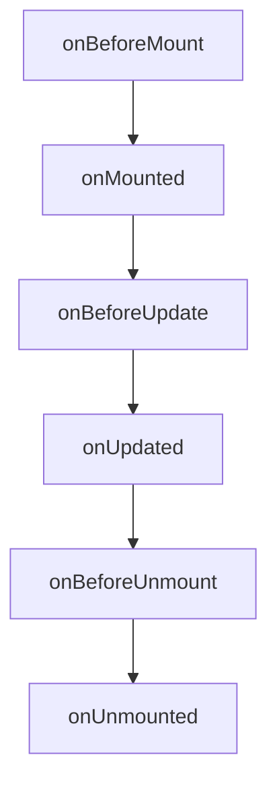

### Contoh
```vue
<script setup>
import { onMounted, onUnmounted } from 'vue'

onMounted(() => {
  console.log("Mounted")
})

onUnmounted(() => {
  console.log("Clean up")
})
</script>
```

---

## 1.2 Nuxt-specific Lifecycle

| Hook | Fungsi |
|------|--------|
| useAsyncData | Fetch data di SSR/Client |
| useFetch | Fetch dengan caching otomatis |
| onServerPrefetch | Eksekusi sebelum SSR render |
| onNuxtReady | Ketika Nuxt sudah siap di client |

**Diagram**


### Contoh useAsyncData
```vue
<script setup>
const { data, pending, error } = await useAsyncData("users", () =>
  $fetch("/api/users")
)
</script>
```

---

# 2. State Management di Nuxt 3

Tiga jenis state:
- Local UI State (ref, reactive, computed)
- Feature State (Composables)
- Global State (Pinia)

---

# 2.1 Local UI State
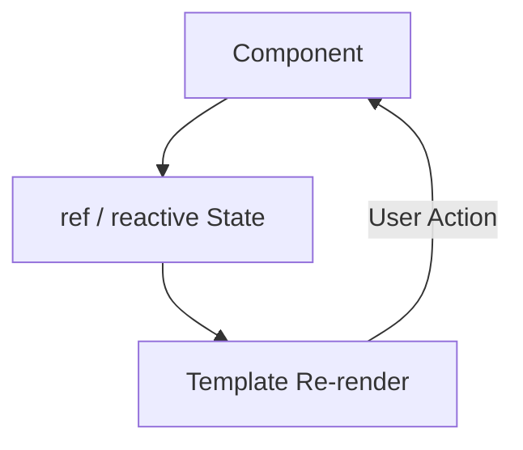

### Contoh
```vue
<script setup>
const isOpen = ref(false)
const count = ref(0)
const double = computed(() => count.value * 2)
</script>
```

---

# 2.2 Feature/Domain State — Composables
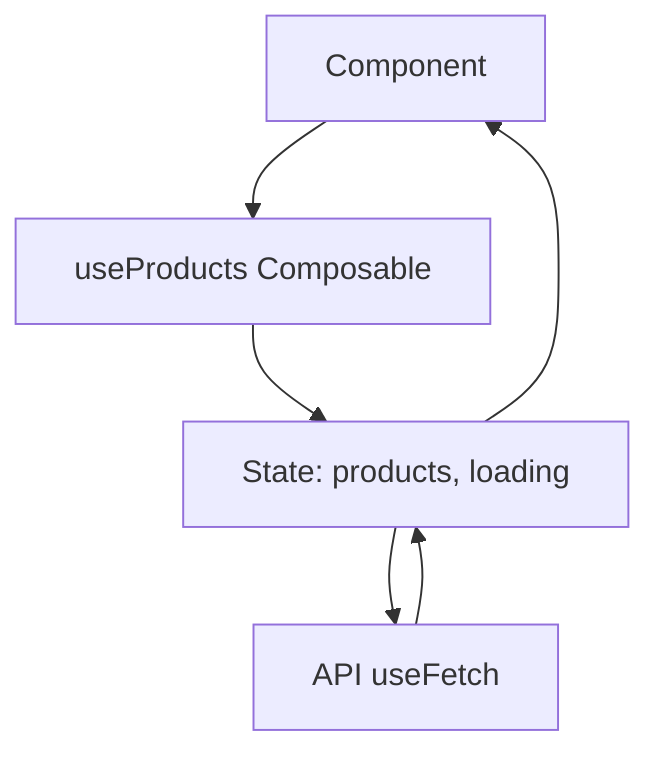
Folder:
```
/composables/useProducts.js
```

### Contoh
```js
export const useProducts = () => {
  const products = useState("products", () => [])
  const loading = ref(false)

  const fetchProducts = async () => {
    loading.value = true
    const { data } = await useFetch("/api/products")
    products.value = data.value
    loading.value = false
  }

  return { products, loading, fetchProducts }
}
```

Penggunaan:
```vue
<script setup>
const { products, fetchProducts } = useProducts()
await fetchProducts()
</script>
```

---

# 2.3 Global State — Pinia

Install:
```
npm install pinia
```

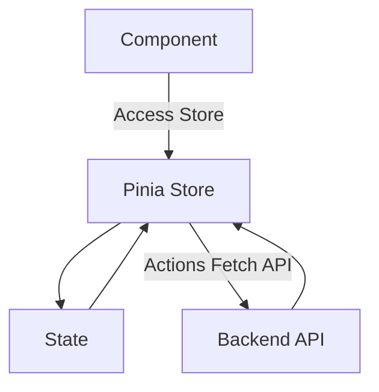

### Store
```js
import { defineStore } from "pinia"

export const useProductStore = defineStore("products", {
  state: () => ({
    list: [],
    loading: false
  }),
  actions: {
    async fetchProducts() {
      this.loading = true
      const { data } = await useFetch("/api/products")
      this.list = data.value
      this.loading = false
    }
  }
})
```

### Usage
```vue
<script setup>
const store = useProductStore()
await store.fetchProducts()
</script>

<template>
  <div v-for="p in store.list" :key="p.id">{{ p.name }}</div>
</template>
```

---

# 3. API Integration di Nuxt

Nuxt memiliki 3 cara:

### 1. useFetch (SSR + Caching)
### 2. $fetch (universal fetch wrapper)
### 3. Axios (optional) + Interceptors

---

# 3.1 useFetch Example
```vue
<script setup>
const { data, pending, error } = await useFetch("/api/users")
</script>
```

---

# 3.2 $fetch Example
```js
const users = await $fetch("/api/users")
```

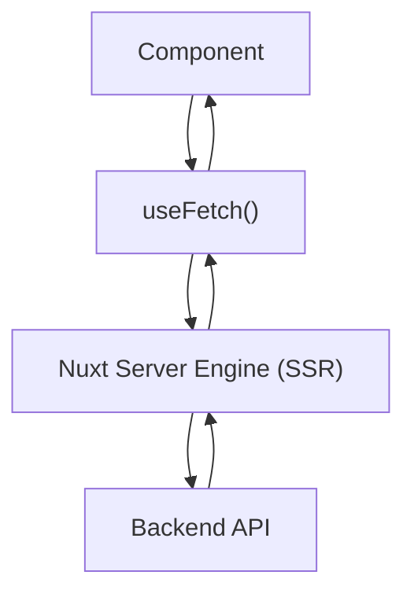

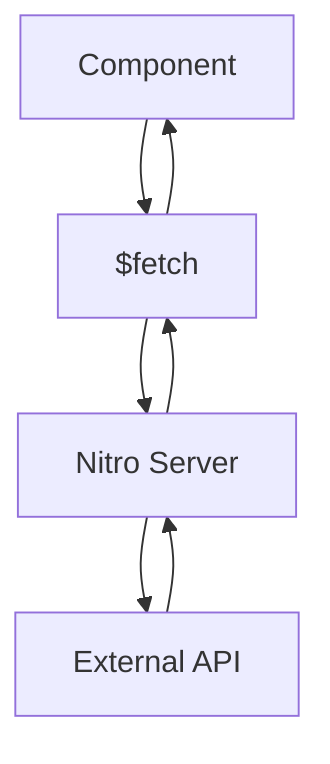

---

# 3.3 Axios + Interceptors

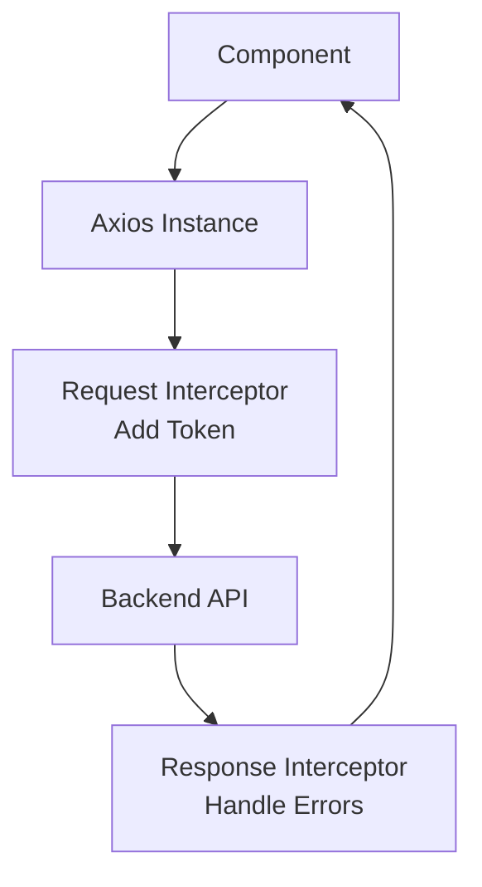

Plugin:
```js
// plugins/axios.js
import axios from "axios"

export default defineNuxtPlugin(() => {
  const api = axios.create({
    baseURL: "https://api.example.com"
  })

  api.interceptors.request.use(config => {
    config.headers.Authorization = "Bearer " + localStorage.getItem("token")
    return config
  })

  api.interceptors.response.use(
    res => res,
    err => {
      if (err.response?.status === 401) navigateTo("/login")
      return Promise.reject(err)
    }
  )

  return {
    provide: { api }
  }
})
```

Usage:
```vue
<script setup>
const { $api } = useNuxtApp()
const res = await $api.get("/users")
</script>
```

---

# 4. Error Handling di Nuxt

### Lempar error
```js
throw createError({
  statusCode: 404,
  statusMessage: "Not Found"
})
```

### Global Error Page: error.vue
```vue
<template>
  <div>
    <h1>{{ error.statusCode }}</h1>
    <p>{{ error.statusMessage }}</p>
  </div>
</template>
```

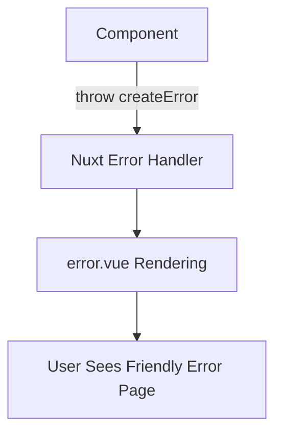

---

# 5. Performance Optimization

- Lazy loading components
- Nuxt Suspense
- Nitro caching
- Static generation
- CDN assets
- defineAsyncComponent

### Example
```vue
<script setup>
const LazyCard = defineAsyncComponent(() => import("~/components/Card.vue"))
</script>
```

**5.1 Diagram Lazy Loading**
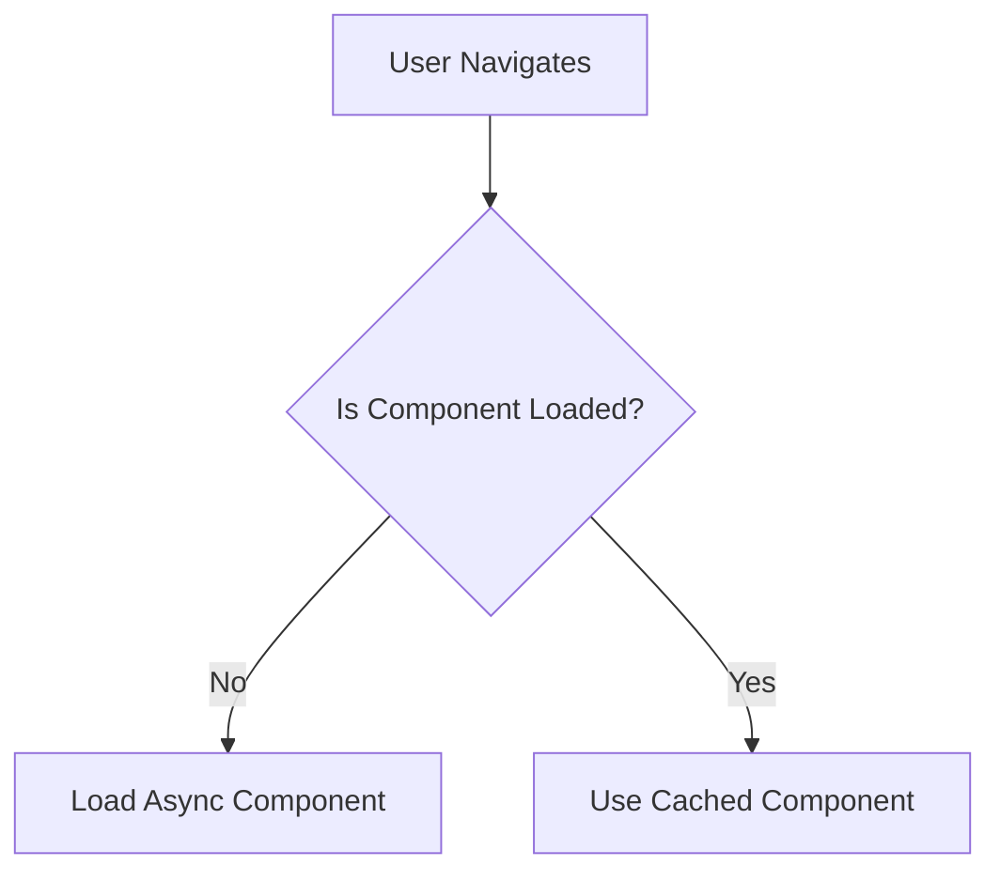

**5.2 Diagram Suspense Flow**
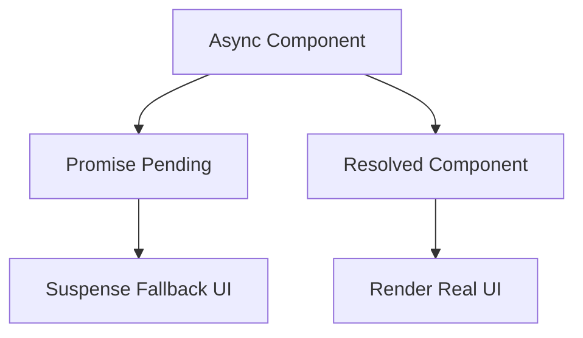

---

# 6. Form Handling di Nuxt

Gunakan:
- Vee-Validate + Yup
- Native reactive form

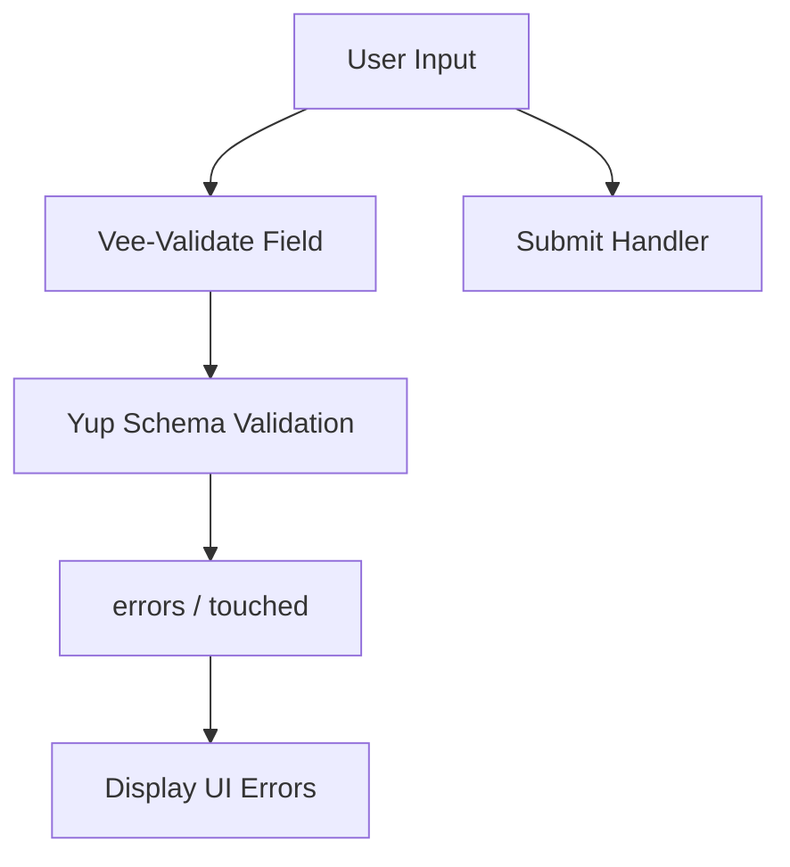

---

# 6.1 Vee-Validate + Yup Example

Install:
```
npm install vee-validate yup
```

```vue
<script setup>
import { useForm, useField } from "vee-validate"
import * as Yup from "yup"

const schema = Yup.object({
  email: Yup.string().required().email(),
  password: Yup.string().required().min(6)
})

const { handleSubmit } = useForm({ validationSchema: schema })
const { value: email, errorMessage: emailError } = useField("email")
const { value: password } = useField("password")

const submit = handleSubmit(values => {
  console.log("Submitted:", values)
})
</script>

<template>
  <form @submit="submit">
    <input v-model="email" placeholder="Email"/>
    <p>{{ emailError }}</p>

    <input v-model="password" type="password" />
    <button type="submit">Login</button>
  </form>
</template>
```
