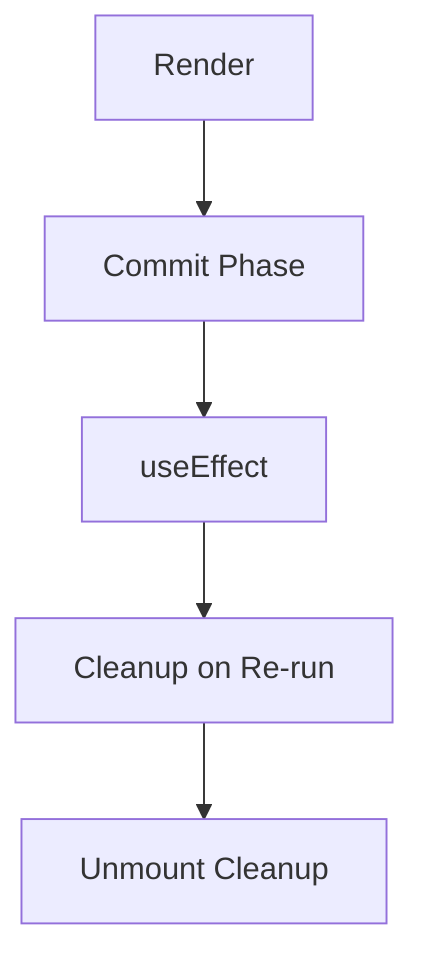
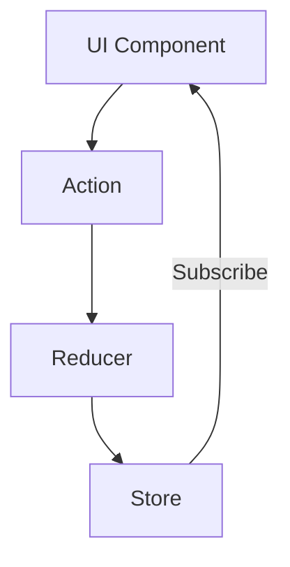
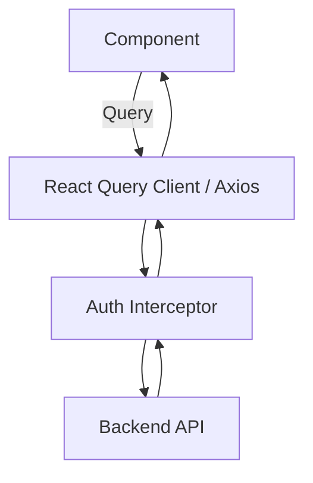
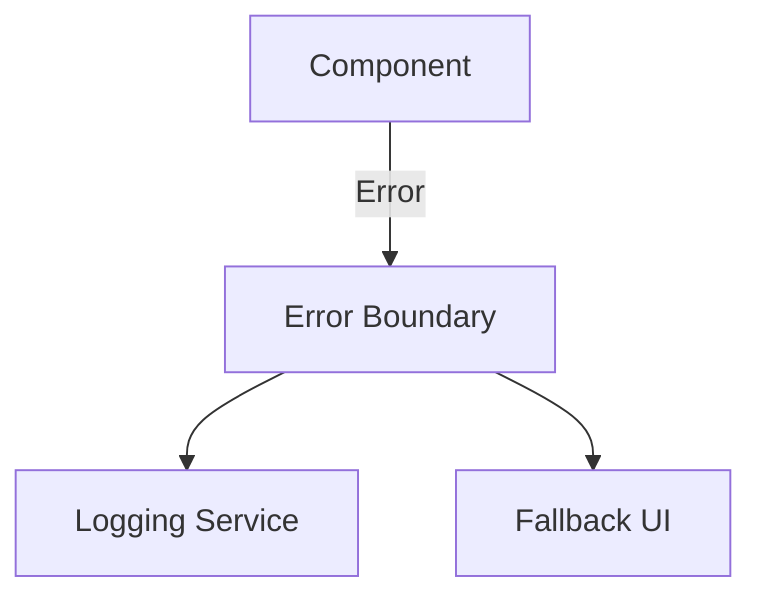
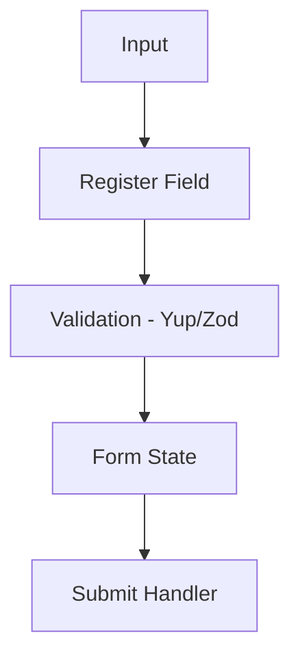

# Design System Frontend (React)
##### Write by: Kelvin Febrian
Dokumen ini merupakan versi React dengan struktur pembahasan yang paralel: lifecycle, state management, API integration, error boundaries, performance, dan form handling.

---

## 1. React Component Lifecycle

React memiliki Lifecycle yang bergantung pada class component atau function component (hooks). Modern React menggunakan **function components + hooks**.

### Lifecycle (Function Component + Hooks)

| Urutan | Lifecycle / Hook | Kapan Dipanggil | Tujuan & Best Practice |
|---|---|---|---|
| 1 | **Render** | Ketika props/state berubah | Hindari side effect. Hanya hitung UI. |
| 2 | **useEffect(() ⇒ ..., [])** | Setelah render pertama | Inisialisasi (fetch data awal), mirip `ngOnInit`. |
| 3 | **useEffect(() ⇒ ..., [deps])** | Setelah render ketika dependency berubah | Mirip `ngOnChanges`. |
| 4 | **useLayoutEffect** | Setelah DOM dirender, sebelum paint | Manipulasi DOM sinkron, mirip `ngAfterViewInit`. |
| 5 | **Cleanup (return () ⇒ … )** | Sebelum effect dijalankan ulang / unmount | Mirip `ngOnDestroy`. |

### Diagram Lifecycle React


---

### 2.  React State Management — Local UI State & Feature State (Detailed)

Dokumen ini menjelaskan **Local UI State** dan **Domain/Feature State** di React secara mendalam, termasuk penjelasan, contoh kode, dan best practices.

**1. LOCAL UI STATE**

Local UI State adalah state yang hanya digunakan oleh satu komponen atau beberapa komponen kecil. Tujuannya adalah mengontrol perilaku UI yang sifatnya lokal.

Hook utama:
- **useState** — state sederhana
- **useReducer** — state kompleks
- **useRef** — state yang tidak memicu re-render
- Hook pendukung lain:
  - useMemo
  - useCallback
  - useLayoutEffect
  - useTransition
  - useDeferredValue

**1.1 useState — Penjelasan & Contoh**
`useState` digunakan ketika:
- state sederhana
- nilai langsung mempengaruhi UI
- perubahan state menyebabkan re-render

**Contoh: Toggle Modal**
```jsx
import { useState } from "react";

export default function ModalExample() {
  const [isOpen, setIsOpen] = useState(false);

  return (
    <div>
      <button onClick={() => setIsOpen(true)}>Open Modal</button>

      {isOpen && (
        <div className="modal">
          <p>Ini modal</p>
          <button onClick={() => setIsOpen(false)}>Close</button>
        </div>
      )}
    </div>
  );
}
```
**1.2 useReducer — Penjelasan & Contoh**
Gunakan `useReducer` jika:
- state kompleks
- ada beberapa aksi berbeda
- ingin struktur mirip Redux untuk komponen tunggal

**Contoh: Multi-field Form**
```jsx
import { useReducer } from "react";

const initialState = {
  username: "",
  email: "",
  loading: false,
};

function reducer(state, action) {
  switch (action.type) {
    case "SET_USERNAME":
      return { ...state, username: action.payload };
    case "SET_EMAIL":
      return { ...state, email: action.payload };
    case "SET_LOADING":
      return { ...state, loading: action.payload };
    default:
      return state;
  }
}

export default function FormReducer() {
  const [state, dispatch] = useReducer(reducer, initialState);

  return (
    <div>
      <input
        value={state.username}
        onChange={(e) => dispatch({ type: "SET_USERNAME", payload: e.target.value })}
      />
      <input
        value={state.email}
        onChange={(e) => dispatch({ type: "SET_EMAIL", payload: e.target.value })}
      />

      <button onClick={() => dispatch({ type: "SET_LOADING", payload: true })}>
        Submit
      </button>

      {state.loading && <p>Submitting...</p>}
    </div>
  );
}
```

**1.3 useRef — Penjelasan & Contoh**
`useRef` digunakan untuk:
- menyimpan nilai *tanpa memicu re-render*
- menyimpan DOM element
- menyimpan previous value
- menyimpan timer id

**Contoh: Previous Value**
```jsx
import { useState, useEffect, useRef } from "react";

export default function PreviousValue() {
  const [count, setCount] = useState(0);
  const prev = useRef(0);

  useEffect(() => {
    prev.current = count;
  }, [count]);

  return (
    <div>
      <p>Current: {count}</p>
      <p>Previous: {prev.current}</p>

      <button onClick={() => setCount(count + 1)}>+</button>
    </div>
  );
}
```

---

**2. DOMAIN / FEATURE STATE**
Feature State adalah state yang:
- digunakan oleh *beberapa komponen* dalam satu fitur yang sama
- memiliki logika bisnis tersendiri
- tidak pantas dipasang di global state
- tidak pantas masuk Local UI State

Pendekatan utama:
- Context + Reducer
- Zustand
- Redux Toolkit (opsional, jika dibutuhkan)

**2.1 FEATURE STATE dengan Context + Reducer**
Struktur folder:
```
/features/product/
   productContext.js
   productReducer.js
   productProvider.js
   useProduct.js
```
**A. productReducer.js**
```jsx
export const initialState = {
  products: [],
  loading: false,
};

export function productReducer(state, action) {
  switch (action.type) {
    case "SET_LOADING":
      return { ...state, loading: action.payload };

    case "SET_PRODUCTS":
      return { ...state, products: action.payload };

    case "ADD_PRODUCT":
      return { ...state, products: [...state.products, action.payload] };

    case "REMOVE_PRODUCT":
      return {
        ...state,
        products: state.products.filter((p) => p.id !== action.payload),
      };

    default:
      return state;
  }
}
```
**B. productContext.js**
```jsx
import { createContext } from "react";

export const ProductContext = createContext(null);
```
**C. productProvider.js**
```jsx
import { useReducer } from "react";
import { ProductContext } from "./productContext";
import { productReducer, initialState } from "./productReducer";

export default function ProductProvider({ children }) {
  const [state, dispatch] = useReducer(productReducer, initialState);

  const value = { state, dispatch };

  return (
    <ProductContext.Provider value={value}>
      {children}
    </ProductContext.Provider>
  );
}
```
**D. useProduct hook**
```jsx
import { useContext } from "react";
import { ProductContext } from "./productContext";

export function useProduct() {
  const context = useContext(ProductContext);
  if (!context) throw new Error("useProduct must be used within ProductProvider");

  return context;
}
```
**E. Penggunaan di Komponen**
```jsx
import { useProduct } from "../features/product/useProduct";

export default function ProductList() {
  const { state, dispatch } = useProduct();

  function add() {
    dispatch({
      type: "ADD_PRODUCT",
      payload: { id: Date.now(), name: "New Product" },
    });
  }

  return (
    <div>
      <button onClick={add}>Add Product</button>

      {state.products.map((p) => (
        <p key={p.id}>{p.name}</p>
      ))}
    </div>
  );
}
```

**2.2 FEATURE STATE dengan Zustand**
Zustand adalah library state global dengan API sederhana, sangat cocok untuk feature state.

**Contoh Product Store (Zustand)**

```jsx
import { create } from "zustand";

export const useProductStore = create((set) => ({
  products: [],
  loading: false,

  setLoading: (v) => set({ loading: v }),

  setProducts: (list) => set({ products: list }),

  addProduct: (product) =>
    set((state) => ({ products: [...state.products, product] })),

  removeProduct: (id) =>
    set((state) => ({
      products: state.products.filter((p) => p.id !== id),
    })),
}));
```
**Penggunaan**
```jsx
import { useProductStore } from "../store/productStore";

export default function ProductList() {
  const { products, addProduct } = useProductStore();

  return (
    <div>
      <button onClick={() => addProduct({ id: Date.now(), name: "New Product" })}>
        Add Product
      </button>

      {products.map((p) => (
        <p key={p.id}>{p.name}</p>
      ))}
    </div>
  );
}
```

### 3. App-wide Global State
Contoh:
- auth session
- theme
- user preferences

Rekomendasi tooling:
- **Redux Toolkit**
- **Zustand**



---

## 3. API Integration di React
React tidak memiliki `HTTPClient` sendiri, sehingga strategi API adalah manual atau memakai library.

**Metode Untuk API**:
**1. Fetch API / Axios (manual)**
Semua API dibuat pada folder `services/`.
Best practice:
- Jangan panggil API langsung dalam render
- Bungkus semua call dalam async function di service

```jsx
// /services/api.js
import axios from "axios";

export const api = axios.create({
  baseURL: "https://api.example.com",
  timeout: 10000,
});

```
**2. React Query (Highly Recommended)**
React Query memberikan:
- caching
- retry
- background refresh
- invalidation
- status loading/error otomatis

**3. Interceptors**
Jika memakai **Axios**, buat instance custom:
- auth header
- retry
- logging
- error handling



---

## 4. Error Boundary Handling (React)
React memiliki sistem error boundary bawaan untuk error runtime komponen.

**1. Error Boundary (Class Component Only)**
Digunakan untuk menangkap:
- runtime error UI
- crash di rendering

```jsx
class ErrorBoundary extends React.Component {
  state = { hasError: false };

  static getDerivedStateFromError() {
    return { hasError: true };
  }

  componentDidCatch(error, info) {
    // logging ke Sentry
  }

  render() {
    if (this.state.hasError) return <FallbackUI />;
    return this.props.children;
  }
}
```

**2. API Error Handling**
Gunakan:
- try/catch
- error state
- React Query `onError`

**3. Boundary Flow**


---

## 5. Performance & Code Splitting (React)
Memanfaatkan fitur bawaan React + bundler (Vite/Next/Webpack).

**Teknik Utama:**
- **useMemo/useCallback** untuk expensive computation
- **React.memo** untuk component memoization
- **Code Splitting** menggunakan `React.lazy`
- **Suspense** untuk lazy load UI
- Debounce/throttle input
- Virtualized list (react-window)

**Lazy Loading**
```jsx
const UserList = React.lazy(() => import("./UserList"));
```

---

## 6. Form Handling & Validation
**Pilihan Utama:**
**1. React Hook Form (Direkomendasikan)**
Keunggulan:
- cepat (uncontrolled input)
- built-in resolver + schema validation
- cocok form besar

**2. Formik + Yup**
Untuk form kompleks & enterprise.
**Formik** adalah library form management untuk React yang membantu mengelola:
* nilai form (`values`)
* error validasi (`errors`)
* touched state (apakah field pernah diinteraksi)
* submit state
* onChange / onBlur handler
* reset form

**Yup** adalah library schema validation yang digunakan untuk:
* mendefinisikan bentuk data form
* validasi berbasis schema
* membuat pesan error otomatis
* reusable validation rules
* nested validation (object, array, nested data)

**Formik** + **Yup** dipakai bersama karena **Formik** berfungsi untuk mengelola **state form**, lalu **Yup** ditugaskan untuk mengelola **validasi form**.

Contoh Penggunaan
```jsx
import { Formik, Form, Field, ErrorMessage } from "formik";
import * as Yup from "yup";

const validationSchema = Yup.object({
  email: Yup.string().email("Email tidak valid").required("Email wajib diisi"),
  password: Yup.string().min(6, "Minimal 6 karakter").required("Password wajib diisi"),
});

export default function LoginForm() {
  return (
    <Formik
      initialValues={{ email: "", password: "" }}
      validationSchema={validationSchema}
      onSubmit={(values) => {
        console.log("Submitted:", values);
      }}
    >
      {(formik) => (
        <Form>
          <div>
            <label>Email</label>
            <Field name="email" type="email" />
            <ErrorMessage component="p" name="email" />
          </div>

          <div>
            <label>Password</label>
            <Field name="password" type="password" />
            <ErrorMessage component="p" name="password" />
          </div>

          <button type="submit" disabled={formik.isSubmitting}>
            Login
          </button>
        </Form>
      )}
    </Formik>
  );
}
```

**Flow Form**

